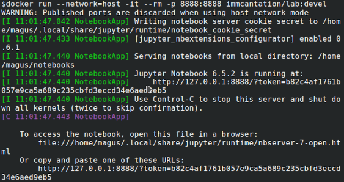
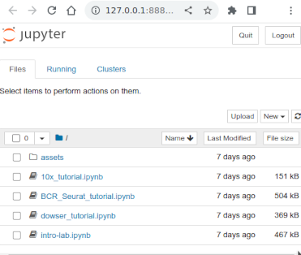

.. _DockerGuide:

Using the Container
================================================================================

Invoking a shell inside the container
--------------------------------------------------------------------------------

To invoke a shell session inside the container:

.. parsed-literal::

    # Docker command
    docker run -it immcantation/suite:|docker-version| bash

    # Singularity command
    singularity shell immcantation_suite-|docker-version|.sif

Sharing files with the container
--------------------------------------------------------------------------------

Sharing files between the host operating system and the container requires you
to bind a directory on the host to one of the container's mount points using the
``-v`` argument for ``docker`` or the ``-B`` argument for ``singularity``.
There are four available mount points defined in the container::

    /data
    /scratch
    /software
    /oasis

For example, to invoke a shell session inside the container with ``$HOME/project`` mounted to
``/data``:

.. parsed-literal::

    # Docker command
    docker run -it -v $HOME/project:/data:z immcantation/suite:|docker-version| bash

    # Singularity command
    singularity shell -B $HOME/project:/data immcantation_suite-|docker-version|.sif

Note, the ``:z`` in the ``-v`` argument of the ``docker`` command is essential.

Executing a specific command
--------------------------------------------------------------------------------

After invoking an interactive session inside the container, commands can be
executed in the container shell as they would be executed in the host shell.

Alternatively, it is possible to execute a specific command directly inside the
container without starting an interactive session. The next example demonstrates
how to execute ``ls`` within ``$HOME/project`` mounted to ``/data``:

.. parsed-literal::

    # Docker command
    docker run -v $HOME/project:/data:z immcantation/suite:|docker-version| ls /data

    # Singularity command
    singularity exec -B $HOME/project:/data immcantation_suite_|docker-version|.sif ls /data

Inspecting the container components
--------------------------------------------------------------------------------

The container includes three informational scripts that provide details about
the versions of installed software and available pipelines.

* The ``versions report`` command will inspect the installed software versions and print them to standard output.
* The analogous ``builds report`` command will display the build date and changesets used during the image build. This is particularly relevant if you are using the ``immcantation/suite:devel`` development builds.
* Finally, the ``pipelines report`` command will display a list of available template pipelines included in the container.

Each command can be run using:

.. parsed-literal::

    # Docker command
    docker run immcantation/suite:|docker-version| [command]

    # Singularity command
    singularity exec immcantation_suite_|docker-version|.sif [command]

.. _DockerGuideTutorials:

Using the container for tutorials
--------------------------------------------------------------------------------

If you would like to run and interact with the Jupyter notebook tutorials from your Docker container, run the following command (replace ``devel`` with a release version if applicable):

.. parsed-literal::
    docker run --network=host -it --rm -p 8888:8888 immcantation/lab:devel

Note that in the container, Jupyter uses the default port 8888. Once the container is running, you will see a message in the terminal asking you to visit a url similar to \http://<hostname>:8888/?token=<token>

Visit the url and open the notebook you want to use.

**Note:** If you want to save the results locally in your computer, you need to bind the folder where you want to save the results to (`<my-out-dir>`), and the results folder in the container.

.. parsed-literal::
    # change my-out-dir to the local directory where you want to have the results saved to
    docker run --network=host -it --rm \\
    -v <my-out-dir>:/home/magus/notebooks/results:z \\
    -p 8888:8888 immcantation/lab:devel