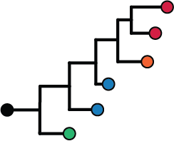

.. meta::
   :description: Immcantation: An Integrated Framework for Adaptive Immune Receptor Repertoire Analysis
   :keywords: rep-seq, immuno-seq, vdj-seq, repertoire sequencing, BCR, TCR, Ig, AIRR,
    adaptive immunity, somatic hypermutation, AbSeq, AbPair, VDJ, immunoglobulin

.. meta::
    :twitter\:card:  summary_large_image
    :og\:title: Immcantation: An Integrated Framework for Adaptive Immune Receptor Repertoire Analysis
    :og\:image: _static/immcantation-card.png'

.. toctree::
    :maxdepth: 1
    :hidden:

    Welcome <self>
    Data Standards <datastandards>
    Contact & Cite <about>
    Contributing <contrib>

.. toctree::
    :maxdepth: 1
    :hidden:
    :caption: Installation

    intro
    docker/intro
    docker/news

.. toctree::
    :maxdepth: 3
    :hidden:
    :caption: Getting started

    getting_started/getting-started
    getting_started/resources

.. toctree::
    :maxdepth: 1
    :caption: Core Packages
    :hidden:

    Alakazam <https://alakazam.readthedocs.io>
    Change-O <https://changeo.readthedocs.io>
    Dowser <https://dowser.readthedocs.io/>
    pRESTO <https://presto.readthedocs.io>
    SCOPer <https://scoper.readthedocs.io>
    SHazaM <https://shazam.readthedocs.io>
    TIgGER <https://tigger.readthedocs.io>

.. toctree::
    :maxdepth: 1
    :caption: Contributed Packages
    :hidden:

    IgPhyML <https://igphyml.readthedocs.io>
    PIgLET <https://bitbucket.org/yaarilab/piglet>
    RAbHIT <https://yaarilab.bitbucket.io/RAbHIT/>
    RDI <https://rdi.readthedocs.io>
    sumrep <https://github.com/matsengrp/sumrep>

.. toctree::
    :maxdepth: 1
    :caption: In Development
    :hidden:

    enchantR <https://enchantr.readthedocs.io/>
    prestoR <packages/prestor>

.. _Welcome:

Welcome to the Immcantation Portal!
==========================================================================================

Advances in high-throughput sequencing technologies now allow for large-scale
characterization of B cell receptor (BCR) and T cell receptor (TCR) repertoires. The high
germline and somatic diversity of the adaptive immune receptor repertoire (AIRR) presents
challenges for biologically meaningful analysis - requiring the development of specialized
computational methods.

The Immcantation framework provide a start-to-finish analytical ecosystem for
high-throughput AIRR-seq datasets. Beginning from raw reads, Python and R packages are
provided for pre-processing, population structure determination, and repertoire analysis.

.. image:: https://img.shields.io/static/v1?label=AIRR-C%20sw-tools%20v1&message=compliant&color=008AFF&labelColor=000000&style=plastic
     :target: https://docs.airr-community.org/en/stable/swtools/airr_swtools_standard.html
     :align: left

Immcantation supports both the original Change-O standard and the new Adaptive Immune
Receptor Repertoire (AIRR) standard developed by the
`AIRR Community (AIRR-C) <https://www.antibodysociety.org/the-airr-community/>`_.

.. image:: https://img.shields.io/docker/pulls/immcantation/suite
    :target: https://hub.docker.com/u/immcantation
    :align: left

The different tools are available from PyPi, CRAN and GitHub. Versioned containers with
all tools installed are hosted on `Docker Hub <https://hub.docker.com/r/immcantation/suite>`_.

Core Packages
-----------------------------------------------------------------------------------------

**Click on the images below for more details.**

.. list-table::
    :widths: 40 60
    :align: left

    * - |alakazam-img|
      - .. image:: https://cranlogs.r-pkg.org/badges/alakazam
            :target: https://www.r-pkg.org/pkg/alakazam
            :align: right
            :alt: downloads

        **Alakazam**

        + Repertoire diversity
        + V(D)J gene usage
        + Physicochemical property analysis

    * - |changeo-img|
      - .. image:: https://img.shields.io/pypi/dm/changeo
            :target: https://pypi.org/project/changeo
            :align: right
            :alt: downloads

        **Change-O**

        + V(D)J alignment with IgBLAST and IMGT

    * - |dowser-img|
      - .. image:: https://cranlogs.r-pkg.org/badges/dowser
            :target: https://www.r-pkg.org/pkg/dowser
            :align: right
            :alt: downloads

        **Dowser**

        + B cell lineage trees
        + Migration and differentiation analysis
        + Detect ongoing evolution over time

    * - |presto-img|
      - .. image:: https://img.shields.io/pypi/dm/presto
            :target: https://pypi.org/project/presto
            :align: right
            :alt: downloads

        **pRESTO**

        + Bulk BCR sequence data pre-processing
        + Read assembly and QC
        + UMI processing

    * - |scoper-img|
      - .. image:: https://cranlogs.r-pkg.org/badges/scoper
            :target: https://www.r-pkg.org/pkg/scoper
            :align: right
            :alt: downloads

        **SCOPer**

        + Identify clonal relationships

    * - |shazam-img|
      - .. image:: https://cranlogs.r-pkg.org/badges/shazam
            :target: https://www.r-pkg.org/pkg/shazam
            :align: right
            :alt: downloads

        **SHazaM**

        + Clonal clustering threshold tuning
        + Mutation profiling
        + Selection pressure quantification
        + Empirical SHM models

    * - |tigger-img|
      - .. image:: https://cranlogs.r-pkg.org/badges/tigger
            :target: https://www.r-pkg.org/pkg/tigger
            :align: right
            :alt: downloads

        **TIgGER**

        + Novel polymorphism detection
        + Genotyping

Contributed Packages
-----------------------------------------------------------------------------------------

**Click on the images below for more details.**

.. list-table::
    :widths: 40 60
    :align: left

    * - |igphyml-img|
      - **IgPhyML**

        + Method to build lineage trees
        + Mutation/selection hypothesis testing
        + Best used via `Dowser`_ package

    * - |rabhit-img|
      - **RAbHIT**

        + Determination of V-D-J haplotypes

    * - |piglet-img|
      - **PIgLET**

        + Tools to improve genotype inference      

    * - |rdi-img|
      - **RDI**

        + Repertoire Dissimilarity Index

    * - |sumrep-img|
      - **sumrep**

        + Generate repertoire summary statistics.
        + Visualize and comparing repertoire summaries.

.. Image substitutions

.. |presto-img| image:: _static/presto.png
    :align: middle
    :width: 200
    :target: pRESTO_
    :alt: pRESTO

.. |alakazam-img| image:: _static/alakazam.png
    :align: middle
    :width: 200
    :target: Alakazam_
    :alt: alakazam

.. |shazam-img| image:: _static/shazam.png
    :align: middle
    :width: 200
    :target: SHazaM_
    :alt: SHazaM

.. |tigger-img| image:: _static/tigger.png
    :align: middle
    :width: 200
    :target: TIgGER_
    :alt: TIgGER

.. |scoper-img| image:: _static/scoper.png
    :align: middle
    :width: 200
    :target: SCOPer_
    :alt: SCOPer

.. |rdi-img| image:: _static/rdi.png
    :align: middle
    :width: 200
    :target: RDI_
    :alt: RDI

.. Doc links

.. _Alakazam: https://alakazam.readthedocs.io
.. _Change-O: https://changeo.readthedocs.io
.. _Dowser: https://dowser.readthedocs.io
.. _IgPhyML: https://igphyml.readthedocs.io
.. _PIgLET: https://bitbucket.org/yaarilab/piglet
.. _pRESTO: https://presto.readthedocs.io
.. _prestoR: packages/prestor.html
.. _RAbHIT: https://yaarilab.bitbucket.io/RAbHIT/
.. _RDI: https://rdi.readthedocs.io
.. _SCOPer: https://scoper.readthedocs.io
.. _SHazaM: https://shazam.readthedocs.io
.. _sumrep: https://github.com/matsengrp/sumrep
.. _TIgGER: https://tigger.readthedocs.io
