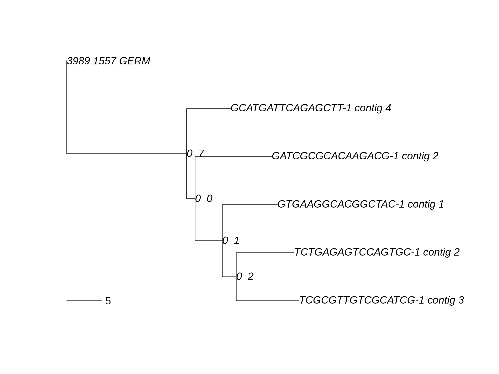

.. _10X-Tutorial:

10X Genomics V(D)J Sequence Analysis Tutorial
===========================================================================================

Overview
-------------------------------------------------------------------------------------------

This tutorial is a basic walkthrough for defining B cell clonal families and building B cell lineage trees using 10X BCR sequencing data.
**It is intended for users without prior experience with Immcantation.**
If you are familiar with Immcantation, then `this page <https://changeo.readthedocs.io/en/stable/examples/10x.html>`__ may be more useful.

*Knowledge of basic command line usage is assumed.*
Please check out the individual documentation sites for the functions detailed in this tutorial before using them on your own data.
For simplicity, this tutorial will use the `Immcantation Docker image <https://immcantation.readthedocs.io/en/stable/docker/intro.html>`__
which contains all necessary software. It is also possible to install the packages being used separately
(see `pRESTO <http://presto.readthedocs.io>`__, `Change-O <http://changeo.readthedocs.io>`__, and `Alakazam <http://alakazam.readthedocs.io>`__).

Please `contact us <https://immcantation.readthedocs.io/en/stable/about.html>`__ if you have any questions.

Getting started
-------------------------------------------------------------------------------------------

First, `download and unzip the example data <http://clip.med.yale.edu/immcantation/examples/10x_data.zip>`__.
It represents the Ig V(D)J sequences from CD19+ B cells isolated from PBMCs of a healthy human donor, and is based on
`data provided by 10X Genomics <https://support.10xgenomics.com/single-cell-vdj/datasets/2.2.0/vdj_v1_hs_cd19_b>`__ under a `Creative Commons Attribute license <https://creativecommons.org/licenses/by/4.0/>`__,
and processed with their `Cell Ranger pipeline <https://support.10xgenomics.com/single-cell-gene-expression/software/pipelines/latest/what-is-cell-ranger>`__.

Second, install `Docker <https://www.docker.com/products/docker-desktop>`__ (if you don't have it already) and
download the `Immcantation Docker image <https://immcantation.readthedocs.io/en/stable/docker/intro.html>`__.
For some operating systems, it may be necessary to use super-user privileges (sudo), and/or to have
`Docker Desktop <https://hub.docker.com/editions/community/docker-ce-desktop-windows>`__
running before entering the following commands.

In a terminal, enter:

.. parsed-literal::

    # download the current Immcantation Docker image (may take a few minutes)
    docker pull kleinstein/immcantation:|docker-version|

Within the terminal, move to the directory where you've placed the example data using the command ``cd``.
Load the current directory into the Docker image:

.. parsed-literal::

    # Linux/Mac OS X
    docker run -it --workdir /data -v $(pwd):/\data:z kleinstein/immcantation:|docker-version| bash

    # Windows
    docker run -it --workdir /data -v %cd%:/\data:z kleinstein/immcantation:|docker-version| bash

After running the previous command, you'll now be in the mounted /data folder inside the container.
To check that everything is properly configured, enter the following commands::

    BuildTrees.py --version
    # should return BuildTrees.py: 1.0.0 2020.05.01

    ls
    # should show filtered_contig_annotations.csv and filtered_contig.fasta, possibly others

If the first command doesn't return the expected output, you probably aren't inside the right (or any) Docker container.
If the second doesn't return the expected output, you may not be running the Docker image from the correct directory.
Exit the image by typing ``exit`` then try again by navigating to the proper directory and rerunning the command above
to enter the Docker image again.

Assign V, D, and J genes and define clonal groups
-------------------------------------------------------------------------------------------

Most of the processing for 10X data can be handled by the ``changeo-10x`` script supplied in the Docker container.
This script will automatically:

+ `Assign V, D, and J genes using IgBLAST <https://changeo.readthedocs.io/en/stable/examples/igblast.html>`__
+ `Convert IgBLAST output to Change-O format. <https://changeo.readthedocs.io/en/stable/examples/igblast.html#processing-the-output-of-igblast>`__
+ `Remove nonfunctional sequences <https://changeo.readthedocs.io/en/stable/examples/filtering.html>`__
+ Define clonal groups (see the :ref:`next section <10X-Clones>`)
+ `Reconstruct heavy chain germline V and J sequences. <https://changeo.readthedocs.io/en/stable/examples/germlines.html>`__
+ Gather and compress intermediate files

To run this script on the example dataset, enter the following command in the Docker container (the ``\`` just indicates a new line for visual clarity)::

    # run 10X processing script
    changeo-10x -s filtered_contig.fasta -a filtered_contig_annotations.csv -o . \
        -g human -t ig -x 0.1

The ``-o`` option refers to the output directory of the processing. The ``-s`` and ``-a`` options
refer to the sequence and sequence annotation file outputs from Cell Ranger respectively. The ``-g`` option indicates
species and the ``-t`` option indicates the type of receptor. The ``-x`` option specifies junction distance threshold
used for assigning sequences into clonal clusters.

This script will create the following files (in addition to ``filtered_contig_annotations.csv`` and
``filtered_contig.fasta``):

+ ``filtered_contig_heavy_productive-F.tsv``
+ ``filtered_contig_heavy_germ-pass.tsv``
+ ``filtered_contig_igblast.fmt7``
+ ``filtered_contig_light_productive-F.tsv``
+ ``filtered_contig_light_productive-T.tsv``
+ ``filtered_contig_threshold-plot.pdf``
+ ``temp_files.tar.gz``

It will also create a /logs directory containing:

+ ``clone.log``
+ ``germline.log``
+ ``pipeline-10x.err``
+ ``pipeline-10x.log``

For a full listing of script options, see the
`10X Genomics V(D)J annotation pipeline <https://immcantation.readthedocs.io/en/stable/docker/pipelines.html#x-genomics-v-d-j-annotation-pipeline>`__.
It is also important to note that this pipeline uses the standard `IMGT <http://www.imgt.org/>`__ reference database of human alleles.
To infer novel alleles and subject-specific genotypes, which would result in more accurate assignments,
see `TIgGER <https://tigger.readthedocs.io/en/stable/vignettes/Tigger-Vignette/>`__.

.. _10X-Clones:

Define clonal groups manually
-------------------------------------------------------------------------------------------
Clonal groups are B cells that descend from a common naive B cell ancestor. To group sequences into
inferred clonal groups, we cluster BCR sequences that have the same heavy chain V and J genes and same junction length.
We next cluster sequences with similar junction regions, using either a
`defined sequence distance cutoff <https://changeo.readthedocs.io/en/stable/examples/cloning.html>`__,
or an adaptive threshold (`SCOPer <https://scoper.readthedocs.io/en/stable/>`__). When available,
we can also split clonal groups that have `differing light chain V and J genes. <https://changeo.readthedocs.io/en/stable/examples/10x.html>`__

In the previous section, we used a predefined clonal clustering threshold of ``0.1``
using the ``-x`` option in the ``changeo-10x`` script.
*This is not appropriate for all datasets.* The current best practice is to find the
appropriate threshold for a given dataset, which can be done automatically in the ``changeo-10x`` script by specifying ``-x auto``.
However, using ``-x auto`` to assign clones doesn't always work
(e.g. if there weren't enough clones to generate a bimodal distance to nearest plot). If this command fails,
there are other options for manually defining clones from the file ``filtered_contig_heavy_productive-T.tsv``.
If ``changeo-10x`` is run successfully above, this file will be in ``temp_files.tar.gz``.
Otherwise it will be in the current working directory.

The first is by inspecting `a plot of sequence distances <https://shazam.readthedocs.io/en/stable/vignettes/DistToNearest-Vignette/>`__.
This is supplied in the file ``filtered_contig_threshold-plot.pdf``. You can then define clones manually using the chosen threshold (e.g. ``0.09``)::

    # define heavy chain clones
    DefineClones.py -d filtered_contig_heavy_productive-T.tsv --act set --model ham \
        --norm len --dist 0.09 --outname filtered_contig_heavy

If the sequence distance plot is not bimodal, it may be more appropriate to instead use `SCOPer <https://scoper.readthedocs.io/en/stable/>`__
to assign clones using an adaptive threshold. In order to be able to directly copy/paste the commands provided in this tutorial,
be sure to rename the output file ``filtered_contig_heavy_clone-pass.tsv`` (to match the output of ``DefineClones.py``).

Once we have defined clonal groups using heavy chains, we can split these groups based on whether or not they have differing light chain V and J genes::

    # split heavy chain clones with different light chains
    light_cluster.py -d filtered_contig_heavy_clone-pass.tsv -e filtered_contig_light_productive-T.tsv \
        -o filtered_contig_heavy_clone-light.tsv

We can also `reconstruct the heavy chain germline V and J genes <https://changeo.readthedocs.io/en/stable/examples/germlines.html>`__
(using the output file from the previous command)::

    # reconstruct heavy chain germline V and J sequences
    CreateGermlines.py -d filtered_contig_heavy_clone-light.tsv -g dmask --cloned \
        -r /usr/local/share/germlines/imgt/human/vdj/imgt_human_IGHV.fasta \
        /usr/local/share/germlines/imgt/human/vdj/imgt_human_IGHD.fasta \
        /usr/local/share/germlines/imgt/human/vdj/imgt_human_IGHJ.fasta \
        --outname filtered_contig_heavy

This results in the file ``filtered_contig_heavy_germ-pass.tsv`` which contains heavy chain sequence
information derived from ``filtered_contig_heavy_clone-light.tsv`` with an additional column ``clone_id``
specifying the clonal group of the sequence.

Build lineage trees
-------------------------------------------------------------------------------------------
Lineage trees represent the series of shared and unshared mutations leading from clone's germline
sequence to the observed sequence data. There are multiple ways of building and visualizing these trees.
Currently the simplest way within Immcantation is to use `Alakazam <https://alakazam.readthedocs.io>`__,
which is built around building maximum parsimony trees using `PHYLIP <http://evolution.genetics.washington.edu/phylip.html>`__.
Alternatively, you can use `IgPhyML <https://igphyml.readthedocs.io>`__, which builds maximum likelihood
trees with B cell specific models. Here we use IgPhyML.

To run IgPhyML from within the Docker container, use the ``BuildTrees.py`` script::

    BuildTrees.py -d filtered_contig_heavy_germ-pass.tsv --minseq 3 --clean all \
        --igphyml --collapse --nproc 2 --asr 0.9

This will remove clones with fewer than 3 unique sequences (``--minseq 3``), run IgPhyML (``--igphyml``) parallelized across 2 cores
(``--nproc 2``) and collapse identical sequences (``--collapse``). It will also reconstruct the maximum likelihood intermediate sequences for
each node (``--asr 0.9``). The number following ``--asr`` controls the amount of reported model uncertainty (range from 0-1, 0.9 recommended).
``--clean all`` deletes all intermediate files from this operation. *This is a computationally intensive task and may take a few minutes.*

The following commands in this section are meant to be entered into an ``R`` session. Open ``R`` within the Docker container
using the command ``R``. Once inside the ``R`` session, load the appropriate libraries and read in the data::

    library(alakazam)
    library(ape)
    library(dplyr)

    # read in the data
    db <- readIgphyml("filtered_contig_heavy_germ-pass_igphyml-pass.tab", format="phylo",
          branches="mutations")

Once built, we can visualize these trees using the R package ``ape``. Here, we only visualize the largest tree using the default parameters.
However, there are many ways to make more lineage tree plots, as detailed in Alakazam's
`lineage vignette <https://alakazam.readthedocs.io/en/stable/vignettes/Lineage-Vignette/>`__. 
Enter into the ``R`` session and save the largest tree as a png image::

    png("graph.png",width=8,height=6,unit="in",res=300)
    plot(db$trees[[1]],show.node.label=TRUE)
    add.scale.bar(length=5)
    dev.off()

   Lineage tree of example clone 1.

The internal nodes of this tree represent inferred intermediate sequences, while the edge lengths represent
the expected number of heavy chain mutations between the nodes (see scale bar to left). If you prefer  more graph-based
trees, these are also detailed in Alakazam's
`lineage vignette <https://alakazam.readthedocs.io/en/stable/vignettes/Lineage-Vignette/#converting-between-graph-phylo-and-newick-formats>`__.

The reconstructed intermediate sequences for each node shown in the tree are available in the file
``filtered_contig_heavy_germ-pass_igphyml-pass_hlp_asr.fasta``. Each possible codon has a certain probability of occuring at each site in the sequence.
The number following ``--asr`` in ``BuildTrees`` specifies the probability interval desired for each site. For instance,
if ``--asr 0.8`` and the relative probability of codon ``ATG`` is 0.5 and ``ATA`` is 0.4, IgPhyML would return ``ATR``.
The ``R`` is the `IUPAC ambiguous nucleotide <https://www.bioinformatics.org/sms/iupac.html>`__ for A and G. These characters represent ambiguity in the reconstruction, and are particularly common in the CDR3 region::

    >0_7
    CAGGTGCAGCTGGTGCAATCTGGGTCTGAGTTGAAGAAGCCTGGGGCCTCAGTGAAGGTTTCCTGCAAGACTTCTGGATACACCTTCASTGACTATGGTGTGAACTGGGTGCGACAGGCCCCTGGACAAGGGCTTGAGTGGATGGGATGGATCAACGCCTACACCGGGAACCCAACGTATGCCCAGGGCTTCACAGGACGGTTTGTCTTCTCCTTGGACACCTCTGTCCGCACGGCATATCTGCAGATCAGCAGCCTGAAGGCTGAGGACACTGCCGTGTATTACTGTGCGATTATCCATGATAGTAGTACYTGGAGTCCTTTTGACTACTGGGGCCAGGGAGCCCTGGTCACCGTCTCCTCAGNN

Merge Cell Ranger annotations
-------------------------------------------------------------------------------------------
As detailed in the `Change-O reference <https://changeo.readthedocs.io/en/stable/examples/10x.html#joining-change-o-data-with-10x-v-d-j-annotations>`__,
it is also possible to directly merge Change-O data tables with annotation information from the Cell Ranger pipeline.

Other Immcantation Training Resources
-------------------------------------------------------------------------------------------
Other training material in using Immcantation is available, such as the
`slides and example data <https://goo.gl/FpW3Sc>`__ from our introductory webinar series.
The webinar is available as a `Jupyter notebook <https://bitbucket.org/kleinstein/immcantation/src/default/training/>`_
and an `interactive website <https://kleinstein.bitbucket.io/tutorials/intro-lab/index.html>`_.
