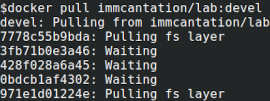
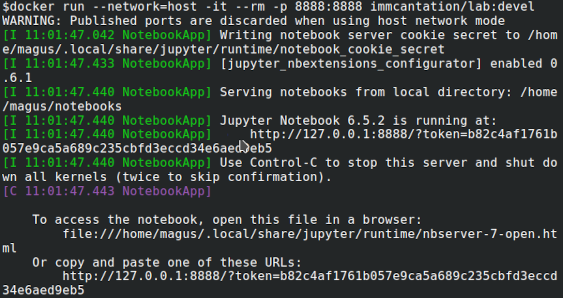
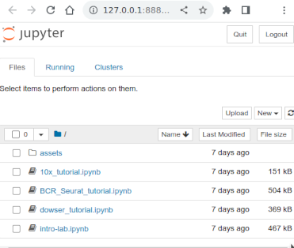

How to use the Immcantation Lab container
--------------------------------------------------------------------------------------------

[UNDER CONSTRUCTION]

Immacantation containers include Immcantation, dependencies,... For reproducibility, if possible,
always use a release version to analyze your data.

<tag> means a version. Release versions are in the form x.y.z.

Available tags: https://hub.docker.com/repository/docker/immcantation/suite/tags?page=1&ordering=last_updated

+---------------------------------------+-----------------------------------------------------------------------------------------+
| Name                                  | Contents                                                                                |
+=======================================+=========================================================================================+
| immcantation/suite:<tag>              | Relase <tag> Immcantation tools.                                                        |
+---------------------------------------+-----------------------------------------------------------------------------------------+
| immcantation/suite:devel              | The development versions of Immcantation tools.                                         |
+---------------------------------------+-----------------------------------------------------------------------------------------+
| immcantation/lab:<tag>                | immcantation/suite:<tag>, Jupyter Notebook, training notebooks, example data.           |
+---------------------------------------+-----------------------------------------------------------------------------------------+
| immcantation/lab:devel                | immcantation/suite:devel, Jupyter Notebook and traning notebooks.                       |
+---------------------------------------+-----------------------------------------------------------------------------------------+

Installation and use of the containers is described in :ref:`DockerIntro` and basic usage is described in :ref:`DockerGuide`.
In this section we focus on the Lab container and the notebooks.

Steps to obtain and use the Lab container and the tutorials
-------------------------------------------------------------------------------------------

1. Install Docker for your system

2. Get the container

.. parsed-literal::

    docker pull immcantation/lab:|docker-version|

3. Start the container

.. parsed-literal::
    docker run --network=host -it --rm -p 8888:8888 immcantation/lab:devel

Once the container is running, you will see in the terminal a message asking you to visit a url like http://<hostname>:8888/?token=<token>

Note: If you want to save the results locally in your computer, you need to bind the folder where you want to
save the results to (`<my-out-dir>`), and the results folder in the container. In the container, Jupyter Notebook uses
the default port 8888.

.. parsed-literal::
    # Note: change my-out-dir for the full path to the local directory where
    # you want to have the results saved to
    docker run --network=host -it --rm \\
    -v <my-out-dir>:/home/magus/notebooks/results:z \\
    -p 8888:8888 immcantation/lab:devel

4. Visit the url and open the notebook you want to use.

