# Single Cell V(D)J Analysis Tutorial

Tutorial outline:

-   [Overview](#overview)
-   [Getting started](#getting-started)
-   [Assign V, D, and J genes using
    IgBLAST](#assign-v-d-and-j-genes-using-igblast)
-   [Load libraries](#load-libraries)
-   [Load in and reformat the data](#load-in-and-reformat-the-data)
-   [Cloning thresholds](#identify-clonal-threshold) (automatically or
    manually)
-   [Define clonal groups](#define-clonal-groups)
-   [Create germlines](#create-germlines)
-   [Calculate V gene SHM frequency](#calculate-v-gene-shm-frequency)
    (in the heavy chain)
-   [Build and visualize trees](#build-and-visualize-trees)
-   [Analyze B cell migration, differentiation, and evolution over
    time](#analyze-b-cell-migration-differentiation-and-evolution-over-time)

## Overview

This tutorial is a basic walk-through for defining B cell clonal
families and building B cell lineage trees using [10x
Genomics](https://www.10xgenomics.com/products/single-cell-immune-profiling)
BCR (B cell receptor) sequencing data.

Knowledge of basic command line usage is assumed. Please check out the
individual documentation sites for the functions detailed in this
tutorial before using them on your own data.

-   For simplicity, this tutorial will use the [Immcantation Lab Docker
    image](https://hub.docker.com/repository/Docker/immcantation/lab)
    which contains R Markdown notebooks and all necessary software to
    run this code.
    -   You can download the current Docker image with
        `docker pull immcantation/lab:devel`
    -   For some operating systems, it may be necessary to use
        super-user privileges (sudo), and/or to have [Docker
        Desktop](https://hub.docker.com/editions/community/docker-ce-desktop-windows)
        running before entering the previous command.
    -   You can read more details about how to get and use the Docker
        container
        [here](https://immcantation.readthedocs.io/en/latest/docker/intro.html),
        including how to run tutorials such as this one.
-   It is also possible to install the packages being used separately.
    Instructions are available in each package’s documentation site. See
    Resources.

You may also reference [this
page](https://immcantation.readthedocs.io/en/stable/docker/pipelines.html)
for an example pipeline script to process 10x data with Immcantation’s
[changeo-10x](https://github.com/immcantation/immcantation/tree/master/pipelines/changeo-10x.sh)
example script.

Resources:

-   You can email <immcantation@googlegroups.com> with any questions or
    issues.
-   Documentation: <http://immcantation.org>
-   Package specific documentation:
    [pRESTO](https://presto.readthedocs.io/en/stable/),
    [Change-O](https://changeo.readthedocs.io/en/stable/),
    [Alakazam](https://alakazam.readthedocs.io/en/stable/),
    [SHazaM](https://shazam.readthedocs.io/en/stable/),
    [SCOPer](https://scoper.readthedocs.io/en/stable/), and
    [dowser](https://dowser.readthedocs.io/en/stable/).
-   Source code and bug reports:
    <https://github.com/immcantation/immcantation>
-   Docker image for this tutorial:
    <https://hub.docker.com/r/immcantation/lab>
-   Source code for Immcantation tutorials:
    <https://github.com/immcantation/immcantation/tree/master/training/>

## Getting started

10x BCR data and 10x GEX (gene expression) data can borrow information
from each other for an improved analysis. This tutorial demonstrates a
few approaches to integrating these data types along with examples on
how the new information can be used.

The example files used in this tutorial are subsamples of the original
10x scRNA-seq and BCR sequencing data from [Turner et
al. (2020)](https://www.nature.com/articles/s41586-020-2711-0) *Human
germinal centres engage memory and naive B cells after influenza
vaccination* Nature. 586, 127–132. The study consists of blood and lymph
node samples taken from a single patient at multiple time points
following influenza vaccination.

We extracted a subset (~3000 cells) of single cell GEX/BCR data of
ultrasound-guided fine needle aspiration (FNA) samples of lymph nodes
for subject P05. These 3000 cells were randomly divided into two
pseudo-subjects, ensuring that each subject has distinct clones while
maintaining a similar clone size distribution. The example data is
already in the container (`/home/magus/data/`). If you want to, you can
download it from Zenodo
.
We will use these files:

-   **filtered\_contig.fasta** and
    **filtered\_contig\_annotations.csv**. They are the direct Cell
    Ranger output files for one of the pseudo-subjects. We are going to
    use the Ig V(D)J sequences from this sample to show how to process
    V(D)J data using Immcantation.
-   **BCR\_data.tsv**: B-Cell Receptor Data. Adaptive Immune Receptor
    Repertoire (AIRR) tsv BCRs from two pseudo-subjects, already aligned
    to IMGT V, D, and J genes.
-   **GEX.data\_08112023.rds**: Gene Expression Data. This file contains
    a Seurat object with RNA-seq data already processed and annotated.
    Processing and annotation are not covered in this tutorial. You can
    learn more on these topics in Seurat’s documentation and tutorials:
    <https://satijalab.org/seurat/articles/pbmc3k_tutorial.html>

The R Markdown notebook with the code is also available in the container
(`/home/magus/notebooks/10x_tutorial.Rmd`).

## Assign V, D, and J genes using IgBLAST

To process 10x V(D)J data, a combination of `AssignGenes.py` and
`MakeDb.py` can be used to generate a TSV file compliant with the [AIRR
Community Rearrangement
schema](https://immcantation.readthedocs.io/en/stable/datastandards.html)
that incorporates annotation information provided by the Cell Ranger
pipeline. The files of **filtered\_contig.fasta** and
**filtered\_contig\_annotations.csv**, generated by `cellranger vdj`,
can be found in the *outs* directory.

Generate AIRR Rearrangement data from the 10x V(D)J FASTA files using
the steps below (the `\` just indicates a new line for visual clarity).

This step needs to be run in the command line after installing Change-O
and igblast, or within the immcantation docker container. There is
documentation on how to use the immcantation docker container on the
[Docker
container](https://immcantation.readthedocs.io/en/stable/docker/guide.html#invoking-a-shell-inside-the-container)
section of the immcantation website. If not using the docker container,
the path to the igblast executable will need to be updated to the local
installation path.

    # assign V, D, and J genes using IgBLAST
    AssignGenes.py igblast \
       -s /home/magus/data/filtered_contig.fasta \
       -b /usr/local/share/igblast \
       --organism human --loci ig --format blast \
       --outdir results --outname BCR_data_sequences

    # convert IgBLAST output to AIRR format
    MakeDb.py igblast \
       -i results/BCR_data_sequences_igblast.fmt7 \
       -s /home/magus/data/filtered_contig.fasta \
       -r /usr/local/share/germlines/imgt/human/vdj/ \
       --10x /home/magus/data/filtered_contig_annotations.csv --extended

    ls results

After running these commands, you should now have
**BCR\_data\_sequences\_igblast\_db-pass.tsv** and
**BCR\_data\_sequences\_igblast.fmt7** in your `results` directory.

-   For a full listing of what the flags mean, see the command line
    usage for [AssignGenes.py
    igblast](https://changeo.readthedocs.io/en/stable/tools/AssignGenes.html#assigngenes-py-igblast)
    and [MakeDb.py
    igblast](https://changeo.readthedocs.io/en/stable/tools/MakeDb.html#makedb-py-igblast).
    You can also read our [“Using
    IgBLAST”](https://changeo.readthedocs.io/en/stable/examples/igblast.html)
    which contains both commands.
-   The `--10x filtered_contig_annotations.csv` specifies the path of
    the contig annotations file generated by `cellranger vdj`, which can
    be found in the *outs* directory.

Please note that:

-   **all\_contig.fasta** can be exchanged for
    **filtered\_contig.fasta**, and **all\_contig\_annotations.csv** can
    be exchanged for **filtered\_contig\_annotations.csv** to use the
    unfiltered cellranger data outputs.
-   The resulting tab-delimited table overwrites the V, D and J gene
    assignments generated by Cell Ranger and uses those generated by
    [IgBLAST](https://ncbi.github.io/igblast/) or
    [IMGT/HighV-QUEST](https://www.imgt.org/IMGTindex/IMGTHighV-QUEST.php)
    instead.
-   To process mouse data and/or TCR data, alter the `--organism` and
    `--loci` arguments to `AssignGenes.py` accordingly (e.g.,
    `--organism mouse`, `--loci tcr`) and use the appropriate V(D)J IMGT
    reference database (e.g., \*\*imgt\_mouse\_TR\*.fasta\*\*)

## Install and load libraries

Note that you might need to install several Bioconductor packages that
are dependencies for some of the R-based Immcantation packages with
`BiocManager`.

    package.check <- lapply(
      packages,
      FUN = function(x) {
        if (!require(x, character.only = TRUE)) {
          install.packages(x, dependencies = TRUE)
        }
      }
    )

    # check for ggtree, a Bioconductor package
    packages <- "ggtree"
    if (!require(packages, character.only = TRUE)) {
      if (!require("BiocManager", quietly = TRUE)) {
        install.packages("BiocManager")
      }
      BiocManager::install(packages)
    }

## Load libraries

    # load libraries
    suppressPackageStartupMessages(library(airr))
    suppressPackageStartupMessages(library(alakazam))
    suppressPackageStartupMessages(library(data.table))
    suppressPackageStartupMessages(library(dowser))
    suppressPackageStartupMessages(library(dplyr))
    suppressPackageStartupMessages(library(ggplot2))
    suppressPackageStartupMessages(library(scoper))
    suppressPackageStartupMessages(library(Seurat))
    suppressPackageStartupMessages(library(shazam))

    # Bioconductor package
    suppressPackageStartupMessages(library(ggtree))

## Load in and reformat the data

### Merge different samples

The preceding instructions outline the process of assigning V, D, and J
genes using IgBLAST for a single sample. In practice, each sample should
undergo individual processing following the same steps. To facilitate
the amalgamation of various samples for subsequent analysis, it is
necessary to augment the resulting table with a column labeled
`sample_id` (and possibly `subject_id`) for sample identification.
Furthermore, to ensure uniqueness across samples, sequence IDs and cell
barcodes may be modified by appending the sample ID to them. This step
has already been performed and the resulting table can be found under
`/home/magus/data/BCR_data.tsv`.

    # read in the data
    # specify the data types of non AIRR-C standard fields
    # we assign integer type to the *_length fields
    bcr_data <- airr::read_rearrangement(file.path("", "home", "magus", "data",
                                                   "BCR_data.tsv"),
                                         aux_types = c("v_germline_length" = "i",
                                                       "d_germline_length" = "i",
                                                       "j_germline_length" = "i",
                                                       "day" = "i"))

### Remove non-productive sequences

You may wish to subset your data to only productive sequences:

    # read in the data
    bcr_data <- bcr_data %>% dplyr::filter(productive)

    cat(paste("There are", nrow(bcr_data), "rows in the data.\n"))

    ## There are 6196 rows in the data.

    bcr_data %>% slice_sample(n = 5) # random examples

    ## # A tibble: 5 x 66
    ##   sequence_id                 sequence  rev_comp productive v_call d_call j_call
    ##   <chr>                       <chr>     <lgl>    <lgl>      <chr>  <chr>  <chr> 
    ## 1 TGGTTCCAGAATCTCC-1_contig_2 AGGAGTCA~ FALSE    TRUE       IGKV1~ <NA>   IGKJ1~
    ## 2 AACTCAGTCTTCGGTC-1_contig_2 TGGGGAGG~ FALSE    TRUE       IGKV1~ <NA>   IGKJ1~
    ## 3 TGAGGGACAGTACACT-1_contig_2 TGGGGACC~ FALSE    TRUE       IGHV1~ IGHD1~ IGHJ4~
    ## 4 CCTATTAAGACAGGCT-1_contig_1 GGGGAGGA~ FALSE    TRUE       IGKV3~ <NA>   IGKJ3~
    ## 5 AACGTTGGTACCAGTT-1_contig_2 AACCACAT~ FALSE    TRUE       IGHV1~ <NA>   IGHJ3~
    ## # i 59 more variables: sequence_alignment <chr>, germline_alignment <chr>,
    ## #   junction <chr>, junction_aa <chr>, v_cigar <chr>, d_cigar <chr>,
    ## #   j_cigar <chr>, vj_in_frame <lgl>, stop_codon <lgl>, v_sequence_start <int>,
    ## #   v_sequence_end <int>, v_germline_start <int>, v_germline_end <int>,
    ## #   np1_length <int>, d_sequence_start <int>, d_sequence_end <int>,
    ## #   d_germline_start <int>, d_germline_end <int>, np2_length <int>,
    ## #   j_sequence_start <int>, j_sequence_end <int>, j_germline_start <int>, ...

### Remove cells with multiple heavy chains

If your single cell data contains cells with multiple heavy chains, you
need to handle it before calling clones (B cells that descend from a
common naive B cell ancestor).

A simple solution is just to remove cells with multiple heavy chains
from the single cell data:

    # remove cells with multiple heavy chain
    multi_heavy <- table(dplyr::filter(bcr_data, locus == "IGH")$cell_id)
    multi_heavy_cells <- names(multi_heavy)[multi_heavy > 1]

    bcr_data <- dplyr::filter(bcr_data, !cell_id %in% multi_heavy_cells)
    cat(paste("There are", nrow(bcr_data),
              "rows in the data after filtering out cells with multiple heavy chains.\n"))

    ## There are 6180 rows in the data after filtering out cells with multiple heavy chains.

### Remove cells without heavy chains

Since most of the following analyses are based on heavy chains, we
remove cells with only light chains:

    # split cells by heavy and light chains
    heavy_cells <- dplyr::filter(bcr_data, locus == "IGH")$cell_id
    light_cells <- dplyr::filter(bcr_data, locus == "IGK" | locus == "IGL")$cell_id
    no_heavy_cells <- light_cells[which(!light_cells %in% heavy_cells)]

    bcr_data <- dplyr::filter(bcr_data, !cell_id %in% no_heavy_cells)
    cat(paste("There are", nrow(bcr_data), "rows in the data after filtering out
              cells without heavy chains."))

    ## There are 6180 rows in the data after filtering out
    ##           cells without heavy chains.

## Add cell type annotations

### Load gene expression Seurat object

We load the gene expression data Seurat object that has already been
pre-processed and the cell types (PBMCs) have been annotation following
the standard Seurat workflow.

    gex_db <- readRDS(file.path("", "home", "magus", "data",
                                "GEX.data_08112023.rds"))

Inspect the data:

    # Object summary
    # `print` can be used to obtain a general overview of the Seurat object
    # (number of features, number of samples, etc.)
    print(gex_db)

    ## An object of class Seurat 
    ## 19293 features across 3729 samples within 1 assay 
    ## Active assay: RNA (19293 features, 1721 variable features)
    ##  1 layer present: data
    ##  2 dimensional reductions calculated: pca, umap

`Idents` reports the cell ID and identities.

    # cell type annotations
    head(Idents(gex_db), 1)

    ## subject2_FNA_d60_1_Y1_GCGACCAGTTGGAGGT-1 
    ##                                      RMB 
    ## Levels: RMB ABC Naive PB GC DC T B NK Monocyte

### Standardize cell IDs

Both of the example datasets have been processed separately and use
slightly different cell identifiers. To consolidate the data into one
object, we need to standardize the cell identifiers. This step could be
different or even not necessary with other datasets.

    # make cell IDs in BCR match those in Seurat object
    bcr_data$cell_id_unique <- paste0(bcr_data$sample_id, "_", bcr_data$cell_id)
    bcr_data$cell_id_unique[1]

    ## [1] "subject2_FNA_d60_1_Y1_GCGACCAGTTGGAGGT-1"

In addition, the cells in both datasets are not presented in the same
order.

    # first id in the BCR data
    bcr_data$cell_id_unique[1]

    ## [1] "subject2_FNA_d60_1_Y1_GCGACCAGTTGGAGGT-1"

    # first id in the GEX data
    Cells(gex_db)[1]

    ## [1] "subject2_FNA_d60_1_Y1_GCGACCAGTTGGAGGT-1"

Having common cell identifiers, we can bring BCR data into the Seurat
object, or the GEX and annotation data from the Seurat object into the
BCR table, by matching `cell_id_unique`.

### Match GEX and BCR cell ids

We perform a `match` step to identify the GEX data in the BCR object.
The vector `match.index` will contain the positions of the BCR sequences
in the GEX data.

    # match indices to find the position of the BCR cells in the GEX data
    # different from finding the position of the GEX cells in the BCR data!
    match.index <- match(bcr_data$cell_id_unique, Cells(gex_db))

Some BCRs don’t have GEX information. This can happen, for example, if
the cell for which BCRs are covered didn’t pass the GEX processing and
quality control thresholds. The proportion of BCRs that do not have GEX
information is:

    # what proportion of BCRs don’t have GEX information?
    mean(is.na(match.index))

    ## [1] 0.08171521

#### Transfer cell type annotations into the BCR data

The GEX cell type annotations can be added as additional columns in the
BCR table:

    # add annotations to BCR data
    cell.annotation <- as.character(Idents(gex_db))
    bcr_data$gex_annotation <-
      unlist(lapply(match.index, function(x) {
        ifelse(is.na(x), NA, cell.annotation[x])
      }))

    bcr_data$gex_annotation[1:5]

    ## [1] "RMB" NA    "GC"  "GC"  "RMB"

#### Remove cells without GEX data

In this tutorial, we exclude cells from BCR data that lack corresponding
partners in GEX data before conducting clonal analysis. This step
deviates from the usual practice.

    # remove cells that didn’t match
    bcr_data <- dplyr::filter(bcr_data, !is.na(gex_annotation))

## Clonal analysis

**Goal:** Partition (cluster) sequences into clonally related lineages.
Each lineage is a group of sequences that came from the same original
naive cell.

Summary of the key steps:

-   *Determine clonal clustering threshold:* sequences which are under
    this cut-off are clonally related.
-   *Assign clonal groups:* add an annotation (`clone_id`) that can be
    used to identify a group of sequences that came from the same
    original naive cell.
-   *Reconstruct germline sequences:* figure out the germline sequence
    of the common ancestor, before mutations are introduced during
    clonal expansion and SMH.

### Identify clonal threshold

#### Manual

Hierarchical clustering is a widely used distance-based method for
identify clonally related sequences. An implementation of the
hierarchical clustering approach is provided via the
`hierarchicalClones` function in the
[SCOPer](https://scoper.readthedocs.io/en/stable/) R package.

It is important to determine an appropriate threshold for trimming the
hierarchical clustering into B cell clones before using this method. The
ideal threshold for separating clonal groups is the value that separates
the two modes of the nearest-neighbor distance distribution. The
nearest-neighbor distance distribution can be generated by using the
`distToNearest` function in the
[SHazaM](https://shazam.readthedocs.io/en/stable/) R package.

We define a clonal threshold only using the heavy chain locus, so we
need to filter the dataset for the “IGH” locus. Clonal groups should be
defined within one subject:

    dist_nearest <- distToNearest(dplyr::filter(bcr_data, locus == "IGH",
                                                subject_id == "subject1"))

    # generate Hamming distance histogram
    p1 <- ggplot(subset(dist_nearest, !is.na(dist_nearest)),
                 aes(x = dist_nearest)) +
            geom_histogram(color = "white", binwidth = 0.02) +
            labs(x = "Hamming distance", y = "Count") +
            scale_x_continuous(breaks = seq(0, 1, 0.1)) +
            theme_bw() +
            theme(axis.title = element_text(size = 18))

    plot(p1)

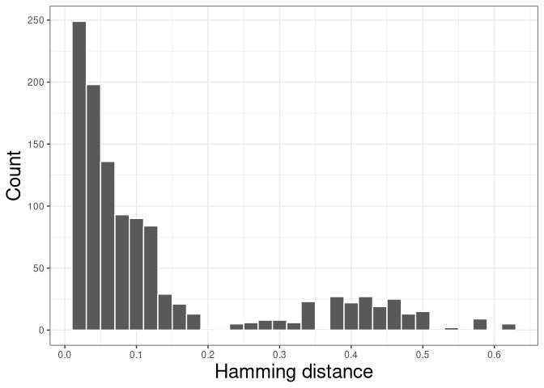

The resulting distribution is often bimodal, with the first mode
representing sequences with clonal relatives in the dataset and the
second mode representing singletons. We can inspect the plot of
nearest-neighbor distance distribution generated above to manually
select a threshold to separates the two modes of the nearest-neighbor
distance distribution.

This procedure should be repeated for all subjects in the dataset. A
mean or median of the identified threshold can then be used as the final
threshold for defining clones. We recommended to always inspect all the
distance histograms to verify that the threshold selected is reasonable
for all subjects.

For further details regarding inferring an appropriate threshold for the
hierarchical clustering method, see the [Distance to Nearest Neighbor
vignette](https://shazam.readthedocs.io/en/stable/vignettes/DistToNearest-Vignette/)
in the SHazaM package.

#### Automatic

The figure shows the distance-to-nearest distribution for the
repertoire. Typically, the distribution is bimodal. The first mode (on
the left) represents sequences that have at least one clonal relative in
the dataset, while the second mode (on the right) is representative of
the sequences that do not have any clonal relatives in the data
(sometimes called “singletons”). A reasonable threshold will separate
these two modes of the distribution.

The threshold itself can be also found using the automatic
`findThreshold` function. There are different ways to find the threshold
and details can also be found in the [Distance to Nearest Neighbor
vignette](https://shazam.readthedocs.io/en/stable/vignettes/DistToNearest-Vignette/)
in the shazam package.

A robust way that we recommend is to use the nearest-neighbor distance
of inter (between) clones as the background and select the threshold
based on the specificity of this background distribution.

    # find threshold for cloning automatically
    threshold_output <- shazam::findThreshold(dist_nearest$dist_nearest,
                                              method = "gmm", model = "gamma-norm",
                                              cutoff = "user", spc = 0.995)
    threshold <- threshold_output@threshold
    threshold

    ## [1] 0.2037778

    plot(threshold_output, binwidth = 0.02, silent = TRUE) +
      theme(axis.title = element_text(size = 18))

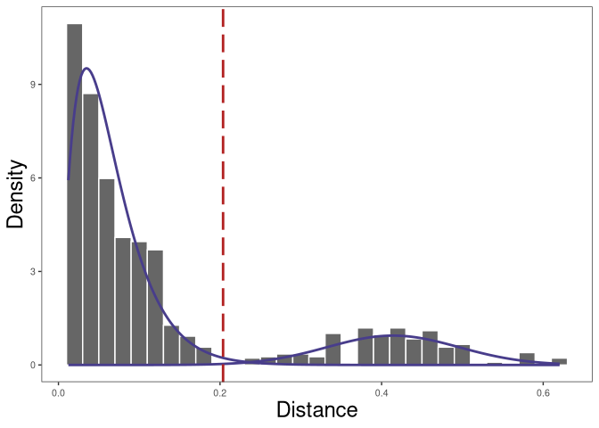

The nearest-neighbor distance distribution is not always bimodal. In
this case, if the data have multiple subjects, we can calculate the
nearest neighbor distances across subjects to initialize the Gaussian
fit parameters of the nearest-neighbor distance of inter (between)
clones distribution.

The nearest neighbor distances across subjects can be calculated by
specifying the parameter `cross` in the function `distToNearest`. And
then when we call function `findThreshold`, Gaussian fit parameters can
be initialized by setting parameter
`cross = dist_crossSubj$cross_dist_nearest`.

In the above data, there are two subjects. We will want to make make
sure that the cross subject `distToNearest` values are valid. To
calculate this do the following:

    # calculate cross subjects distribution of distance to nearest
    dist_crossSubj <- distToNearest(dplyr::filter(bcr_data, locus == "IGH"),
                                    nproc = 1, cross = "subject_id")

    # find threshold for cloning automatically and initialize the Gaussian fit
    # parameters of the nearest-neighbor

    # distance of inter (between) clones using cross subjects distribution of distance to nearest
    threshold_output <- shazam::findThreshold(dist_nearest$dist_nearest,
                                              method = "gmm", model = "gamma-norm",
                                              cross = dist_crossSubj$cross_dist_nearest,
                                              cutoff = "user", spc = 0.995)
    threshold_withcross <- threshold_output@threshold
    threshold_withcross

    ## [1] 0.2037778

    # plot the threshold along the density plot
    plot(threshold_output, binwidth = 0.02,
         cross = dist_crossSubj$cross_dist_nearest, silent = TRUE) +
      theme(axis.title = element_text(size = 18))

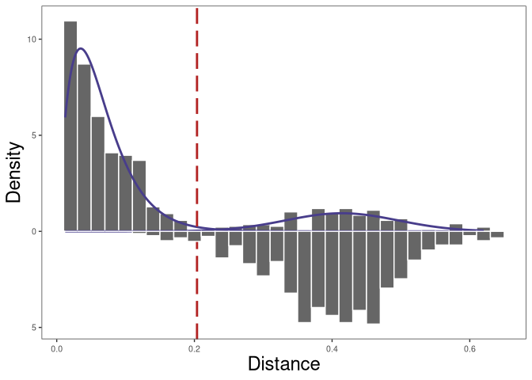

In the plot above, the top plot is the nearest-neighbor distance
distribution within Subj1, and the bottom plot is the nearest neighbor
distances across Subj1 and Subj2.

### Define clonal groups

Once a threshold is decided, we perform the clonal assignment. At the
end of this step, the BCR table will have an additional column
(`clone_id`) that provides an identifier for each sequence to indicate
which clone it belongs to (i.e., sequences that have the same identifier
are clonally-related). *Note that these identifiers are only unique to
the dataset used to carry out the clonal assignments.*

The `hierarchicalClones` function in `SCOPer` package can be used to
call clones using single cell mode:

    # call clones using hierarchicalClones
    results <- hierarchicalClones(bcr_data,
                                  cell_id = "cell_id_unique",
                                  threshold = threshold,
                                  only_heavy = TRUE, split_light = TRUE,
                                  summarize_clones = FALSE,
                                  fields = "subject_id")

    ## Running defineClonesScoper in single cell mode

`hierarchicalClones` clusters B receptor sequences based on junction
region sequence similarity within partitions that share the same V gene,
J gene, and junction length, thus allowing for ambiguous V or J gene
annotations. By setting it up the `cell_id` parameter,
`hierarchicalClones` will run in single cell mode with paired-chain
sequences. With `only_heavy = TRUE` and `split_light = TRUE`, grouping
should be done by using IGH only and inferred clones should be split by
the light/short chain (IGK and IGL) following heavy/long chain
clustering.

### Visualize clonal abundance

After calling clones, a clonal abundance distribution can be displayed.
To estimate the clonal abundance, we will select only the heavy chains:

    # calculate and plot the rank-abundance curve
    abund <- estimateAbundance(dplyr::filter(results, locus == "IGH"),
                               group = "sample_id", nboot = 100)

    abund_plot <- plot(abund, silent=T)
    abund_plot

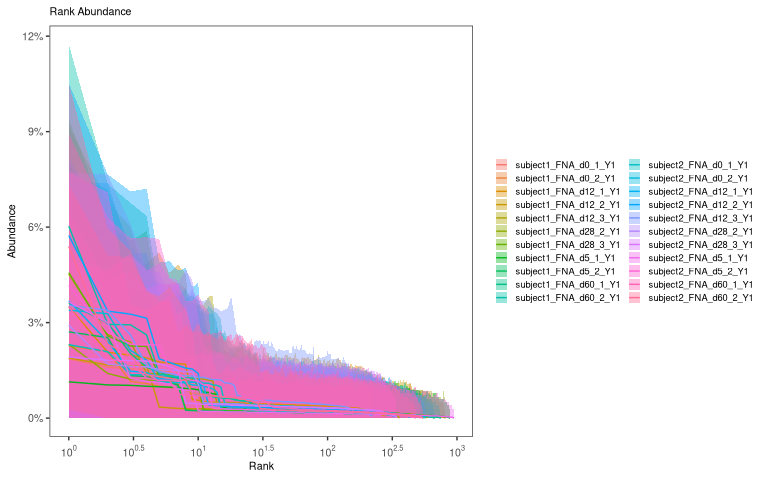

    # plot by sample_id
    abund_plot + facet_wrap("sample_id", ncol = 3)

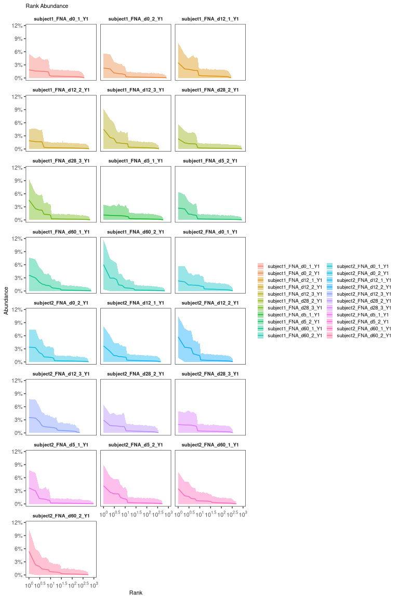 Most real
datasets, will have most clones of size 1 (one sequence). In this
tutorial, we processed data to remove most of singleton clone and we
don’t see the much higher peak at 1 that we would normally expect.

    # get clone sizes using dplyr functions
    clone_sizes <- countClones(dplyr::filter(results, locus == "IGH"),
                               groups = "sample_id")

    # plot cells per clone
    ggplot(clone_sizes, aes(x = seq_count)) +
      geom_bar() +
      facet_wrap("sample_id", ncol = 3) +
      labs(x = "Sequences per clone") +
      theme_bw()

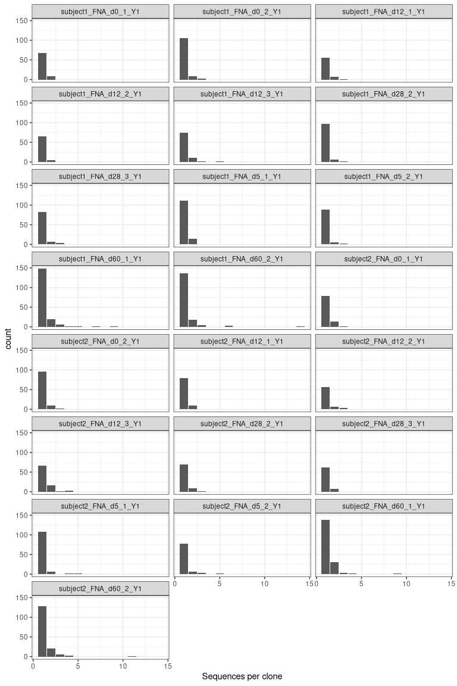

### Visualize clonal diversity

The clonal diversity can also be displayed. To estimate the clonal
diversity, we will also select only the heavy chains:

    # calculate and plot the rank-abundance curve
    div <- alphaDiversity(dplyr::filter(results, locus == "IGH"),
                          group = "sample_id", nboot = 100)

    plot(div, silent = TRUE) + facet_wrap("sample_id", ncol = 3)

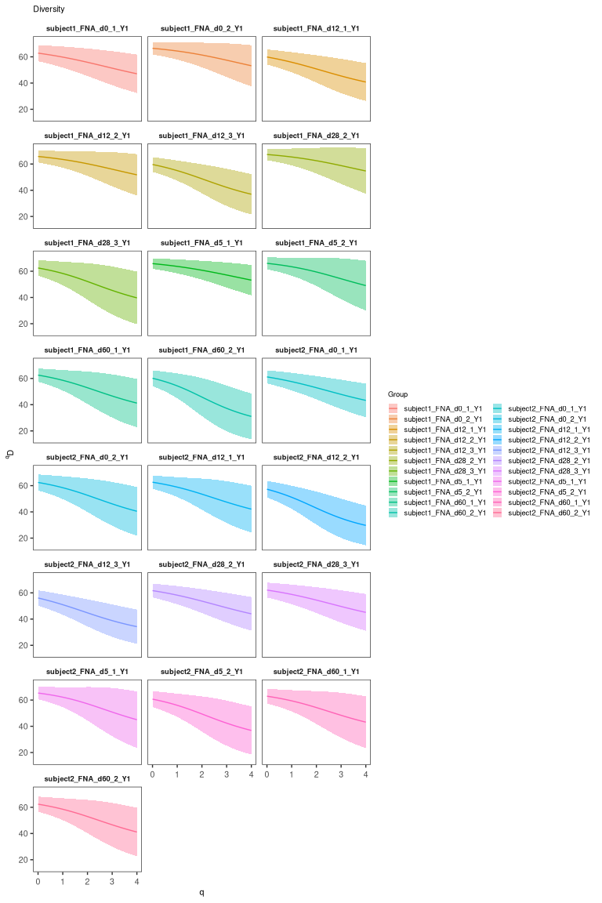

## Create germlines

The goal is to reconstruct the sequence of the unmutated ancestor of
each clone using a reference database of known alleles
([IMGT](http://www.imgt.org)), before building B cell lineage trees. Due
to the challenging nature of accurately inferring the D region and the
junction region for BCR sequences, this region is masked with `N`. Note
that occasionally errors are thrown for some clones - this is typical
and usually results in those clones being excluded.

In the example below, we read in the IMGT germline references from our
Docker container. If you’re using a local installation, you can download
the most up-to-date reference genome by cloning the Immcantation
repository and running the script:

    # Retrieve reference genome with the script fetch_imgtdb.sh.
    # It will create directories where it is run
    git clone https://github.com/immcantation/immcantation.git
    ./immcantation/scripts/fetch_imgtdb.sh 

And passing `"human/vdj/"` to the `readIMGT` function.

    # read in IMGT data if downloaded on your own (above)
    # and update `dir` to use the path to your `human/vdj` folder
    # references <- readIMGT(dir = "human/vdj/")

    # read in IMGT files in the Docker container
    references <- readIMGT(dir = "/usr/local/share/germlines/imgt/human/vdj")

    ## [1] "Read in 1194 from 17 fasta files"

    # reconstruct germlines
    results <- createGermlines(results, references, fields = "subject_id",
                               nproc = 1)

## Calculate V gene SHM frequency

Basic mutational load calculations can be performed by the function
`observedMutations` in the
[SHazaM](https://shazam.readthedocs.io/en/stable/) R package:

    # this is typically only done on heavy chains, but can also be done on light chains
    results_heavy <- dplyr::filter(results, locus == "IGH")

    # calculate SHM frequency in the V gene
    data_mut <-
      shazam::observedMutations(results_heavy,
                                sequenceColumn = "sequence_alignment",
                                germlineColumn = "germline_alignment_d_mask",
                                regionDefinition = IMGT_V,
                                frequency = TRUE,
                                combine = TRUE,
                                nproc = 1)

The plot below shows the distribution of median mutation frequency of
clones:

    # calculate the median mutation frequency of a clone
    mut_freq_clone <- data_mut %>%
                        dplyr::group_by(clone_id) %>%
                        dplyr::summarize(median_mut_freq = median(mu_freq))

    ggplot(mut_freq_clone, aes(median_mut_freq)) +
      geom_histogram(binwidth = 0.005) +
      theme_bw() + theme(axis.title = element_text(size = 18))

The plots below show the distribution of mutation frequency of cells by
subject, isotype and cell type respectively:

    # plotting mu_freq by subject_id
    ggplot(data_mut, aes(y = mu_freq, x = subject_id, fill = subject_id)) +
      geom_boxplot() +
      geom_jitter(width = 0.2, alpha = 0.3) +
      labs(x = "", y = "Mutation frequency", fill = "subject_id") +
      theme(axis.text.x = element_blank())

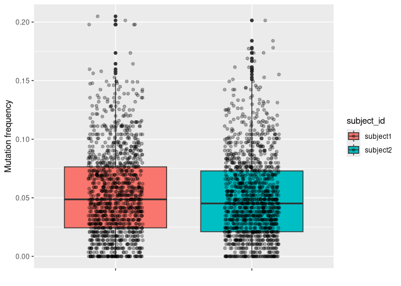

    # plotting mu_freq by isotype
    ggplot(data_mut, aes(y = mu_freq, x = c_gene, fill = c_gene)) +
      geom_boxplot() +
      geom_jitter(width = 0.2, alpha = 0.3) +
      labs(x = "", y = "Mutation frequency", fill = "Isotype") +
      theme(axis.text.x = element_blank())

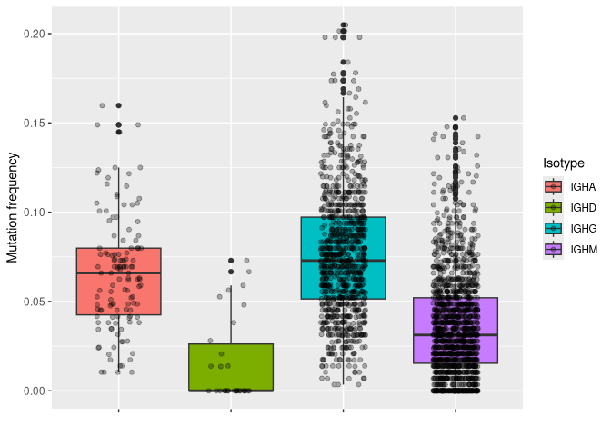

    # plotting mu_freq by cell type
    ggplot(data_mut, aes(y = mu_freq, x = gex_annotation, fill = gex_annotation)) +
      geom_boxplot() +
      geom_jitter(width = 0.2, alpha = 0.3) +
      labs(x = "", y = "Mutation frequency", fill = "Cell type") +
      theme(axis.text.x = element_blank())

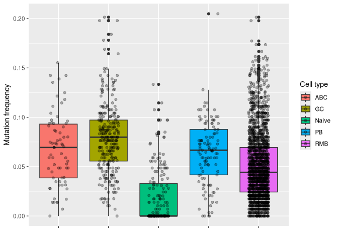

## Build and visualize trees

Steps:

1.  Formatting clones
2.  Tree building
3.  Visualize trees
4.  Reconstruct intermediate sequences

### Format clones with dowser

In the rearrangement table, each row corresponds to a sequence, and each
column is information about that sequence. We will create a new data
structure, where each row is a clonal cluster, and each column is
information about that clonal cluster. The function `formatClones`
performs this processing and has options that are relevant to determine
how the trees can be built and visualized. For example, `traits`
determines the columns from the rearrangement data that will be included
in the `clones` object, and will also be used to determine the
uniqueness of the sequences, so they are not collapsed.

    # make clone objects with aligned, processed sequences
    # collapse identical sequences unless differ by trait
    # add up duplicate_count column for collapsed sequences
    # store day, gex_annotation
    # discard clones with < 5 distinct sequences
    clones <-
      dowser::formatClones(results,
                           traits = c("day", "gex_annotation"),
                           num_fields = c("duplicate_count"), minseq = 5, nproc = 1)

    head(clones)

    ## # A tibble: 6 x 4
    ##   clone_id data       locus  seqs
    ##   <chr>    <list>     <chr> <int>
    ## 1 208      <airrClon> IGH      14
    ## 2 533      <airrClon> IGH      14
    ## 3 693      <airrClon> IGH      14
    ## 4 257      <airrClon> IGH      12
    ## 5 603      <airrClon> IGH      12
    ## 6 544      <airrClon> IGH      11

Additionally, if there is paired heavy and light chain data, you can
format the clones such that the paired data is used in building trees.
There is an additional step that occurs before the `formatClones` step
in this situation. In order for the trees to best use the addition of
light chain information, we will need to assign `clone_subgroups` using
dowser’s function `resolveLightChains`. This group cells within a clone
based on the light chain V and J gene and assign a subgroup to each
sequence. Then, in the `formatClones` step, specify `chain="HL"`.

    ## # A tibble: 6 x 4
    ##   clone_id data       locus    seqs
    ##   <chr>    <list>     <chr>   <int>
    ## 1 208      <airrClon> IGH,IGL    15
    ## 2 533      <airrClon> IGH,IGK    14
    ## 3 693      <airrClon> IGH,IGL    14
    ## 4 257      <airrClon> IGH,IGK    12
    ## 5 603      <airrClon> IGH,IGK    12
    ## 6 215      <airrClon> IGH,IGK    11

### Build trees with dowser

Dowser offers multiple ways to build B cell phylogenetic trees. These
differ by the method used to estimate tree topology and branch lengths
(e.g. maximum parsimony and maximum likelihood) and implementation
(IgPhyML, PHYLIP, RAxML, or R packages `ape` and `phangorn`). Each
method has pros and cons.

#### Maximum parsimony

This is the oldest method and very popular. It tries to minimize the
number of mutations from the germline to each of the tips. It can
produce misleading results when parallel mutations are present.

There are two options for maximum parsimony trees. The first uses
phangorn:

    trees <- getTrees(clones, nproc = 1)
    head(trees)

    ## # A tibble: 6 x 5
    ##   clone_id data       locus    seqs trees  
    ##   <chr>    <list>     <chr>   <int> <list> 
    ## 1 208      <airrClon> IGH,IGL    15 <phylo>
    ## 2 533      <airrClon> IGH,IGK    14 <phylo>
    ## 3 693      <airrClon> IGH,IGL    14 <phylo>
    ## 4 257      <airrClon> IGH,IGK    12 <phylo>
    ## 5 603      <airrClon> IGH,IGK    12 <phylo>
    ## 6 215      <airrClon> IGH,IGK    11 <phylo>

And the second uses dnapars (PHYLIP):

    # the executable path is the location of the executable in the Docker container
    trees <- getTrees(clones, build = "dnapars",
                      exec = "/usr/local/bin/dnapars", nproc = 1)

    head(trees)

    ## # A tibble: 6 x 5
    ##   clone_id data       locus    seqs trees  
    ##   <chr>    <list>     <chr>   <int> <list> 
    ## 1 208      <airrClon> IGH,IGL    15 <phylo>
    ## 2 533      <airrClon> IGH,IGK    14 <phylo>
    ## 3 693      <airrClon> IGH,IGL    14 <phylo>
    ## 4 257      <airrClon> IGH,IGK    12 <phylo>
    ## 5 603      <airrClon> IGH,IGK    12 <phylo>
    ## 6 215      <airrClon> IGH,IGK    11 <phylo>

#### Standard maximum likelihood trees

These methods model each sequence separately. Use a markov model of the
mutation process and try to find the tree, not the branch lengths, that
maximizes the likelihood of seen data.

There are several options for standard maximum likelihood trees. The
first uses pml (phangorn):

    trees <- getTrees(clones, build = "pml", nproc = 1)
    head(trees)

    ## # A tibble: 6 x 5
    ##   clone_id data       locus    seqs trees  
    ##   <chr>    <list>     <chr>   <int> <list> 
    ## 1 208      <airrClon> IGH,IGL    15 <phylo>
    ## 2 533      <airrClon> IGH,IGK    14 <phylo>
    ## 3 693      <airrClon> IGH,IGL    14 <phylo>
    ## 4 257      <airrClon> IGH,IGK    12 <phylo>
    ## 5 603      <airrClon> IGH,IGK    12 <phylo>
    ## 6 215      <airrClon> IGH,IGK    11 <phylo>

The second uses dnaml (PHYLIP):

    # the executable path is the location of the executable in the Docker container
    trees <- getTrees(clones, build = "dnaml",
                      exec = "/usr/local/bin/dnaml", nproc = 1)

And the third uses RAxML (RAxML-ng):

    # the executable path is the location of the executable in the Docker container
    trees <- getTrees(clones, build = "raxml",
                      exec = "/usr/local/bin/raxml-ng", nproc = 1)

#### B cell specific maximum likelihood

This is similar to the standard maximum likelihood, but incorporates SHM
specific mutation biases into the tree building:

    # B cell specific maximum likelihood with IgPhyML
    # the executable path is the location of the executable in the Docker container
    trees <- getTrees(clones, build = "igphyml",
                      exec = "/usr/local/share/igphyml/src/igphyml", nproc = 1)

In addition to standard and B cell specific maximum likelihood, dowser
offers partitioned maximum likelihood approaches for `RAxML` and
`IgPhyML`. This approach should only be used when there is paired heavy
and light chain data, not just heavy chain data because both methods
will partition on the heavy chain and light chains separately.

    # RAxML
    trees <- getTrees(clones, build = "raxml",
                      exec = "/usr/local/bin/raxml-ng",
                      partition = "scaled", nproc = 1)

    # IgPhML
    trees <- getTrees(clones, build = "igphyml",
                      exec = "/usr/local/share/igphyml/src/igphyml",
                      partition = "hl", nproc = 1)

### Plot trees with dowser and ggtree

Regardless of how you build trees, they are visualized in the same
manner with the `plotTrees` function. This will return a list of
`ggplot` objects in the same order as the input object. Here, we color
the tips by the `day` value because we specified that column in the
`formatClones` step.

Plot all of the trees:

    plots_all <- plotTrees(trees, tips = "day", tipsize = 2)

Plot the largest tree:

    plots_all[[1]]

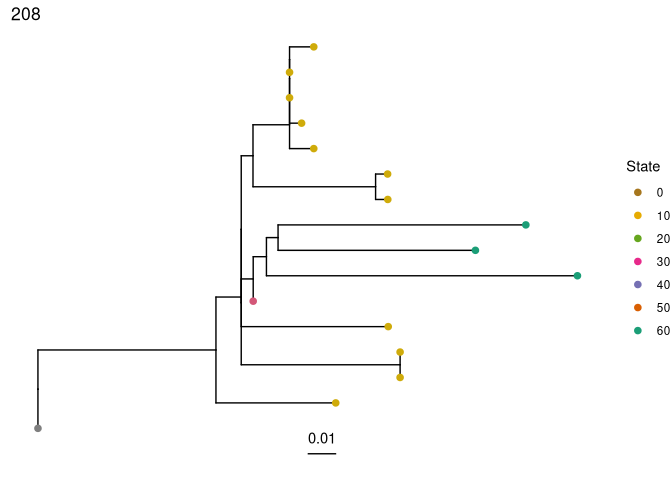

    # save a pdf of all trees
    dir.create("results/dowser_tutorial/", recursive = TRUE)

    ## Warning in dir.create("results/dowser_tutorial/", recursive = TRUE):
    ## 'results/dowser_tutorial' already exists

    treesToPDF(plots_all,
               file = file.path("results", "dowser_tutorial","final_data_trees.pdf"),
               nrow = 2, ncol = 2
              )

    ## png 
    ##   2

### Making more informative tree plots

Plot trees so that tips are colored by cell type, scaled by sample day,
and labelled by isotype:

    # Scale branches to mutations rather than mutations/site
    trees <- scaleBranches(trees)

    # Make fancy tree plot of second largest tree
    plots_all <- plotTrees(trees, scale = 5)[[2]] +
                   geom_tippoint(aes(color = gex_annotation, size = day)) +
                   geom_tiplab(aes(label = day), offset = 0.002)

    print(plots_all)

### Reconstruct intermediate sequences

Sequences of intermediate nodes are automatically reconstructed during
the tree build process. To retrieve them, first plot the node numbers
for each node. The function `collapseNodes` can help clean up the tree
plots.

Get the predicted intermediate sequence at an internal node in the
second largest tree (dots represent IMGT gaps):

    # collapse nodes with identical sequences
    trees <- collapseNodes(trees)

    # node_nums = TRUE labels each internal node
    plots_all <- plotTrees(trees, node_nums = TRUE, labelsize = 6, scale = 5)[[2]] +
                   geom_tippoint(aes(color = gex_annotation, size = day)) +
                   geom_tiplab(aes(label = day), offset = 0.002)

    print(plots_all)

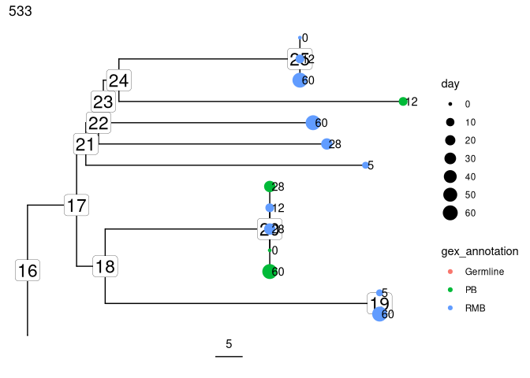

    # get sequence at node 5 for the second clone_id in trees
    getNodeSeq(trees, clone = trees$clone_id[2], node = 5)

    ##                                                                                                                                                                                                                                                                                                                                                                                                            IGH 
    ## "CAGGTTCAACTGGTGCAGTCTGGACCT...GAGGTGAAGATGCCTGGGGCCTCAGTGGAGGTCTCCTGCGAGGCTTCTGGTTACACCTTT............TCCACCTCTGGTATCAGCTGGGTGCGACAGGCCCCTGGACAAGGGCTTGAGTGGATGGGATGGATCAGCGATGAC......AATGGTTACACAACGTATGCAGAGAATTTCCAG...GGCAGAGTCACCATGACCACAGACACATCCACAAAAACAGCCTATATGGAGCTGAGGAGGCTGAGATCTGACGACACGGCCGTGTATTATTGTGCGAGAGATGGCCAATGGGGGAGCCTCACTGGGGCGAGTTTTGACTACTGGGGCCAGGGAACCCTGGTCACCGTCTCCTCAGNN" 
    ##                                                                                                                                                                                                                                                                                                                                                                                                            IGK 
    ##                         "GACATCCAGATGACCCAGTCTCCATCCTCCCTGTCTGCCTCTCTAGGCGACAGAGTCACCATCACTTGCCGGGCAAGTCAGAGCATT..................AGCACCTTTTTAAATTGGTATCAGCTGAAACCAGGGAAAGCCCCTAAACTCCTGATCTATGATGCC.....................TCCAGTTTGCAAAGTGGGGTCCCA...TCAAGGTTCAGTGGCAGTGGA......TCTGGGACAGATTTCACTCTCTCCATCAGAAATCTGCAACCTGAAGATTTTGCAACTTACTACTGTCAACAGAGTTACACTATCCCTCGGACGTTCGGCCAAGGGACCAAGGTGGAAATCAAACNN"

### Test for measurable evolution

Perform root-to-tip regression on each tree to detect if later-sampled
timepoints are more diverged from the germline:

    # correlation test
    trees <- correlationTest(trees, time = "day", nproc = 1)

    # remove trees with one timepoint, order by p value
    trees <- dplyr::filter(trees, !is.na(p))
    trees <- trees[order(trees$p), ]

    # coloring tips by sample day
    plots_time <- plotTrees(trees)
    plots_time <- lapply(plots_time, function(x) {
      x +
        geom_tippoint(aes(fill = day), shape = 21, size = 3) +
        scale_fill_distiller(palette = "RdYlBu")
    })

    dplyr::select(trees, clone_id, slope, correlation, p)

    ## # A tibble: 31 x 4
    ##    clone_id  slope correlation      p
    ##    <chr>     <dbl>       <dbl>  <dbl>
    ##  1 605      0.0453       0.711 0.0749
    ##  2 741      0.120        0.877 0.136 
    ##  3 541      0.277        0.827 0.195 
    ##  4 1181     0.707        0.578 0.228 
    ##  5 608      0.0828       0.328 0.229 
    ##  6 208      0.307        0.770 0.278 
    ##  7 195      0.169        0.301 0.279 
    ##  8 221      0.0537       0.384 0.294 
    ##  9 383      2.57         0.833 0.325 
    ## 10 210      0.197        0.488 0.357 
    ## # i 21 more rows

    print(plots_time[[1]])

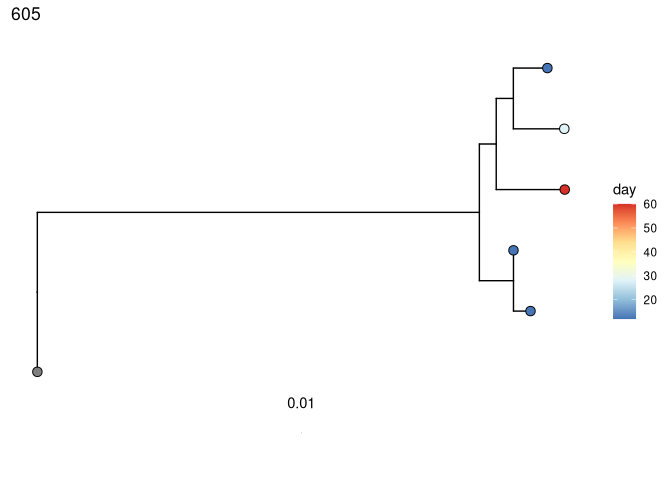

    # save all trees to a pdf file
    treesToPDF(plots_time, 
               file = file.path("results", "dowser_tutorial", "time_data_trees.pdf"))

    ## png 
    ##   2

## Analyze B cell migration, differentiation, and evolution over time

In addition to the functions for building and visualizing trees,
`dowser` also implements new techniques for analyzing B cell migration
and differentiation, as well as for detecting new B cell evolution over
time. These are more advanced topics detailed on the [dowser
website](https://dowser.readthedocs.io).

If you have data from **different tissues, B cell subtypes, and/or
isotypes** and want to use lineage trees to study the pattern of those
traits along lineage trees, check out the [discrete trait
vignette](https://dowser.readthedocs.io/en/latest/vignettes/Discrete-Trait-Vignette/).

If you have data from **multiple timepoints** from the same subject and
want to determine if B cell lineages are evolving over the sampled
interval, check out the [measurable evolution
vignette](https://dowser.readthedocs.io/en/latest/vignettes/Measurable-Evolution/).

For more advanced tree **visualization**, check out the [plotting trees
vignette](https://dowser.readthedocs.io/en/latest/vignettes/Plotting-Trees-Vignette/).
