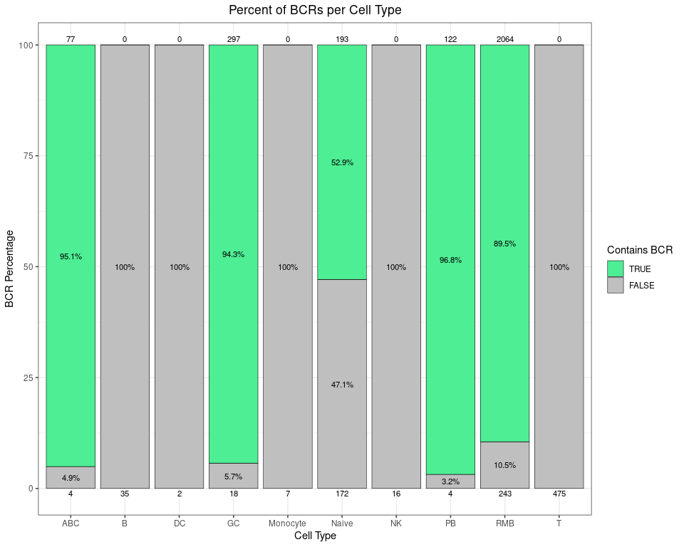
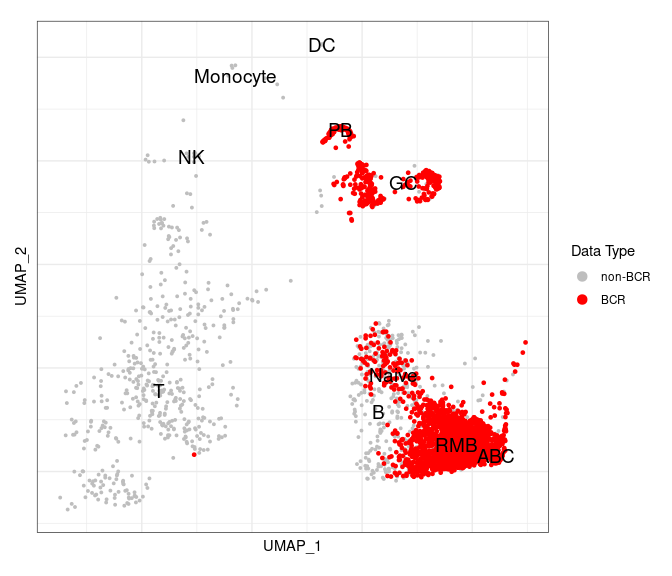
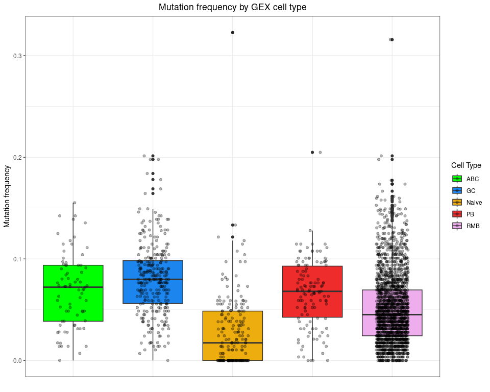
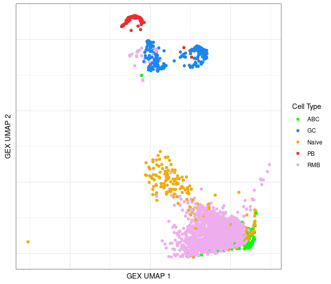
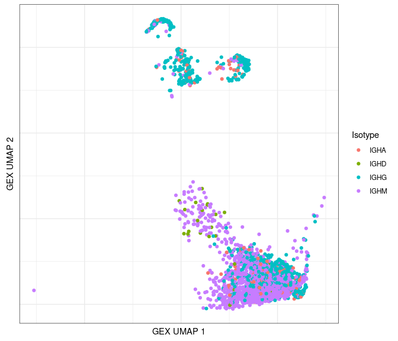
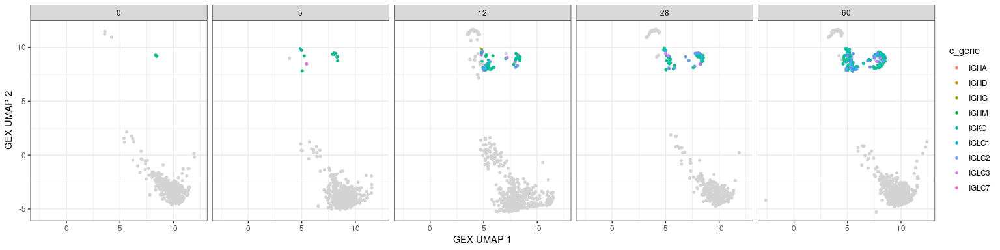
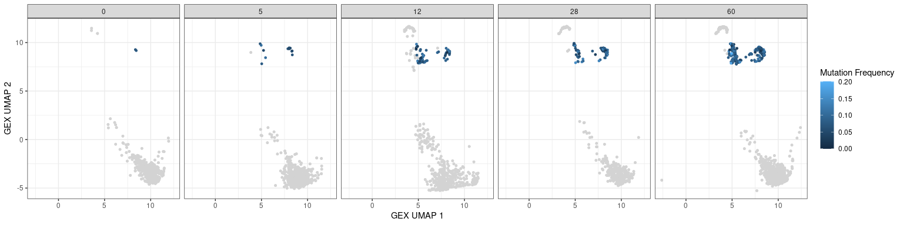

# Integration of BCR and GEX Data

## Introduction

BCR (B cell receptor) data and GEX (gene expression) data can borrow
information from each other for expanded analyses. This tutorial
demonstrates several approaches to integrating these data types along
with examples on how the new information can be used.

The example files used in this tutorial are subsamples of the original
10x scRNA-seq and BCR sequencing data from [Turner et
al. (2020)](https://www.nature.com/articles/s41586-020-2711-0) *Human
germinal centres engage memory and naive B cells after influenza
vaccination* Nature. 586, 127–132. The study consists of blood and lymph
node samples taken from a single patient at multiple time points
following influenza vaccination.

We extracted a subset (~3000 cells) of single cell GEX/BCR data of
ultrasound-guided fine needle aspiration (FNA) samples of lymph nodes
for subject P05. These 3000 cells were randomly divided into two
pseudo-subjects, ensuring that each subject has distinct clones while
maintaining a similar clone size distribution. The example data is
already in the container (`/home/magus/data/`). If you want to, you can
download it from Zenodo
.
We will use these files:

-   **BCR.data\_08112023.rds**: R dataframe object containing the
    single-cell BCR sequencing data.
-   **GEX.data\_08112023.rds**: Gene Expression Data. This file contains
    a Seurat object with RNA-seq data already processed and annotated.
    Processing and annotation are not covered in this tutorial. You can
    learn more on these topics in Seurat’s documentation and tutorials:
    <https://satijalab.org/seurat/articles/pbmc3k_tutorial.html>

Please note that you may have to alter the code in this tutorial if you
are not using 10x or prefer a different single-cell system other than
Seurat (such as
[SingleCellExperiment](https://bioconductor.org/packages/release/bioc/html/SingleCellExperiment.html)
or [scverse](https://scverse.org/)).

    # make sure the environment is clear
    rm(list = ls())

    # show some useful information
    cat(R.Version()$version.string,
        paste("Platform:", R.Version()$platform),
        paste("Running under:", sessionInfo()$running),
        sep = "\n")

    ## R version 4.3.2 (2023-10-31)
    ## Platform: x86_64-redhat-linux-gnu
    ## Running under: Fedora Linux 38 (Container Image)

    # cat("\n")

    # load the required packages
    packages <- c("dplyr", "ggplot2", "Seurat")
    for (n in seq_along(packages)) {
      suppressPackageStartupMessages(library(packages[n], character.only = TRUE))
      cat(paste0(packages[n], ": ", packageVersion(packages[n]), "\n"))
    }

    ## dplyr: 1.1.4
    ## ggplot2: 3.4.4
    ## Seurat: 5.0.1

    # set the data directory
    path_data <- file.path("..", "data") # change this to fit your own structure
    # so that the plots are consistent
    set.seed(42)

In this tutorial, we will integrate the BCR and GEX data by using the
cell barcodes. However, since cell barcodes can be duplicated in
multiple samples, **we suggest concatenating the sample ids with the
cell ids in order to ensure the uniqueness of cell barcodes across
multiple samples**. The sample ids can be added as a prefix to the
existing cell ids when the GEX data is being processed with a Seurat
command such as
`gex_obj <- RenameCells(object = gex_obj, add.cell.id = sample)`.

*Note: We have already added the sample ids to the cell ids as such in
the example GEX data. We have also renamed `c_call` to `c_gene`.*

    # read in the data
    gex_obj <- readRDS(file.path(path_data, "GEX.data_08112023.rds"))
    bcr_data <- readRDS(file.path(path_data, "BCR.data_08112023.rds"))

    # examine the GEX data
    gex_obj

    ## An object of class Seurat 
    ## 19293 features across 3729 samples within 1 assay 
    ## Active assay: RNA (19293 features, 1721 variable features)
    ##  1 layer present: data
    ##  2 dimensional reductions calculated: pca, umap

    names(gex_obj@commands) # the Seurat processing steps run on this data

    ## [1] "ScaleData.RNA"            "FindVariableFeatures.RNA"
    ## [3] "RunPCA.RNA"               "RunUMAP.RNA.pca"         
    ## [5] "FindNeighbors.RNA.pca"    "FindClusters"

    # make sure that the GEX object has the unique cell ids in the metadata
    names(gex_obj[[]])

    ##  [1] "orig.ident"     "nCount_RNA"     "nFeature_RNA"   "sampleType"    
    ##  [5] "day"            "percent.mt"     "cell_id"        "subject"       
    ##  [9] "sample"         "cell_id_unique"

    # gex_obj$cell_id_unique <- Cells(gex_obj) # assuming you made them unique already, see above

    # examine a few select columns of the BCR data
    bcr_data %>%
      ungroup %>%
      select(day, sample, cell_id, cell_id_unique, v_call, j_call, c_gene) %>%
      slice_sample(n = 5)

    ## # A tibble: 5 x 7
    ##     day sample                cell_id        cell_id_unique v_call j_call c_gene
    ##   <int> <chr>                 <chr>          <chr>          <chr>  <chr>  <chr> 
    ## 1     0 subject1_FNA_d0_2_Y1  ATTATCCAGACAT~ subject1_FNA_~ IGHV3~ IGHJ2~ IGHA  
    ## 2     5 subject1_FNA_d5_2_Y1  GACTGCGTCGTAG~ subject1_FNA_~ IGLV5~ IGLJ2~ IGLC2 
    ## 3     0 subject2_FNA_d0_1_Y1  AGCCTAAGTATAT~ subject2_FNA_~ IGHV1~ IGHJ6~ IGHG  
    ## 4    60 subject2_FNA_d60_1_Y1 CACATAGAGTACT~ subject2_FNA_~ IGKV4~ IGKJ1~ IGKC  
    ## 5    60 subject1_FNA_d60_1_Y1 CATCGAAAGGCAG~ subject1_FNA_~ IGHV1~ IGHJ5~ IGHG

The GEX data here has already had cell types annotated (using
characteristic marker genes). We suggest creating a column in the
object’s metadata to store these annotations
e.g. `gex_obj$annotated_clusters <- Idents(gex_obj)` (if the annotations
are the `active.ident`).

    gex_obj$annotated_clusters <- Idents(gex_obj)

Alphabetize the cell types within the GEX if desired:

    # nice for plotting
    gex_obj$annotated_clusters <- 
      factor(gex_obj$annotated_clusters,
             levels = sort(levels(gex_obj$annotated_clusters)))

## Integration of BCR data with the GEX Seurat object

The meta.data data slot in the Seurat object contains metadata for each
cell and is a good place to hold information from BCR data.

-   For example, we can indicate if a cell in the GEX data has a
    corresponding BCR or not by adding a column called `contains_bcr.`
-   If the column `contains_bcr` is valid, then we can add other useful
    BCR data information such as clonal lineage, mutation frequency,
    isotype, etc. to the metadata slot.
-   Note that you can only match information to one cell at a time in
    the Seurat object. This means that you cannot integrate both the
    heavy chain and the light chain information for a cell. We suggest
    only adding in the heavy chain information.
-   Make sure to check that all of your heavy chains had a `c_gene`
    assigned e.g. with `dplyr::filter(bcr_data, is.na(c_gene))`.

### Create the new metadata columns

    # match by using the unique cell ids
    new_meta_cols <- data.frame(cell_id_unique = Cells(gex_obj))

    # only add in the heavy chains (otherwise the row counts differ)
    bcr_data_selected <- dplyr::filter(bcr_data, locus == "IGH")

    # select columns from BCR data
    bcr_data_selected <- bcr_data_selected %>%
                           select(cell_id_unique, clone_id, mu_freq, c_gene) %>%
                           rename(Isotype = c_gene)

    # sort BCR data by cell id in GEX Seurat Object
    new_meta_cols <- left_join(new_meta_cols, bcr_data_selected,
                               by = "cell_id_unique")

    # integrate BCR data with the Seurat object
    for (colname in colnames(bcr_data_selected)) {
      gex_obj[[colname]] <- new_meta_cols[[colname]]
    }
    gex_obj$contains_bcr <- !is.na(gex_obj$clone_id)

    # examples of the new columns
    ncol_meta <- ncol(gex_obj[[]])
    gex_obj[[]][, (ncol_meta - 3):ncol_meta] %>%
      dplyr::filter(contains_bcr) %>% # let's look at the ones that match with BCRs
      slice_sample(n = 5) # row names = cell ids

    ##                                          clone_id    mu_freq Isotype
    ## subject2_FNA_d60_1_Y1_GGAAAGCGTATCTGCA-1    18599 0.10416667    IGHG
    ## subject1_FNA_d60_2_Y1_GGGTTGCGTCATACTG-1   129238 0.11458333    IGHA
    ## subject2_FNA_d60_1_Y1_TGAGCATTCCCTCTTT-1    49068 0.06872852    IGHM
    ## subject2_FNA_d60_1_Y1_TACTTGTTCGGTCCGA-1   116918 0.02083333    IGHM
    ## subject2_FNA_d0_1_Y1_AGTGGGACAGTCACTA-1     40973 0.03819444    IGHM
    ##                                          contains_bcr
    ## subject2_FNA_d60_1_Y1_GGAAAGCGTATCTGCA-1         TRUE
    ## subject1_FNA_d60_2_Y1_GGGTTGCGTCATACTG-1         TRUE
    ## subject2_FNA_d60_1_Y1_TGAGCATTCCCTCTTT-1         TRUE
    ## subject2_FNA_d60_1_Y1_TACTTGTTCGGTCCGA-1         TRUE
    ## subject2_FNA_d0_1_Y1_AGTGGGACAGTCACTA-1          TRUE

> **Note:** If you are also adding TCR information, be careful with the
> columns that you select as they may have the same names as BCR
> information. For example, if you had already added in a `v_call`
> column from BCR data, then adding the same column from TCR data will
> overwrite it. One possible solution to this is to use the columns as
> defined by the [AIRR
> standard](https://docs.airr-community.org/en/stable/index.html), but
> with a prefix added denoting the AIRR type e.g. “bcr\_”.\*

### Examine integrated information

    # you could fill by isotype to get even more info
    ggplot(gex_obj[[]], aes(x = contains_bcr, fill = Isotype)) +
      geom_bar(color = "black", linewidth = 0.2) +
      labs(title = "GEX Data with Matching BCRs",
           x = "Contains BCRs", y = "Count") +
      theme_bw() + theme(plot.title = element_text(hjust = 0.5))

Check the BCRS per annotated cell type:

    # calculate the percentage of each cell type that has BCRs
    pct_bcrs <- as.data.frame(table(gex_obj$contains_bcr,
                                    gex_obj$annotated_clusters)) %>% 
                  rename(contains_bcr = Var1, annotated_clusters = Var2,
                         Count = Freq) %>% 
                  as_tibble() %>%
                  group_by(annotated_clusters) %>%
                  mutate(Percent = 100 * Count / sum(Count),
                         contains_bcr = factor(contains_bcr,
                                               levels = c(TRUE, FALSE)))

    # make a stacked bar plot, with raw counts for each group on top/bottom
    # you could use scales::label_percent to make the %'s nicer
    # change the label size, percent rounding, colors, etc. as desired
    ggplot(data = pct_bcrs,
           aes(x = annotated_clusters, y = Percent, fill = contains_bcr)) +
      geom_bar(stat = "identity", color = "black", linewidth = 0.2) +
      labs(title = "Percent of BCRs per Cell Type",
           x = "Cell Type", y = "BCR Percentage", fill = "Contains BCR") +
      scale_fill_manual(values = c("TRUE" = "seagreen2", "FALSE" = "grey75"),
                        limits = force) +
      scale_y_continuous(expand = expansion(mult = 0.05)) +
      geom_text(aes(label = ifelse(Percent > 2, paste0(round(Percent, 1), "%"), NA),
                    group = contains_bcr),
                size = 3, position = position_stack(vjust = 0.5)) +
      # counts on top
      geom_text(mapping = aes(label = ifelse(contains_bcr == TRUE, Count, "")),
                position = position_stack(), vjust = -0.5,
                color = "black", size = 3) +
      # counts on bottom
      geom_text(mapping = aes(label = ifelse(contains_bcr == FALSE, Count, ""),
                              y = -1),
                color = "black", size = 3) +
      theme_bw() + theme(plot.title = element_text(hjust = 0.5))

    ## Warning: Removed 5 rows containing missing values (`geom_text()`).

### Highlight BCR cells in the GEX UMAP

After we integrate the BCR data into the Seurat object, we can highlight
BCR cells in a GEX UMAP plot to check if annotations based upon
biomarker gene expression are accurate or not.

    # have to set the idents
    Idents(gex_obj) <- "annotated_clusters" # should be annotated

    highlighted_cells <- Cells(gex_obj)[which(gex_obj$contains_bcr)]

    UMAPPlot(object = gex_obj, cells.highlight = highlighted_cells,
             label = TRUE, label.size = 5, pt.size = 0.7) +
      scale_color_manual(name = "Data Type",
                         labels = c("non-BCR", "BCR"),
                         values = c("gray", "red"))

    ## Scale for colour is already present.
    ## Adding another scale for colour, which will replace the existing scale.

As we can see, there is a very good correlation between the BCR cells
(in red) and the clusters labeled as B cells.

*UMAP labels explanation: DC = dendritic cells, GC B = germinal center B
cells, NK = natural killer cells, PB = plasmablasts, RMB = resting
memory B cells.*

## Integration of GEX cell annotations in the BCR data

The annotation information of B cells (such as sub-types of B cells and
their associated UMAP coordinates) identified by the GEX data can be
integrated into BCR data.

### Add GEX information to the BCR data

    # select columns from the GEX data
    gex_data_selected <-
      data.frame(cell_id_unique = gex_obj$cell_id_unique,
                 gex_umap_1 = gex_obj@reductions$umap@cell.embeddings[, 1],
                 gex_umap_2 = gex_obj@reductions$umap@cell.embeddings[, 2],
                 gex_annotation = gex_obj$annotated_clusters)

    # integrate GEX data with the BCR data
    bcr_gex_data <- left_join(bcr_data, gex_data_selected,
                              by = "cell_id_unique")

    # keep BCR cells has matched cells from GEX data (assuming everything was annotated)
    bcr_gex_data <- dplyr::filter(bcr_gex_data, !is.na(gex_annotation))

    # filter out the light chains?

    # examples of the new columns
    ncol_bcr_gex <- ncol(bcr_gex_data)
    bcr_gex_data[, (ncol_bcr_gex - 3):ncol_bcr_gex] %>% slice_sample(n = 5)

    ## # A tibble: 5 x 4
    ##   subject  gex_umap_1 gex_umap_2 gex_annotation
    ##   <chr>         <dbl>      <dbl> <fct>         
    ## 1 subject1       4.46     9.39   RMB           
    ## 2 subject1       9.01    -3.00   RMB           
    ## 3 subject1       5.96     0.0959 Naive         
    ## 4 subject2       7.29    -5.19   ABC           
    ## 5 subject2       8.81    -3.88   RMB

#### Plot mutation frequency by cell type

    ggplot(bcr_gex_data, aes(y = mu_freq, x = gex_annotation, fill = gex_annotation)) +
      geom_boxplot() +
      geom_jitter(width = 0.2, alpha = 0.3) +
      labs(x = "", y = "Mutation frequency", fill = "Cell type") +
      theme(axis.text.x = element_blank())

    ## Warning: Removed 2938 rows containing non-finite values (`stat_boxplot()`).

    ## Warning: Removed 2938 rows containing missing values (`geom_point()`).

### Identify GEX clusters in the BCR UMAP

Using the annotated information, we can lay out cells from the BCR data
in a UMAP plot color-coded by the B cell subtypes.

    # use custom colors for the cell types
    anno_cols <- c("ABC" = "green", "GC" = "dodgerblue2", "Naive" = "darkgoldenrod2",
                   "PB" = "firebrick2", "RMB" = "plum2")

    ggplot(data = bcr_gex_data,
           aes(x = gex_umap_1, y = gex_umap_2, color = gex_annotation)) +
      geom_point() +
      scale_colour_manual(name = "GEX Cell Types", values = anno_cols) +
      theme_bw()

Plot by isotype:

    # only plot the heavy chains
    ggplot(data = dplyr::filter(bcr_gex_data, locus == "IGH"),
           aes(x = gex_umap_1, y = gex_umap_2, color = c_gene)) +
      geom_point() +
      labs(color = "Isotype") +
      theme_bw()

### Other BCR features in UMAPs

Characteristics associated with the BCR can also be displayed in UMAP
plots. The plots below show the mutation frequencies and isotypes of GC
B cells at various time points.

    # base plot
    p <- ggplot(data = dplyr::filter(bcr_gex_data, gex_annotation != "GC"),
                aes(x = gex_umap_1, y = gex_umap_2)) +
           geom_point(color = "lightgray", size = 1) +
           theme_bw() + facet_wrap(~day, nrow = 1)

    # isotype information
    p + geom_point(data = dplyr::filter(bcr_gex_data, gex_annotation == "GC"),
                   aes(x = gex_umap_1, y = gex_umap_2, color = c_gene),
                   size = 1)

    # heavy only
    p + geom_point(data = dplyr::filter(bcr_gex_data, gex_annotation == "GC",
                                        locus == "IGH"),
                   aes(x = gex_umap_1, y = gex_umap_2, color = c_gene),
                   size = 1)

    # mutation frequency
    # heavy only
    p + geom_point(data = dplyr::filter(bcr_gex_data, gex_annotation == "GC",
                                        locus == "IGH"),
                   aes(x = gex_umap_1, y = gex_umap_2, color = mu_freq),
                   size = 1)

