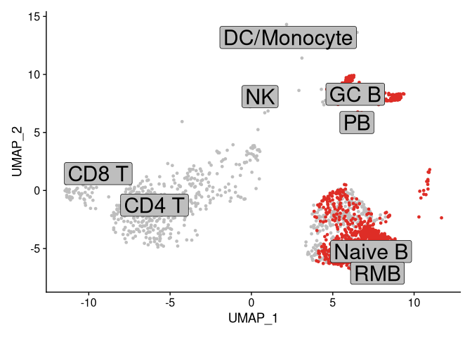
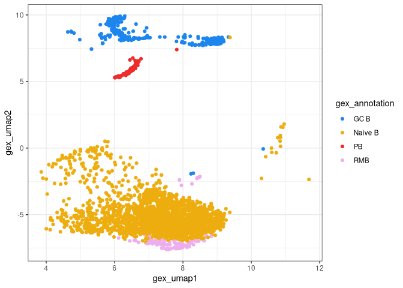
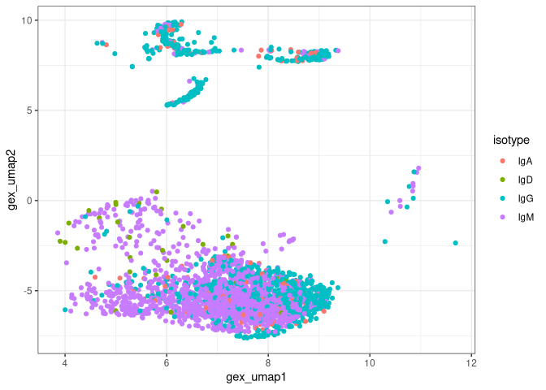
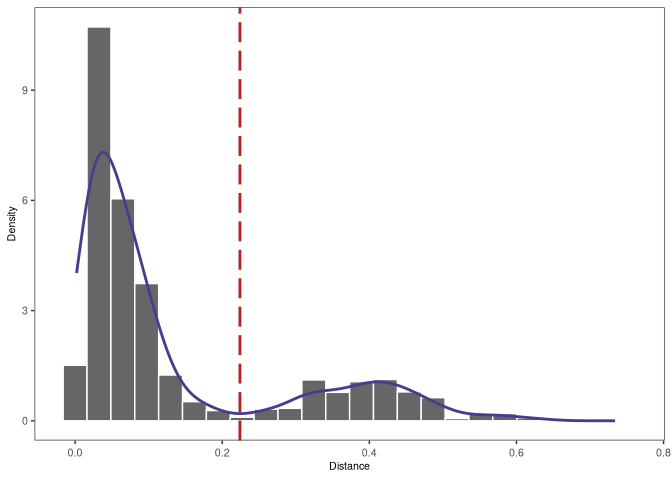
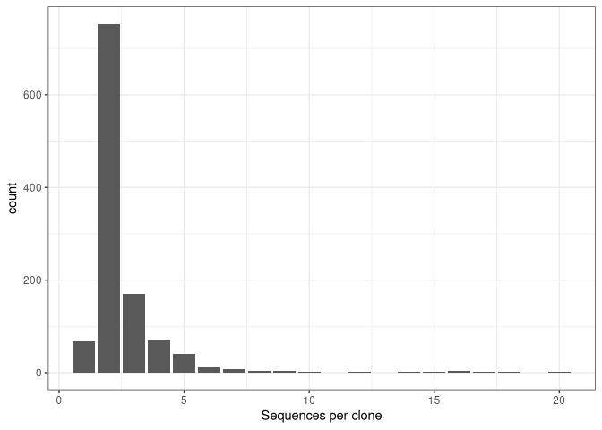
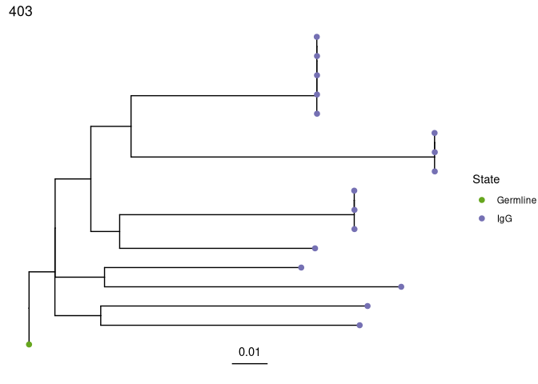
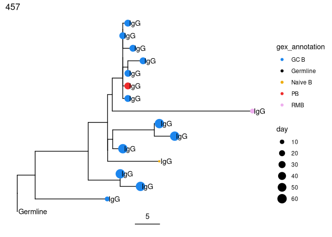
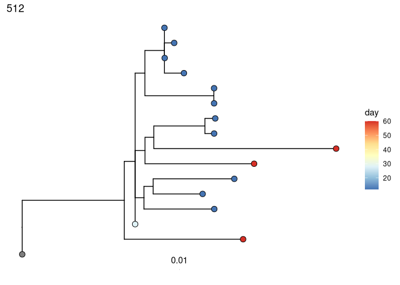

# Reconstruction and Analysis of B-cell Lineage Trees from Single Cell Data using Immcantation

Human B cells play a fundamental role in the adaptive immune response to
infection and vaccination, as well as the pathology of allergies and
many autoimmune diseases. Central to all of these processes is the fact
that B cells are an evolutionary system, and undergo rapid somatic
hypermutation and antigen-driven selection as part of the adaptive
immune response. The similarities between this B cell response and
evolution by natural selection have made phylogenetic methods a powerful
means of characterizing important processes, such as immunological
memory formation. Recent methodological work has led to the development
of phylogenetic methods that adjust for the unique features of B cell
evolution. Further, advances in single cell sequencing can now provide
an unprecedented resolution of information, including linked heavy and
light chain data, as well as the associated transcriptional states of
individual B cells. In this tutorial, we show how single cell
information can be integrated into B cell phylogenetic analysis using
the Immcantation suite (Immcantation.org).

**This tutorial covers:**

Beginning with processed single cell RNA-seq (scRNA-seq) + BCR data from
10X Genomics, we will show:

-   how cell type annotations can be associated with BCR sequences,
-   how clonal clusters can be identified, and
-   how B cell phylogenetic trees can be built and visualized using
    these data sources.

[Watch on YouTube](https://youtu.be/ZNOSQGh22X4) a recorded version of
this tutorial, that was presented at the [Adaptive Immune Receptor
Repertoires Webinar
Series](https://www.antibodysociety.org/learningcenter/adaptive-immune-receptor-repertoires-webinar-series/)
organized by the [AIRR Community](http://airr-community.org/) and [The
Antibody Society](https://www.antibodysociety.org/) (November 9, 2021).

## Resources

-   You can email <immcantation@googlegroups.com> with any questions or
    issues.
-   Documentation: <http://immcantation.org>
-   Source code and bug reports:
    <https://bitbucket.org/kleinstein/immcantation>
-   Docker image for this tutorial:
    <https://hub.docker.com/r/immcantation/lab>

## How to use the notebook

R Markdown documentation: <https://rmarkdown.rstudio.com/>

**Ctrl+Enter** will run the code in the selected cell.

## Inside this container

This container comes with software and example data that is ready to
use. The commands `versions report` and `builds report` show the
versions and dates respectively of the tools and data.

### Software versions

Use this command to list the software versions

    versions report

    ## immcantation: devel
    ## date: 2023.10.18
    ## 
    ## presto: 0.7.1.999
    ## changeo: 1.3.0
    ## alakazam: 1.3.0
    ## shazam: 1.2.0.999
    ## tigger: 1.1.0
    ## scoper: 1.3.0
    ## dowser: 1.3.0
    ## enchantr: 0.1.9
    ## prestor: 0.0.7
    ## rabhit: 0.2.5
    ## rdi: 1.0.0
    ## igphyml: 2.0.0
    ## seurat: 5.0.1
    ## 
    ## airr-py: 1.5.0
    ## airr-r: 1.5.0
    ## blast: 2.13.0
    ## cd-hit: 4.8.1
    ## igblast: 1.22.0
    ## muscle: 3.8.425
    ## phylip: 3.697
    ## raxml-ng: 1.2.0
    ## vsearch: 2.22.1

### Build versions

Use this command to list the date and changesets used during the image
build.

    builds report

    ## date: 2023-11-28 13:40:02 UTC
    ## immcantation: 4.4.0-186-g8d433f2938f1+
    ## presto: 0.7.1-18-g2140c55eefae
    ## changeo: 1.3.0-18-gfd3372709f6f
    ## alakazam: 1.2.0-79-g8ff706f26deb
    ## shazam: 1.1.2-65-gae5ba7939d2f
    ## tigger: b0ad8b4f4fb9
    ## rdi: d27b9067cab6+
    ## scoper: 1.2.0-65-gd3ee771d2b28
    ## dowser: 2.0.0-7-g77e5189ea75f
    ## prestor: 0.0.8+

### Example data used in the tutorial

-   `../data/bcr_phylo_tutorial/BCR.data.tsv`: B-Cell Receptor Data.
    Adaptive Immune Receptor Repertoire (AIRR) tsv BCRs already aligned
    to IMGT V, D, and J genes. This process is not covered in this
    tutorial. To learn more visit
    <https://immcantation.readthedocs.io/en/stable/tutorials/tutorials.html>
-   `../data/bcr_phylo_tutorial/GEX.data.rds`: Gene Expression Data.
    This file contains a Seurat object with RNA-seq data already
    processed and annotated. Processing and annotation are not covered
    in this tutorial. You can learn more on these topics in Seurat’s
    documentation and tutorials:
    <https://satijalab.org/seurat/articles/pbmc3k_tutorial.html>

These two files are subsamples of the original 10x scRNA-seq and BCR
sequencing data from Turner et al. (2020) *Human germinal centres engage
memory and naive B cells after influenza vaccination* Nature. 586,
127–132 [link](https://www.nature.com/articles/s41586-020-2711-0) The
study consists of blood and lymph node samples taken from a single
patient at multiple time points following influenza vaccination.

Note: The example files are available for download
[here](https://yale.box.com/shared/static/96y1rlu4ujerprxr53qxw87g7ybc1y99).

## Outline of tutorial

1.  Combining gene expression and BCR sequences.

2.  Identifying clonal clusters, reconstruct germlines.

3.  Building and visualizing trees.

4.  Tree analysis, detecting ongoing evolution.

## The R session

The is the working directory:

    getwd()

    ## [1] "/home/magus/notebooks"

The example files are expected to be in `../data/bcr_phylo_tutorial`.

    list.files("../data/bcr_phylo_tutorial")

    ## [1] "BCR.data.final.tsv" "BCR.data.tsv"       "GEX.data.rds"

## Read in data

The example files are expected to be in `../data/bcr_phylo_tutorial`. If
you are using a different path, update the code in the cell bellow
accordingly.

    suppressPackageStartupMessages(library(airr))
    suppressPackageStartupMessages(library(alakazam))
    suppressPackageStartupMessages(library(Seurat))

    # Read BCR data
    bcr_db <- airr::read_rearrangement("../data/bcr_phylo_tutorial/BCR.data.tsv",
                   aux_types=c("v_germline_length"="i",
                               "d_germline_length"="i",
                               "j_germline_length"="i",
                               "day"="i")
                )

    # Read GEX data
    gex_db <- readRDS("../data/bcr_phylo_tutorial/GEX.data.rds")

## Inspect the data objects

## The gene expression Seurat object

`print` can be used to obtain a general overview of the Seurat object
(number of features, number of samples…).

    library(Seurat)

    # Updates old Seurat objects to new structure.
    gex_db <- UpdateSeuratObject(gex_db)

    ## Validating object structure

    ## Updating object slots

    ## Ensuring keys are in the proper structure

    ## Updating matrix keys for DimReduc 'pca'

    ## Updating matrix keys for DimReduc 'umap'

    ## Warning: Assay RNA changing from Assay to Assay

    ## Warning: DimReduc pca changing from DimReduc to DimReduc

    ## Warning: DimReduc umap changing from DimReduc to DimReduc

    ## Ensuring keys are in the proper structure

    ## Ensuring feature names don't have underscores or pipes

    ## Updating slots in RNA

    ## Updating slots in pca

    ## Updating slots in umap

    ## Setting umap DimReduc to global

    ## Setting assay used for ScaleData.RNA to RNA

    ## Setting assay used for FindVariableFeatures.RNA to RNA

    ## Setting assay used for RunPCA.RNA to RNA

    ## Setting assay used for RunUMAP.RNA.pca to RNA

    ## Setting assay used for FindNeighbors.RNA.pca to RNA

    ## No assay information could be found for FindClusters

    ## Warning: Adding a command log without an assay associated with it

    ## Validating object structure for Assay 'RNA'

    ## Validating object structure for DimReduc 'pca'

    ## Validating object structure for DimReduc 'umap'

    ## Object representation is consistent with the most current Seurat version

    # Object summary
    print(gex_db)

    ## An object of class Seurat 
    ## 18989 features across 3865 samples within 1 assay 
    ## Active assay: RNA (18989 features, 1726 variable features)
    ##  1 layer present: data
    ##  2 dimensional reductions calculated: pca, umap

`Idents` reports the cell ID and identities. The first annotation in
this blood sample is a TCR.

    # Cell type annotations
    head(Idents(gex_db), 1)

    ## P05_FNA_12_Y1_TCACAAGTCAAACAAG 
    ##                          CD4 T 
    ## Levels: CD4 T Naive B CD8 T DC/Monocyte GC B NK RMB PB

## The immune repertoire data

The default file format for all functions in Immcantation is the AIRR-C
format as of release 4.0.0. The rearrangement data is stored in a table
where each row is a sequence, and each column an annotation fields. To
learn more about this format (including the valid field names and their
expected values), visit the [AIRR-C Rearrangement Schema
documentation](https://docs.airr-community.org/en/stable/datarep/rearrangements.html#fields).

    suppressPackageStartupMessages(library(dplyr))

    # object summary
    head(bcr_db, 1)

    ## # A tibble: 1 x 71
    ##   sequence_id                  sequence rev_comp productive v_call d_call j_call
    ##   <chr>                        <chr>    <lgl>    <lgl>      <chr>  <chr>  <chr> 
    ## 1 CCACTACCAGTATCTG-1_contig_2~ ATACTCT~ FALSE    TRUE       IGHV4~ IGHD3~ IGHJ3~
    ## # i 64 more variables: sequence_alignment <chr>, germline_alignment <chr>,
    ## #   junction <chr>, junction_aa <chr>, v_cigar <chr>, d_cigar <chr>,
    ## #   j_cigar <chr>, vj_in_frame <lgl>, stop_codon <lgl>, v_sequence_start <int>,
    ## #   v_sequence_end <int>, v_germline_start <int>, v_germline_end <int>,
    ## #   np1_length <int>, d_sequence_start <int>, d_sequence_end <int>,
    ## #   d_germline_start <int>, d_germline_end <int>, np2_length <int>,
    ## #   j_sequence_start <int>, j_sequence_end <int>, j_germline_start <int>, ...

It is possible to subset columns using regular `R` functions. The cell
below shows how to subset some fields of interest for the first sequence
in the table.

    # check out select columns
    head(select(bcr_db, cell_id, v_call, j_call, sample, day), 1)

    ## # A tibble: 1 x 5
    ##   cell_id            v_call      j_call   sample            day
    ##   <chr>              <chr>       <chr>    <chr>           <dbl>
    ## 1 CCACTACCAGTATCTG-1 IGHV4-59*01 IGHJ3*02 P05_FNA_3_12_Y1    12

## Standardize cell IDs

Both of the example datasets have been processed separately, and use
slightly different cell identifiers. To consolidate the data into one
object, we need to standardize the cell identifiers. This step could be
different, or not necessary at all, with other datasets.

    # Make cell IDs in BCR match those in Seurat Object
    bcr_db$cell_id_unique <- paste0(bcr_db$sample, "_", bcr_db$cell_id)
    bcr_db$cell_id_unique <- gsub("-1", "", bcr_db$cell_id_unique)
    bcr_db$cell_id_unique[1]

    ## [1] "P05_FNA_3_12_Y1_CCACTACCAGTATCTG"

## Different order

In addition, the cells in both datasets are not presented in the same
order.

    # First id in the BCR data
    bcr_db$cell_id_unique[1]

    ## [1] "P05_FNA_3_12_Y1_CCACTACCAGTATCTG"

    # First id in the GEX data
    Cells(gex_db)[1]

    ## [1] "P05_FNA_12_Y1_TCACAAGTCAAACAAG"

Having common cell identifiers, we will be able to bring BCR data into
the Seurat object, or the gene expression and annotation data from the
Seurat object into the BCR table, by matching `cell_id_unique`.

## Add BCR data to Seurat object

1.  Find the GEX cells in the BCR data
2.  Label GEX data with BCR data availability
3.  Plot UMAP

### Find the GEX cells in the BCR data

The vector `match.index` contains the position of the GEX cells in the
BCR data. If there is not match, the value will be `NA`.

    # match index to find the position of the GEX cells in the BCR data
    match.index <- match(Cells(gex_db), bcr_db$cell_id_unique)

    # In this data, not all cells are B cells
    # What proportion of cells don’t have BCRs?
    mean(is.na(match.index))

    ## [1] 0.2455369

    # Just to double check cell ids in the GEX match cells ids in BCR data
    # Should be 1
    mean(Cells(gex_db) == bcr_db$cell_id_unique[match.index], na.rm = TRUE)

    ## [1] 1

### Label GEX data with BCR data availability

With the matching indices, it is possible to label the GEX cells with
`TRUE` or `FALSE` to indicate whether there is BCR information available
for the cell, and visualize this information in the UMAP plot.

    # label whether BCR found in cell
    gex_db$contains_bcr <- !is.na(match.index)

### plot UMAP

We expect that for a large proportion of cells labelled as BCR, there
will be BCR sequencing data available, and these cells will be
highlighted in the UMAP plot.

    # List of cells with BCRs
    highlighted.cells <- Cells(gex_db)[which(gex_db$contains_bcr)]

    # Plot UMAP with BCR-containing cells
    DimPlot(object = gex_db, reduction = "umap",
            cells.highlight = highlighted.cells, label = TRUE, cols = "gray",
            pt.size = 1.0, label.size = 8, label.box = TRUE) + NoLegend()

## Add GEX data to BCR object

1.  Find the BCR cells in the GEX data
2.  Transfer GEX annotations into the BCR data
3.  Add UMAP coordinates to the BCR data
4.  Remove cells without GEX data
5.  Ensure information transferred from Seurat object

### Find the BCR cells in the GEX data

We repeat the `match` step, reversing the order. The vector
`match.index` will now contain the positions of the BCR sequences in the
GEX data.

    # Match indices to find the position of the BCR cells in the GEX data
    # Different from finding the position of the GEX cells in the BCR data!
    match.index <- match(bcr_db$cell_id_unique, Cells(gex_db))

Some BCRs don’t have GEX information. This can happen, for example, if
the cell for which BCR’s are covered didn’t pass the GEX processing and
quality controls thresholds.

    # What proportion of BCRs don’t have GEX information?
    mean(is.na(match.index))

    ## [1] 0.09243697

### Transfer GEX annotations into the BCR data

The GEX cell annotations can be added as additional columns in the BCR
table.

    # Add annotations to BCR data
    cell.annotation <- as.character(Idents(gex_db))
    bcr_db$gex_annotation <-
       unlist(lapply(match.index, function(x) {
          ifelse(is.na(x), NA, cell.annotation[x])
       }))
    bcr_db$gex_annotation[1:5]

    ## [1] NA        "Naive B" "Naive B" NA        "GC B"

### Add UMAP coordinates to BCR data

The UMAP coordinates can be added as additional columns in the BCR table
as well.

    # Add UMAP coordinates to BCR data
    umap1 <- gex_db@reductions$umap@cell.embeddings[, 1]
    umap2 <- gex_db@reductions$umap@cell.embeddings[, 2]
    bcr_db$gex_umap1 <-
       unlist(lapply(match.index, function(x) {
          ifelse(is.na(x), NA, umap1[x])
       }))
    bcr_db$gex_umap2 <-
       unlist(lapply(match.index, function(x) {
          ifelse(is.na(x), NA, umap2[x])
       }))

    bcr_db[1:5, ] %>% select(cell_id_unique, gex_umap1, gex_umap2, gex_annotation)

    ## # A tibble: 5 x 4
    ##   cell_id_unique                   gex_umap1 gex_umap2 gex_annotation
    ##   <chr>                                <dbl>     <dbl> <chr>         
    ## 1 P05_FNA_3_12_Y1_CCACTACCAGTATCTG     NA        NA    <NA>          
    ## 2 P05_FNA_5_Y1_GACTGCGCAAGCCTAT         7.96     -5.60 Naive B       
    ## 3 P05_FNA_60_Y1_GGCAATTAGACAGAGA        8.65     -4.55 Naive B       
    ## 4 P05_FNA_2_5_Y1_CGCGTTTCAGATGGGT      NA        NA    <NA>          
    ## 5 P05_FNA_2_60_Y1_AGTGTCACACTGTTAG      6.15      8.44 GC B

### Remove cells without GEX data

    # Remove cells that didn’t match
    bcr_db <- dplyr::filter(bcr_db, !is.na(gex_annotation))

### Ensure information transferred from Seurat object

The BCR data table now has the UMAP coordinates. We can reproduce
**part** of the UMAP plot with standard `ggplot` commands. This plot
will have a similar shape to the GEX UMAP, but will only show points for
which both GEX and BCR data is available.

    suppressPackageStartupMessages(library(ggplot2))

    # Set up color palette for annotations
    col_anno <- c("GC B" = "dodgerblue2", "PB" = "firebrick2", "ABC" = "seagreen",
                  "Naive B" = "darkgoldenrod2", "RMB" = "plum2",
                  "Germline" = "black")

    # Plot UMAP from bcr_db
    bcr_umap <- ggplot(bcr_db) +
                   geom_point(aes(x = gex_umap1, y = gex_umap2,
                                  color = gex_annotation)) +
                   scale_colour_manual(values = col_anno) +
                   theme_bw()
    bcr_umap

### Color the UMAP by isotype

The BCR data frame contains additional annotation fields, such us the
isotype, that can also be visualized on the UMAP. We expect that naive
cell express IgM. The germinal center and plasmablast cells, primarily
express IgG and IgA.

    # Plot isotype on UMAP
    ggplot(bcr_db) +
       geom_point(aes(x = gex_umap1, y = gex_umap2, color = isotype)) +
       theme_bw()

## Identifying clonal clusters

**Goal:** Partition (cluster) sequences into clonally related lineages.
Each lineage is a group of sequences that came from the same original
naive cell.

Summary of the key steps: - *Determine clonal clustering threshold:*
sequences which are under this cut-off are clonally related. - *Assign
clonal groups:* add an annotation (`clone_id`) that can be used to
identify a group of sequences that came from the same original naive
cell. - *Reconstruct germline sequences:* figure out the germline
sequence of the common ancestor, before mutations are introduced during
clonal expansion and SMH.

### Picking a threshold using shazam

*Gupta et al. (2015)*

We first split sequences into groups that share the same V and J gene
assignments and that have the same junction (or equivalently CDR3)
length. This is based on the assumption that members of a clone will
share all of these properties. `distToNearest` performs this grouping
step, then counts the number of mismatches in the junction region
between all pairs of sequences in each group and returns the smallest
non-zero value for each sequence. At the end of this step, a new column
(`dist_nearest`) which contains the distances to the closest
non-identical sequence in each group will be added to the BCR table.
`findThreshold` uses the distribution of distances calculated in the
previous step to determine an appropriate threshold for the dataset.
This can be done using either a `density` or `mixture` based method.

### distToNearest

    suppressPackageStartupMessages(library(shazam))

    # Find threshold using heavy chains
    dist_ham <- distToNearest(dplyr::filter(bcr_db, locus == "IGH"))
    head(dist_ham) %>% select(cell_id_unique, dist_nearest)

    ## # A tibble: 6 x 2
    ##   cell_id_unique                   dist_nearest
    ##   <chr>                                   <dbl>
    ## 1 P05_FNA_5_Y1_GACTGCGCAAGCCTAT          0.0667
    ## 2 P05_FNA_60_Y1_GGCAATTAGACAGAGA         0.0667
    ## 3 P05_FNA_2_60_Y1_AGTGTCACACTGTTAG       0.0196
    ## 4 P05_FNA_2_60_Y1_CGGGTCAGTCTGGAGA       0.0196
    ## 5 P05_FNA_60_Y1_ACTGATGTCCTAGAAC         0.0196
    ## 6 P05_FNA_60_Y1_CTGAAACAGTGAAGTT         0.0196

### findThreshold

The figure shows the distance-to-nearest distribution for the
repertoire. Typically, the distribution is bimodal. The first mode (on
the left) represents sequences that have at least one clonal relative in
the dataset, while the second mode (on the right) is representative of
the sequences that do not have any clonal relatives in the data
(sometimes called “singletons”). A reasonable threshold will separate
these two modes of the distribution.

    output <- findThreshold(dist_ham$dist_nearest)
    threshold <- output@threshold

    # Visualize the distance-to-nearest distribution and threshold
    plotDensityThreshold(output)

### Performing clustering using scoper

Once a threshold is decided, we perform the clonal assignment. At the
end of this step, the BCR table will have an additional column
(`clone_id`) that provides an identifier for each sequence to indicate
which clone it belongs to (i.e., sequences that have the same identifier
are clonally-related). *Note that these identifiers are only unique to
the dataset used to carry out the clonal assignments.*

Note: will print out “running in bulk mode” because the subsampled
example data has only heavy chains. [Other
options](https://scoper.readthedocs.io/en/stable/topics/hierarchicalClones/#single-cell-data)
available if light chains are included.

    suppressPackageStartupMessages(library(scoper))

    # Assign clonal clusters
    results <- hierarchicalClones(dist_ham, threshold = threshold)

    ## Running defineClonesScoper in bulk mode and only keep heavy chains

    results_db <- as.data.frame(results)

    head(results_db) %>% select(cell_id_unique, clone_id)

    ##                     cell_id_unique clone_id
    ## 1 P05_FNA_3_28_Y1_ATGCGATCAACTGCTA        1
    ## 2 P05_FNA_2_60_Y1_GCATGTAGTTATGTGC        1
    ## 3 P05_FNA_2_60_Y1_TACAGTGAGGCGACAT        1
    ## 4 P05_FNA_2_60_Y1_ACGGCCAGTCGCATAT        2
    ## 5   P05_FNA_12_Y1_CACACCTTCTACCAGA        2
    ## 6 P05_FNA_2_60_Y1_TTGGCAAAGAGTAAGG        3

### Visualize clone size distribution

Most real datasets, will have most clones of size 1 (one sequence). In
this tutorial, we processed data to remove most of singleton clone and
we don’t see the much higher peak at 1 that we would normally expect.

    # get clone sizes using dplyr functions
    clone_sizes <- countClones(results_db)

    # Plot cells per clone
    ggplot(clone_sizes, aes(x = seq_count)) +
       geom_bar() + theme_bw() +
       xlab("Sequences per clone")

## Reconstruct clonal germlines using dowser

The goal is to reconstruct the sequence of the unmutated ancestor of
each clone. We use a reference database of known alleles
([IMGT](http://www.imgt.org)). Because it is very difficult to
accurately infer the D region and the junction region for BCR sequences,
we mask this region with `N`.

Note: If you opted for a native installation to run this tutorial, you
can obtain reference germlines from IMGT with:

        git clone https://bitbucket.org/kleinstein/immcantation
        immcantation/scripts/fetch_imgtdb.sh

    suppressPackageStartupMessages(library(dowser))

    # read in IMGT data if downloaded on your own (above)
    # and update `dir` to use the path to your `human/vdj` folder
    # references = readIMGT(dir = "human/vdj/")

    # Read in IMGT data if using in Docker image
    references <- readIMGT(dir = "/usr/local/share/germlines/imgt/human/vdj")

    ## [1] "Read in 1173 from 17 fasta files"

    # Reconstruct germlines
    results_db <- suppressWarnings(createGermlines(results_db, references))

    # Check output column
    results_db$germline_alignment_d_mask[1]

    ## [1] "CAGGTGCAGCTGCAGGAGTCGGGCCCA...GGACTGGTGAAGCCTTCGGAGACCCTGTCCCTCACCTGCGCTGTCTCTGGTTACTCCATCAGC.........AGTGGTTACTACTGGGGCTGGATCCGGCAGCCCCCAGGGAAGGGGCTGGAGTGGATTGGGAGTATCTATCATAGT.........GGGAGCACCTACTACAACCCGTCCCTCAAG...AGTCGAGTCACCATATCAGTAGACACGTCCAAGAACCAGTTCTCCCTGAAGCTGAGCTCTGTGACCGCCGCAGACACGGCCGTGTATTACTGTGCGAGANNNNNNNNNNNNNNNNNNNNNNNNTTTGACTACTGGGGCCAGGGAACCCTGGTCACCGTCTCCTCAG"

# Building and visualizing trees

1.  Formatting clones
2.  Tree building
3.  Visualize trees
4.  Reconstruct intermediate sequences

## Formatting clones with dowser

In the rearrangement table, each row corresponds to a sequence, and each
column is information about that sequence. We will create a new data
structure, where each row is a clonal cluster, and each column is
information about that clonal cluster. The function `formatClones`
performs this processing and has options that are relevant to determine
how the trees can be built and visualized. For example, `traits`
determines the columns from the rearrangement data that will be included
in the `clones` object, and will also be used to determine the
uniqueness of the sequences, so they are not collapsed.

    # Make clone objects with aligned, processed sequences
    # collapse identical sequences unless differ by trait
    # add up duplicate_count column for collapsed sequences
    # store day, isotype, gex_annotation
    # discard clones with < 5 distinct sequences
    clones <- formatClones(results_db,
                           traits = c("day", "isotype", "gex_annotation"),
                           num_fields = c("duplicate_count"), minseq = 7)
    clones

    ## # A tibble: 25 x 4
    ##    clone_id data       locus  seqs
    ##    <chr>    <list>     <chr> <int>
    ##  1 403      <airrClon> IGH      16
    ##  2 457      <airrClon> IGH      15
    ##  3 512      <airrClon> IGH      15
    ##  4 823      <airrClon> IGH      15
    ##  5 12       <airrClon> IGH      13
    ##  6 539      <airrClon> IGH      13
    ##  7 446      <airrClon> IGH      12
    ##  8 1006     <airrClon> IGH       9
    ##  9 1125     <airrClon> IGH       9
    ## 10 442      <airrClon> IGH       9
    ## # i 15 more rows

## Tree building with dowser

Dowser offers multiple ways to build B cell phylogenetic trees. These
differ by the method used to estimate tree topology and branch lengths
(e.g. maximum parsimony and maximum likelihood) and implementation
(IgPhyML, PHYLIP, or R packages ape and phangorn). Each method has pros
and cons.

### Maximum parsimony

This is the oldest method and very popular. It tries to minimize the
number of mutations from the germline to each of the tips. It can
produce misleading results when parallel mutations are present.

    # Two options for maximum parsimony trees
    # 1. phangorn
    trees <- getTrees(clones)
    head(trees)

    ## # A tibble: 6 x 5
    ##   clone_id data       locus  seqs trees  
    ##   <chr>    <list>     <chr> <int> <list> 
    ## 1 403      <airrClon> IGH      16 <phylo>
    ## 2 457      <airrClon> IGH      15 <phylo>
    ## 3 512      <airrClon> IGH      15 <phylo>
    ## 4 823      <airrClon> IGH      15 <phylo>
    ## 5 12       <airrClon> IGH      13 <phylo>
    ## 6 539      <airrClon> IGH      13 <phylo>

    # 2. dnapars (PHYLIP)
    trees <- getTrees(clones, build = "dnapars", exec = "/usr/local/bin/dnapars")
    head(trees)

    ## # A tibble: 6 x 5
    ##   clone_id data       locus  seqs trees  
    ##   <chr>    <list>     <chr> <int> <list> 
    ## 1 403      <airrClon> IGH      16 <phylo>
    ## 2 457      <airrClon> IGH      15 <phylo>
    ## 3 512      <airrClon> IGH      15 <phylo>
    ## 4 823      <airrClon> IGH      15 <phylo>
    ## 5 12       <airrClon> IGH      13 <phylo>
    ## 6 539      <airrClon> IGH      13 <phylo>

### Standard maximum likelihood

These methods model each sequence separately. Use a markov model of the
mutation process and try to find the tree, not the branch lengths, that
maximizes the likelihood of seen data.

    # Two options for standard maximum likelihood trees
    # 1. pml (phangorn)
    trees <- getTrees(clones, build = "pml", sub_model = "GTR")
    head(trees)

    ## # A tibble: 6 x 5
    ##   clone_id data       locus  seqs trees  
    ##   <chr>    <list>     <chr> <int> <list> 
    ## 1 403      <airrClon> IGH      16 <phylo>
    ## 2 457      <airrClon> IGH      15 <phylo>
    ## 3 512      <airrClon> IGH      15 <phylo>
    ## 4 823      <airrClon> IGH      15 <phylo>
    ## 5 12       <airrClon> IGH      13 <phylo>
    ## 6 539      <airrClon> IGH      13 <phylo>

    # 2. dnaml (PHYLIP)
    trees <- getTrees(clones, build = "dnaml", exec = "/usr/local/bin/dnaml")
    head(trees)

    ## # A tibble: 6 x 5
    ##   clone_id data       locus  seqs trees  
    ##   <chr>    <list>     <chr> <int> <list> 
    ## 1 403      <airrClon> IGH      16 <phylo>
    ## 2 457      <airrClon> IGH      15 <phylo>
    ## 3 512      <airrClon> IGH      15 <phylo>
    ## 4 823      <airrClon> IGH      15 <phylo>
    ## 5 12       <airrClon> IGH      13 <phylo>
    ## 6 539      <airrClon> IGH      13 <phylo>

### Bcell specific maximum likelihood

Similar to the standard maximum likelihood, but incorporating SHM
specific mutation biases into the tree building.

    # B cell specific maximum likelihood with IgPhyML
    # This code is commented out because of long running time
    # trees = getTrees(clones, build="igphyml", exec="/usr/local/share/igphyml/src/igphyml", nproc=2)
    # head(trees)

## Plotting trees with dowser and ggtree

All tree building methods are plotted using the same method in dowser,
`plotTrees`.

    # Plot all trees
    plots <- plotTrees(trees, tips = "isotype", tipsize = 2)

    # Plot the largest tree
    plots[[1]]

    # Save PDF of all trees
    dir.create("results/dowser_tutorial/", recursive = TRUE)

    ## Warning in dir.create("results/dowser_tutorial/", recursive = TRUE):
    ## 'results/dowser_tutorial' already exists

    treesToPDF(plots,
               file = file.path("results/dowser_tutorial/final_data_trees.pdf"),
               nrow = 2, ncol = 2)

    ## png 
    ##   2

## More elaborate tree plots

Plot trees so that tips are colored by cell type, scaled by sample day,
and labelled by isotype.

    suppressPackageStartupMessages(library(ggtree))

    # Scale branches to mutations rather than mutations/site
    trees <- scaleBranches(trees)

    # Make fancy tree plot of second largest tree
    plotTrees(trees, scale = 5)[[2]] +
       geom_tippoint(aes(colour = gex_annotation, size = day)) +
       geom_tiplab(aes(label = isotype), offset = 0.002) +
       scale_colour_manual(values = col_anno)

    ## Warning: Removed 1 rows containing missing values (`geom_point_g_gtree()`).

## Reconstruct intermediate sequences

Get the predicted intermediate sequence at an internal node in the
second largest tree. Dots represent IMGT gaps.

    suppressPackageStartupMessages(library(ggtree))

    # Collapse nodes with identical sequences
    trees <- collapseNodes(trees)

    # node_nums=TRUE labels each internal node
    p <- plotTrees(trees, node_nums = TRUE, labelsize = 6, scale = 5)[[2]] +
           geom_tippoint(aes(colour = gex_annotation, size = day)) +
           geom_tiplab(aes(label = isotype), offset = 0.002) +
           scale_colour_manual(values = col_anno)
    print(p)

    ## Warning: Removed 1 rows containing missing values (`geom_point_g_gtree()`).

    # Get sequence at node 26 for the second clone_id in trees
    getSeq(trees, clone = trees$clone_id[2], node = 26)

    ## Warning in getSeq(trees, clone = trees$clone_id[2], node = 26): getSeq is
    ## depracated and will be removed. Use getNodeSeq instead.

    ##                                                                                                                                                                                                                                                                                                                                                                                                                           IGH 
    ## "CAGGTCCAGCTGGTGCAGTCTGGGGCT...GAAGTGAAGAAGCCTGGGTCCTCGGTGAGGGTCTCCTGCAAGGCCTCTGGAGGGACCTTC............AGCAGCTATGCAATCAGCTGGGTGCGACAGGCCCCTGGACAAGGTCTTGAGTGGATGGGAGGGGTCATCCCTATC......TATGGTACAGCACAGTATGCACAGAGGTTCCAG...GGCAGAGTCACGATTACCGCGGACGGATCCACGGGCACAGCCTACATGGAGCTGAGCAGCCTGAGATCTGAGGACACGGCCGTGTATTACTGTGCGAGAAGTCCTGACTATGGTTCGGGGACTTACCTTAACTACTTCTACTACTACTTGGCCTTCTGGGGCAAAGGGACCACGGTCACCGTCTCCTCAGSS"

## Test for measurable evolution

Perform root-to-tip regression on each tree to detect if later-sampled
timepoints are more diverged from the germline. See this reference for
more detail:

Hoehn, K. B. et al. (2021) Human B cell lineages engaged by germinal
centers following influenza vaccination are measurably evolving.
bioRxiv. <https://doi.org/10.1101/2021.01.06.425648>

    # Correlation test
    trees <- correlationTest(trees, time = "day")

    ## Warning in runCorrelationTest(clones$trees[[x]], clones$data[[x]],
    ## permutations, : Only one timepoint cluster in clone 12

    ## Warning in runCorrelationTest(clones$trees[[x]], clones$data[[x]],
    ## permutations, : Only one timepoint cluster in clone 539

    ## Warning in runCorrelationTest(clones$trees[[x]], clones$data[[x]],
    ## permutations, : Only one timepoint cluster in clone 1125

    ## Warning in runCorrelationTest(clones$trees[[x]], clones$data[[x]],
    ## permutations, : Only one timepoint cluster in clone 1097

    ## Warning in runCorrelationTest(clones$trees[[x]], clones$data[[x]],
    ## permutations, : Only one timepoint cluster in clone 1138

    ## Warning in runCorrelationTest(clones$trees[[x]], clones$data[[x]],
    ## permutations, : Only one timepoint cluster in clone 171

    # Remove trees with one timepoint, order by p value
    trees <- dplyr::filter(trees, !is.na(p))
    trees <- trees[order(trees$p), ]

    # Fancy tree plots coloring tips by sample day
    p <- plotTrees(trees)
    p <- lapply(p, function(x) {
                x +
                   geom_tippoint(aes(fill = day), shape = 21, size = 3) +
                   scale_fill_distiller(palette = "RdYlBu")})

    # Save all trees to a pdf file
    treesToPDF(p, file = "results/dowser_tutorial/time_data_trees.pdf")

    ## png 
    ##   2

    select(trees, clone_id, slope, correlation, p)

    ## # A tibble: 19 x 4
    ##    clone_id    slope correlation      p
    ##    <chr>       <dbl>       <dbl>  <dbl>
    ##  1 512       0.159        0.642  0.0430
    ##  2 988       0.278        0.878  0.0539
    ##  3 553       0.344        0.952  0.0749
    ##  4 446       0.117        0.350  0.219 
    ##  5 950       0.00673      0.0484 0.374 
    ##  6 912       0.586        0.599  0.413 
    ##  7 999       0.108        0.242  0.473 
    ##  8 604       0.0453       0.458  0.513 
    ##  9 403      -0.00224     -0.0109 0.521 
    ## 10 1006     -0.00817     -0.0151 0.529 
    ## 11 669      -0.0613      -0.113  0.548 
    ## 12 457      -0.0546      -0.154  0.646 
    ## 13 1040     -0.0573      -0.242  0.711 
    ## 14 442      -0.937       -0.398  0.768 
    ## 15 823      -0.206       -0.376  0.905 
    ## 16 500      -0.103       -0.530  0.916 
    ## 17 493      -0.188       -0.709  0.963 
    ## 18 560      -0.00972     -0.213  1     
    ## 19 584      -0.194       -0.297  1

    print(p[[1]])

# References

## B cell phylo

Hoehn, K. B. et al. (2016) The diversity and molecular evolution of
B-cell receptors during infection. MBE.
<https://doi.org/10.1093/molbev/msw015>

Hoehn, K. B. et al. (2019) Repertoire-wide phylogenetic models of B cell
molecular evolution reveal evolutionary signatures of aging and
vaccination. PNAS 201906020.

Hoehn, K. B. et al. (2020) Phylogenetic analysis of migration,
differentiation, and class switching in B cells. bioRxiv.
<https://doi.org/10.1101/2020.05.30.124446>

Hoehn, K. B. et al. (2021) Human B cell lineages engaged by germinal
centers following influenza vaccination are measurably evolving.
bioRxiv. <https://doi.org/10.1101/2021.01.06.425648>

## BCR analysis

Gupta,N.T. et al. (2017) Hierarchical clustering can identify b cell
clones with high confidence in ig repertoire sequencing data. The
Journal of Immunology, 1601850.

Gupta,N.T. et al. (2015) Change-o: A toolkit for analyzing large-scale b
cell immunoglobulin repertoire sequencing data. Bioinformatics, 31,
3356–3358.

Nouri,N. and Kleinstein,S.H. (2018a) A spectral clustering-based method
for identifying clones from high-throughput b cell repertoire sequencing
data. Bioinformatics, 34, i341–i349.

Nouri,N. and Kleinstein,S.H. (2018b) Optimized threshold inference for
partitioning of clones from high-throughput b cell repertoire sequencing
data. Frontiers in immunology, 9.

Stern,J.N. et al. (2014) B cells populating the multiple sclerosis brain
mature in the draining cervical lymph nodes. Science translational
medicine, 6, 248ra107–248ra107.

Vander Heiden,J.A. et al. (2017) Dysregulation of b cell repertoire
formation in myasthenia gravis patients revealed through deep
sequencing. The Journal of Immunology, 1601415.

Yaari,G. et al. (2012) Quantifying selection in high-throughput
immunoglobulin sequencing data sets. Nucleic acids research, 40,
e134–e134.

Yaari,G. et al. (2013) Models of somatic hypermutation targeting and
substitution based on synonymous mutations from high-throughput
immunoglobulin sequencing data. Frontiers in immunology, 4, 358.
