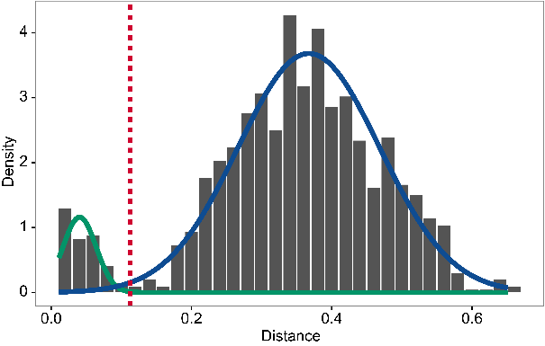

# Introduction to Bulk B Cell Repertoire Analysis using the Immcantation Framework


The field of high-throughput adaptive immune receptor repertoire sequencing (AIRR-seq) has experienced significant growth in recent years, but this growth has come with considerable complexity and variety in experimental design. These complexities, combined with the high germline and somatic diversity of immunoglobulin repertoires, present analytical challenges requiring specialized methodologies. In this tutorial, we present an example pipeline for processing bulk BCR data.

**This tutorial covers:**

* V(D)J gene annotation and novel polymorphism detection
* Inference of B cell clonal relationships
* Diversity analysis
* Mutational load profiling
* Modeling of somatic hypermutation (SHM) targeting
* Quantification of selection pressure

General workflow:  


## Resources

* You can email [immcantation@googlegroups.com](mailto:immcantation@googlegroups.com) with any questions or issues.
* Documentation: http://immcantation.org
* Source code and bug reports: https://bitbucket.org/kleinstein/
* Docker image for this tutorial: https://hub.docker.com/r/immcantation/lab
* Slides and example data: https://goo.gl/FpW3Sc
* The tutorial is available as a R Markdown notebook in the Immcantation repository: [intro-lab.Rmd](https://bitbucket.org/kleinstein/immcantation/src/master/training).

## How to use the notebook

R Markdown documentation: https://rmarkdown.rstudio.com/

**Ctrl+Enter** will run the code in the selected cell.

## Inside this container

The lab Docker image container comes with software, scripts, reference V(D)J germline genes and example data that is ready to use. The commands `versions report` and `builds report` show the versions and dates respectively of the tools and data.

### Software versions

Use this command to list the software versions:

```{bash}
versions report
```

### Build versions

Use this command to list the date and changesets used during the image build:

```{bash}
builds report
```

### Example data used in the tutorial

`../data/input.fasta`: Processed B cell receptor reads from one healthy donor (PGP1) 3 weeks after flu vaccination (*Laserson et al. (2014)*)

* As part of the processing, each sequence has been annotated with the isotype.
* This step is not a part of the tutorial, but you can learn how to do it [here](https://presto.readthedocs.io/en/latest/examples/primers.html#assigning-isotype-annotations-from-the-constant-region-sequence).

```{bash}
head ../data/input.fasta
```

### Reference germlines

The container has human and mouse reference V(D)J germline genes from IMGT (`/usr/local/share/germlines/imgt`) and the corresponding IgBLAST databases (`/usr/local/share/igblast`) for these germline repertoires. The training container also contains a modified version of these databases where allele IGHV3-20\*04 has been removed, to be rediscovered by TIgGER. The modified databases are in `/usr/local/share/germlines/imgt_test_tigger` and `/usr/local/share/igblast_test_tigger`.

```{bash}
ls /usr/local/share/germlines/imgt
```

```{bash}
ls /usr/local/share/igblast
```

## V(D)J gene annotation

The first step in the analysis of processed reads (`input.fasta`) is to annotate each read with its germline V(D)J gene alleles and to identify relevant sequence structure such as the CDR3 sequence. Immcantation provides tools to read the output of many popular V(D)J assignment tools, including [IMGT/HighV-QUEST](http://www.imgt.org/HighV-QUEST) and [IgBLAST](https://www.ncbi.nlm.nih.gov/igblast/). 

Here, we will use IgBLAST. Change-O provides a wrapper script (`AssignGenes.py`) to run IgBLAST using the reference V(D)J germline sequences in the container.

### A test with 200 sequences

It is often useful to prototype analysis pipelines using a small subset of sequences. For a quick test of Change-O's V(D)J assignment tool, use `SplitSeq.py` to extract 200 sequences from `input.fasta`, then assign the V(D)J genes with `AssignGenes.py`.

```{bash}
mkdir -p results/igblast
SplitSeq.py sample -n 200 --outdir results --fasta -s ../data/input.fasta
```

`AssignGenes.py` performs V(D)J assignment with IgBLAST.

* It requires the input sequences (`-s`) and a reference germlines database (`-b`). In this case, we use the germline database already available in the container.
* The organism is specified with `--organism` and the type of receptor with `--loci` (`ig` for the B cell receptor).
* Use `--format blast` to specify that the results should be in the `fmt7` format.
* Improved computational speed can be achieved by specifying the number of processors with `--nproc`. 

```{bash}
AssignGenes.py igblast -s results/input_sample1-n200.fasta \
-b /usr/local/share/igblast_test_tigger --organism human --loci ig \
--format blast --outdir results/igblast --nproc 8
```

### V(D)J assignment using all the data

To run the command on all of the data, modify it to change the input file (`-s`) to the full data set. *Please note that this may take some time to finish running.*

```{bash}
AssignGenes.py igblast -s ../data/input.fasta \
-b /usr/local/share/igblast_test_tigger --organism human --loci ig \
--format blast --outdir results/igblast --nproc 8
```

## Data standardization using Change-O

Once the V(D)J annotation is finished, the IgBLAST results are parsed into a [standardized format](https://changeo.readthedocs.io/en/stable/standard.html) suitable for downstream analysis. All tools in the Immcantation framework use this format, which allows for interoperability and provides flexibility when designing complex workflows.

In this example analysis, the `fmt7` results from IgBLAST are converted into the [AIRR](https://docs.airr-community.org/en/latest/datarep/rearrangements.html) format, a tabulated text file with one sequence per row. Columns provide the annotation for each sequence using standard column names as described here: https://docs.airr-community.org/en/latest/datarep/rearrangements.html.

### Generate a standardized database file

The command line tool `MakeDb.py igblast` requires the original input sequence fasta file (`-s`) that was passed to the V(D)J annotation tool, as well as the V(D)J annotation results (`-i`). The argument `--format airr` specifies that the results should be converted into the AIRR format. The path to the reference germlines is provided by `-r`.

```{bash}
mkdir -p results/changeo
MakeDb.py igblast \
-s ../data/input.fasta -i results/igblast/input_igblast.fmt7 \
--format airr \
-r /usr/local/share/germlines/imgt_test_tigger/human/vdj/ --outdir results/changeo \
--outname data
```

### Subset the data to include productive heavy chain sequences

We next filter the data from the previous step to include **only productive** sequences from the heavy chain. The determination of whether a sequence is productive (or not) is provided by the V(D)J annotation software.

`ParseDb.py select` finds the rows in the file `-d` for which the column `productive` (specified with `-f`) contains the values `T` or `TRUE` (specified by `-u`). The prefix `data_p` will be used in the name of the output file (specified by `--outname`).

```{bash}
ParseDb.py select -d results/changeo/data_db-pass.tsv \
-f productive -u T --outname data_p
```

Next, we filter the data to include **only heavy chain** sequences. 

`ParseDb.py select` finds the rows in the file `-d` from the previous step for which the column `v_call` (specified with `-f`) contains (pattern matching specified by `--regex`) the word `IGHV` (specified by `-u`). The prefix `data_ph` (standing for productive and heavy) will be used in the name of the output file (specified by `--outname`) to indicate that this file contains productive (p) heavy (h) chain sequence data.

```{bash}
ParseDb.py select -d results/changeo/data_p_parse-select.tsv \
-f v_call -u IGHV --regex --outname data_ph
```

## Set up the notebook to run R code

The following steps in the tutorial will use several R packages in the Immcantation framework. The next two lines of code are required to be able to use `R magic` and run `R` code in this Jupyter notebook.

```{python}
# R for Python
import rpy2.rinterface
%load_ext rpy2.ipython
```

## Load libraries and read in the data

After loading the libraries needed, the process is started by using `readChangeoDb` to read the tabulated data generated in the previous step.

```{r, message = FALSE}
library(airr)
library(alakazam)
library(dplyr)
library(ggplot2)
library(tigger)

dir.create(file.path("results", "tigger"))

db <- read_rearrangement(file.path("results", "changeo",
                                   "data_ph_parse-select.tsv"))
colnames(db) # show the column names in the database
```

### Remove sequences with many Ns using filterN 

Bulk BCR data in general includes ambiguous nucleotides (Ns), and we will remove those low-quality sequences with many Ns
```{r, message = FALSE}
source("filterN.R")

# Identify sequences with at least 20 Ns or continuous 15 Ns in the v_region
v_n_stretches_plot <- filterN(db, "sequence_alignment",
                                  start=1, end=312, 
                                  ignore.gaps=T,
                                  max.n=20, max.n.stretch = 15,
                                  label="v_region",
                                  plot=FALSE)

v_region_n_pass <- v_n_stretches_plot$df_pass
# number of sequences before filtering N
dim(db)
db = db[which(v_region_n_pass),]
# number of sequences after filtering N
dim(db)
```

## Genotyping and discovery of novel V gene alleles with TIgGER


V(D)J assignment is a key step in analyzing repertoires and is done by matching the sequences against a database of known V(D)J alleles. However, current databases are incomplete and this process will fail for sequences that utilize previously undetected alleles. Some assignments may also occur to genes which are not carried by the individual. The TIgGER R package infers subject-specific V genotypes (including novel alleles), then uses the results to improve the V gene annotations. 


`readIgFasta` loads the reference V germline genes that were used in the V(D)J assignment (in this case the sequences in the Immcantation container).

```{r}
ighv <- readIgFasta(file.path("", "usr", "local", "share", "germlines",
                              "imgt_test_tigger", "human", "vdj",
                              "imgt_human_IGHV.fasta"))
ighv[1] # show the first germline
```

#### Identify potentially novel V gene alleles

For each V gene allele, `findNovelAlleles` analyzes the sequences that were assigned the allele and evaluates the apparent mutation frequency at each position as a function of sequence-wide mutation counts. Positions that contain polymorphisms (rather than somatic hypermutations) will exhibit a high apparent mutation frequency even when the sequence-wide mutation count is low. 

In this example, TIgGER finds one novel V gene allele.

```{r}
nv <- findNovelAlleles(db, germline_db = ighv, nproc = 8) # find novel alleles
```

```{r}
selectNovel(nv) # show novel alleles
```

The function `plotNovel` helps visualize the supporting evidence for calling the novel V gene allele. The mutation frequency of the position that is predicted to contain a polymorphism is highlighted in red. In this case, the position contains a high number of apparent mutations for all sequence-wide mutation counts (top panel). 

By default, `findNovelAlleles` uses several additional filters to avoid false positive allele calls. For example, to avoid calling novel alleles resulting from clonally-related sequences, TIgGER requires that sequences perfectly matching the potential novel allele be found in sequences with a diverse set of J genes and a range of junction lengths. This can be observed in the bottom panel.

```{r}
plotNovel(db, selectNovel(nv)[1, ]) # visualize the novel allele(s)
```

### Genotyping, including novel V gene alleles

The next step is to infer the subject’s genotype and use this to improve the V gene calls. 

`inferGenotype` uses a frequency-based method to determine the genotype. For each V gene, it finds the minimum set of alleles that can explain a specified fraction of each gene’s calls. The most commonly observed allele of each gene is included in the genotype first, then the next most common allele is added until the desired fraction of sequence annotations can be explained. 

Immcantation also includes other methods for inferring subject-specific genotypes (`inferGenotypeBayesian`).

```{r}
gt <- inferGenotype(db, germline_db = ighv, novel = nv)

# save genotype inf .fasta format to be used later with CreateGermlines.py
gtseq <- genotypeFasta(gt, ighv, nv)
writeFasta(gtseq, file.path("results", "tigger", "v_genotype.fasta"))

gt %>% arrange(total) %>% slice(1:3) # show the first 3 rows
```

The individual's genotype can be visualized with `plotGenotype`. Each row is a gene, with colored cells indicating each of the alleles for that gene that are included in the inferred genotype.

```{r}
plotGenotype(gt) # genotyping including novel V gene alleles
```

### Reassign V gene allele annotations

Some of the V gene calls may use genes that are not part of the subject-specific genotype inferred by TIgGER. These gene calls can be corrected with `reassignAlleles`. Mistaken allele calls can arise, for example, from sequences which by chance have been mutated to look like another allele. `reassignAlleles` saves the corrected calls in a new column, `v_call_genotyped`. 

With `write_rearrangement` the updated data is saved as a tabulated file for use in the following steps.

```{r}
db <- reassignAlleles(db, gtseq)

# show some of the corrected gene calls
db %>%
  dplyr::filter(v_call != v_call_genotyped) %>%
  sample_n(3) %>%
  select(v_call, v_call_genotyped)
```

```{r}
write_rearrangement(db, file.path("results", "tigger", "data_ph_genotyped.tsv"))
```

## Clonal diversity analysis

**Goal:** Partition (cluster) sequences into clonally related lineages. Each lineage is a group of sequences that came from the same original naive cell.

Summary of the key steps:
* *Determine clonal clustering threshold:* sequences which are under this cut-off are clonally related.
* *Assign clonal groups:* add an annotation (`clone_id`) that can be used to identify a group of sequences that came from the same original naive cell.
* *Reconstruct germline sequences:* figure out the germline sequence of the common ancestor, before mutations are introduced during clonal expansion and SMH.
* *Analyze clonal diversity:* number and size of clones? any expanded clones?


### Clonal assignment using the CDR3 as a fingerprint

Clonal relationships can be inferred from sequencing data. Hierarchical clustering is a widely used method for identify clonally related sequences. This method requires a measure of distance between pairs of sequences and a choice of linkage to define the distance between groups of sequences. Since the result will be a tree, a threshold to cut the hierarchy into discrete clonal groups is also needed. 

The figure below shows a tree and the chosen threshold (red dotted line). Sequences which have a distance under this threshold are considered to be part of the same clone (i.e., clonally-related) whereas sequences which have distance above this threshold are considered to be part of independent clones (i.e., not clonally related). 


`shazam` provides methods to calculate the distance between sequences and find an appropriate distance threshold for each dataset (`distToNearest` and `findThreshold`). The threshold can be determined by analyzing the distance to the nearest distribution. This is the set of distances between each sequence and its closest non-identical neighbor. 

The figure below shows the distance-to-nearest distribution for a repertoire. Typically, the distribution is bimodal. The first mode (on the left) represents sequences that have at least one clonal relative in the dataset, while the second mode (on the right) is representative of the sequences that do not have any clonal relatives in the data (sometimes called "singletons"). A reasonable threshold will separate these two modes of the distribution. In this case, it is easy to manually determine a threshold as a value intermediate between the two modes. However, `findThreshold` can be used to automatically find the threshold.



### Setting the clonal distance threshold with SHazaM

We first split sequences into groups that share the same V and J gene assignments and that have the same junction (or equivalently CDR3) length. This is based on the assumption that members of a clone will share all of these properties. `distToNearest` performs this grouping step, then counts the number of mismatches in the junction region between all pairs of sequences in each group and returns the smallest non-zero value for each sequence. At the end of this step, a new column (`dist_nearest`) which contains the distances to the closest non-identical sequence in each group will be added to `db`.

`findThreshold` uses the distribution of distances calculated in the previous step to determine an appropriate threshold for the dataset. This can be done using either a `density` or `mixture` based method. The function `plot` can be used to visualize the distance-to-nearest distribution and the threshold.

```{r}

# get the distance to nearest neighbors
suppressPackageStartupMessages(library(shazam))
db <- distToNearest(db, model = "ham", normalize = "len",
                    vCallColumn = "v_call_genotyped", nproc = 4)

# determine the threshold
threshold <- findThreshold(db$dist_nearest, method = "density")
thr <- round(threshold@threshold, 2)
thr
```

```{r}
plot(threshold) # plot the distribution
```

#### Advanced method: Spectral-based clonal clustering (SCOPer)

In some datasets, the distance-to-nearest distribution may not be bimodal and `findThreshold` may fail to determine the distance threshold. In these cases, spectral clustering with an adaptive threshold to determine the local sequence neighborhood may be used. This can be done with functions from the [SCOPer R package](https://scoper.readthedocs.io/).

### Change-O: Clonal assignment

Once a threshold is decided, the command line tool `DefineClones.py` from Change-O performs the clonal assignment. There are some arguments that need to be specified:
* `--model`: the distance metric used in `distToNearest`
* `--norm`: type of normalization used in `distToNearest`
* `--dist`: the cut-off from `findThreshold`

At the end of this step, the output file will have an additional column (`clone_id`) that provides an identifier for each sequence to indicate which clone it belongs to (i.e., sequences that have the same identifier are clonally-related). *Note that these identifiers are only unique to the dataset used to carry out the clonal assignments.*

```{r, message = FALSE}
library(scoper)
# Clonal assignment using hierarchical clustering
results <- hierarchicalClones(db, threshold=thr)

# Plot a histogram of inter and intra clonal distances
plot(results, binwidth=0.02)
```

### TBD: See vignettes of Alakazam

Links to other types of analysis. For example, see below "Clonal Lineages". 

## Alakazam: lineage reconstruction

TBD: Update to Dowser version, which will involve the asignment of germlines as well (createGermlines())

B cell repertoires often consist of hundreds to thousands of separate clones. A clonal lineage recapitulates the ancestor-descendant relationships between clonally-related B cells and uncovering these relationships can provide insights into affinity maturation. The R package `alakazam` uses PHYLIP to reconstruct lineages following a maximum parsimony technique. PHYLIP is already installed in the Immcantation container.

Before performing lineage reconstruction, some preprocessing in needed. The code below shows an example of such preprocessing done for one of the largest clones in the example dataset. The function `makeChangeoClone` takes as input a data.frame with information for a clone (`db_clone`). `text_fields = "isotype"` specifies that annotation in the column `isotype` should be merged during duplicate removal. For example, if two duplicate sequences (defined by identical nucleotide composition) are found, and one is annotated as IGHM and the second one is an IGHG, then they will be "collapsed" into a single sequence that will have the `isotype` value "IGHM,IGHG". The preprocessing done by `makeChangeoClone` also includes masking gap positions and masking ragged ends.

```{r, message = FALSE}
# read in the file that passed cloning and germline creation
db <- read_rearrangement(file.path("results", "changeo", "data_ph_genotyped_germ-pass.tsv"))
```

```{r}
# Select one clone, the 2nd largest, just as an example
largest_clone <- countClones(db) %>%
                   slice(2) %>%
                   select(clone_id) %>% as.character()

# Subset db, get db with data for largest_clone
db_clone <- subset(db, clone_id == largest_clone)

# Build tree from a single clone
x <- makeChangeoClone(db_clone, v_call = "v_call_genotyped",
                      text_fields = "isotype")
```

Lineage reconstruction is done with `buildPhylipLineage`. This function uses the `dnapars` tool from PHYLIP, which in the container is located at `/usr/local/bin/dnapars`, to build the lineage, and returns an `igraph` object. This object can be quickly visualized with the command `plot`. It is possible to use `igraph` or other tools to resize nodes (e.g., by the underlying sequence count) or add colors (e.g., to indicate tissue location of B cell subsets) to help answer specific biological questions.

```{r}
# Lineage reconstruction
g <- buildPhylipLineage(x, phylip_exec = "/usr/local/bin/dnapars")
suppressPackageStartupMessages(library(igraph))
plot(g)
```

