# Introduction to Bulk B Cell Repertoire Analysis using the Immcantation Framework

The field of high-throughput adaptive immune receptor repertoire
sequencing (AIRR-seq) has experienced significant growth in recent
years, but this growth has come with considerable complexity and variety
in experimental design. These complexities, combined with the high
germline and somatic diversity of immunoglobulin repertoires, present
analytical challenges requiring specialized methodologies. In this
tutorial, we present an example pipeline for processing bulk BCR data.

-   The tutorial is available as a R Markdown notebook in the
    Immcantation repository:
    [intro-lab.Rmd](https://bitbucket.org/kleinstein/immcantation/src/master/training).

**This tutorial covers:**

-   V(D)J gene annotation and novel polymorphism detection
-   Inference of B cell clonal relationships
-   Diversity analysis
-   Lineage tree reconstruction
-   Mutational load profiling
-   Modeling of somatic hypermutation (SHM) targeting
-   Quantification of selection pressure

For installation of docker used in this tutorial, go to the link given
below:

<https://immcantation.readthedocs.io/en/latest/docker/intro.html>

### Software versions

Use this command to list the software versions:

    versions report

    ## immcantation: devel
    ## date: 2024.01.11
    ## 
    ## presto: 0.7.1.999
    ## changeo: 1.3.0
    ## alakazam: 1.3.0.999
    ## shazam: 1.2.0.999
    ## tigger: 1.1.0
    ## scoper: 1.3.0
    ## dowser: 2.1.0
    ## enchantr: 0.1.10.999
    ## prestor: 0.0.7
    ## piglet: None
    ## rabhit: 0.2.5
    ## rdi: 1.0.0
    ## igphyml: 2.0.0
    ## seurat: 5.0.1
    ## 
    ## airr-py: 1.5.0
    ## airr-r: 1.5.0
    ## blast: 2.13.0
    ## cd-hit: 4.8.1
    ## igblast: 1.22.0
    ## muscle: 3.8.425
    ## phylip: 3.697
    ## raxml-ng: 1.2.0
    ## vsearch: 2.22.1

### Build versions

Use this command to list the date and changesets used during the image
build:

    builds report

    ## date: 2024-01-21 18:39:41 UTC
    ## immcantation: 4.4.0-238-g27d75636645a+
    ## presto: 0.7.1-18-g2140c55eefae
    ## changeo: 1.3.0-20-g14bc8feffaaa
    ## alakazam: 1.2.0-85-gdfd2bff439c3+
    ## shazam: 1.1.2-67-gc1c6483baa5f+
    ## tigger: b0ad8b4f4fb9+
    ## rdi: d27b9067cab6+
    ## scoper: 1.2.0-65-gd3ee771d2b28+
    ## dowser: 2.0.0-19-g8c0d17173ab5+
    ## prestor: 0.0.8+

### Example data used in the tutorial

You can download the example data from Zenodo
.
It is alreday available in the container:
`/home/magus/data/input.fasta`: Processed B cell receptor reads from one
healthy donor (PGP1) 3 weeks after flu vaccination (*Laserson et
al. (2014)*)

-   As part of the processing, each sequence has been annotated with the
    isotype.
-   This step is not a part of the tutorial, but you can learn how to do
    it
    [here](https://presto.readthedocs.io/en/latest/examples/primers.html#assigning-isotype-annotations-from-the-constant-region-sequence).

<!-- -->

    head /home/magus/data/input.fasta

    ## >seq1|ISOTYPE=IGHM
    ## nnnnnnnnnnnnnnnnnnnnnnnagtgtcaggtgcagctggtggagctggggagcgtggt
    ## ccagcctgggaggccctgagtctctcctgtgcagcctctggattcaccttcagtctctat
    ## gctatgcactgggtccgccaggctccaggcaaggggctggagtgggtggcagttatatca
    ## tatcatgtaagcagtaaatactacgcagactccgtgaagggccgattcaccatctccaga
    ## gacaattccaagaacacgctgtatctgcaaatgaacagcctgagagctgaggacacggct
    ## gtgtattactgtgcgagagggccctatagtactggttattactacgagcttgactactgg
    ## ggccagggaacgctcggtcacccgtctcctcacgggtagtgcatccgccccaaccc
    ## >seq2|ISOTYPE=IGHM
    ## nnnnnnnnnnnnnnnnnntgtcccaggtgcagctgcaggagtcgggcccaggactggtga

### Reference germlines

The container has human and mouse reference V(D)J germline genes from
IMGT (`/usr/local/share/germlines/imgt`) and the corresponding IgBLAST
databases (`/usr/local/share/igblast`) for these germline repertoires.
The training container also contains a modified version of these
databases where allele IGHV3-20\*04 has been removed, to be rediscovered
by TIgGER. The modified databases are in
`/usr/local/share/germlines/imgt_test_tigger` and
`/usr/local/share/igblast_test_tigger`.

    ls /usr/local/share/germlines/imgt

    ## IMGT.yaml
    ## human
    ## mouse
    ## rabbit
    ## rat
    ## rhesus_monkey

    ls /usr/local/share/igblast

    ## database
    ## fasta
    ## internal_data
    ## optional_file

## V(D)J gene annotation

The first step in the analysis of processed reads (`input.fasta`) is to
annotate each read with its germline V(D)J gene alleles and to identify
relevant sequence structure such as the CDR3 sequence. Immcantation
provides tools to read the output of many popular V(D)J assignment
tools, including [IMGT/HighV-QUEST](http://www.imgt.org/HighV-QUEST) and
[IgBLAST](https://www.ncbi.nlm.nih.gov/igblast/).

Here, we will use IgBLAST. Change-O provides a wrapper script
(`AssignGenes.py`) to run IgBLAST using the reference V(D)J germline
sequences in the container.

### A test with 200 sequences

It is often useful to prototype analysis pipelines using a small subset
of sequences. For a quick test of Change-O’s V(D)J assignment tool, use
`SplitSeq.py` to extract 200 sequences from `input.fasta`, then assign
the V(D)J genes with `AssignGenes.py`.

    mkdir -p results/igblast
    SplitSeq.py sample -n 200 --outdir results --fasta -s /home/magus/data/input.fasta

    ##      START> SplitSeq
    ##    COMMAND> sample
    ##       FILE> input.fasta
    ## MAX_COUNTS> 200
    ##      FIELD> None
    ##     VALUES> None
    ## 
    ## PROGRESS> 20:28:12 |Reading files            | 0.0 minPROGRESS> 20:28:12 |Done                     | 0.0 min
    ## 
    ## PROGRESS> 20:28:12 |Sampling n=200           | 0.0 minPROGRESS> 20:28:12 |Done                     | 0.0 min
    ## 
    ## MAX_COUNT> 200
    ##   SAMPLED> 200
    ##    OUTPUT> input_sample1-n200.fasta
    ## 
    ## END> SplitSeq

`AssignGenes.py` performs V(D)J assignment with IgBLAST.

-   It requires the input sequences (`-s`) and a reference germlines
    database (`-b`). In this case, we use the germline database already
    available in the container.
-   The organism is specified with `--organism` and the type of receptor
    with `--loci` (`ig` for the B cell receptor).
-   Use `--format blast` to specify that the results should be in the
    `fmt7` format.
-   Improved computational speed can be achieved by specifying the
    number of processors with `--nproc`.

<!-- -->

    AssignGenes.py igblast -s results/input_sample1-n200.fasta \
    -b /usr/local/share/igblast_test_tigger --organism human --loci ig \
    --format blast --outdir results/igblast --nproc 8

    ##    START> AssignGenes
    ##  COMMAND> igblast
    ##  VERSION> 1.22.0
    ##     FILE> input_sample1-n200.fasta
    ## ORGANISM> human
    ##     LOCI> ig
    ##    NPROC> 8
    ## 
    ## PROGRESS> 20:28:14 |Running IgBLAST          | 0.0 minPROGRESS> 20:28:17 |Done                     | 0.1 min
    ## 
    ##   PASS> 200
    ## OUTPUT> input_sample1-n200_igblast.fmt7
    ##    END> AssignGenes

### V(D)J assignment using all the data

To run the command on all of the data, modify it to change the input
file (`-s`) to the full data set. *Please note that this may take some
time to finish running.*

    AssignGenes.py igblast -s /home/magus/data/input.fasta \
    -b /usr/local/share/igblast_test_tigger --organism human --loci ig \
    --format blast --outdir results/igblast --nproc 8

    ##    START> AssignGenes
    ##  COMMAND> igblast
    ##  VERSION> 1.22.0
    ##     FILE> input.fasta
    ## ORGANISM> human
    ##     LOCI> ig
    ##    NPROC> 8
    ## 
    ## PROGRESS> 20:28:18 |Running IgBLAST          | 0.0 minPROGRESS> 21:54:43 |Done                     | 86.4 min
    ## 
    ##   PASS> 91010
    ## OUTPUT> input_igblast.fmt7
    ##    END> AssignGenes

## Data standardization using Change-O

Once the V(D)J annotation is finished, the IgBLAST results are parsed
into a [standardized
format](https://changeo.readthedocs.io/en/stable/standard.html) suitable
for downstream analysis. All tools in the Immcantation framework use
this format, which allows for interoperability and provides flexibility
when designing complex workflows.

In this example analysis, the `fmt7` results from IgBLAST are converted
into the
[AIRR](https://docs.airr-community.org/en/latest/datarep/rearrangements.html)
format, a tabulated text file with one sequence per row. Columns provide
the annotation for each sequence using standard column names as
described here:
<https://docs.airr-community.org/en/latest/datarep/rearrangements.html>.

### Generate a standardized database file

The command line tool `MakeDb.py igblast` requires the original input
sequence fasta file (`-s`) that was passed to the V(D)J annotation tool,
as well as the V(D)J annotation results (`-i`). The argument
`--format airr` specifies that the results should be converted into the
AIRR format. The path to the reference germlines is provided by `-r`.

    mkdir -p results/changeo
    MakeDb.py igblast \
    -s /home/magus/data/input.fasta -i results/igblast/input_igblast.fmt7 \
    --format airr \
    -r /usr/local/share/germlines/imgt_test_tigger/human/vdj/ --outdir results/changeo \
    --outname data

    ##          START> MakeDB
    ##        COMMAND> igblast
    ##   ALIGNER_FILE> input_igblast.fmt7
    ##       SEQ_FILE> input.fasta
    ##        ASIS_ID> False
    ##     ASIS_CALLS> False
    ##       VALIDATE> strict
    ##       EXTENDED> False
    ## INFER_JUNCTION> False
    ## 
    ## PROGRESS> 21:54:43 |Loading files       | 0.0 minPROGRESS> 21:54:44 |Done                | 0.0 min
    ## 
    ## PROGRESS> 21:54:44 |                    |   0% (     0) 0.0 minPROGRESS> 21:54:47 |#                   |   5% ( 4,551) 0.0 minPROGRESS> 21:54:49 |##                  |  10% ( 9,102) 0.1 minPROGRESS> 21:54:51 |###                 |  15% (13,653) 0.1 minPROGRESS> 21:54:54 |####                |  20% (18,204) 0.2 minPROGRESS> 21:54:56 |#####               |  25% (22,755) 0.2 minPROGRESS> 21:54:58 |######              |  30% (27,306) 0.2 minPROGRESS> 21:55:00 |#######             |  35% (31,857) 0.3 minPROGRESS> 21:55:02 |########            |  40% (36,408) 0.3 minPROGRESS> 21:55:04 |#########           |  45% (40,959) 0.3 minPROGRESS> 21:55:06 |##########          |  50% (45,510) 0.4 minPROGRESS> 21:55:08 |###########         |  55% (50,061) 0.4 minPROGRESS> 21:55:10 |############        |  60% (54,612) 0.4 minPROGRESS> 21:55:12 |#############       |  65% (59,163) 0.5 minPROGRESS> 21:55:14 |##############      |  70% (63,714) 0.5 minPROGRESS> 21:55:16 |###############     |  75% (68,265) 0.5 minPROGRESS> 21:55:18 |################    |  80% (72,816) 0.6 minPROGRESS> 21:55:20 |#################   |  85% (77,367) 0.6 minPROGRESS> 21:55:23 |##################  |  90% (81,918) 0.6 minPROGRESS> 21:55:25 |################### |  95% (86,469) 0.7 minPROGRESS> 21:55:27 |####################| 100% (91,010) 0.7 min
    ## 
    ## OUTPUT> data_db-pass.tsv
    ##   PASS> 87785
    ##   FAIL> 3225
    ##    END> MakeDb

### Subset the data to include productive heavy chain sequences

We next filter the data from the previous step to include **only
productive** sequences from the heavy chain. The determination of
whether a sequence is productive (or not) is provided by the V(D)J
annotation software.

`ParseDb.py select` finds the rows in the file `-d` for which the column
`productive` (specified with `-f`) contains the values `T` or `TRUE`
(specified by `-u`). The prefix `data_p` will be used in the name of the
output file (specified by `--outname`).

    ParseDb.py select -d results/changeo/data_db-pass.tsv \
    -f productive -u T --outname data_p

    ##   START> ParseDb
    ## COMMAND> select
    ##    FILE> data_db-pass.tsv
    ##  FIELDS> productive
    ##  VALUES> T
    ##   REGEX> False
    ## 
    ## PROGRESS> 21:55:28 |                    |   0% (     0) 0.0 minPROGRESS> 21:55:28 |#                   |   5% ( 4,390) 0.0 minPROGRESS> 21:55:28 |##                  |  10% ( 8,780) 0.0 minPROGRESS> 21:55:28 |###                 |  15% (13,170) 0.0 minPROGRESS> 21:55:28 |####                |  20% (17,560) 0.0 minPROGRESS> 21:55:28 |#####               |  25% (21,950) 0.0 minPROGRESS> 21:55:28 |######              |  30% (26,340) 0.0 minPROGRESS> 21:55:29 |#######             |  35% (30,730) 0.0 minPROGRESS> 21:55:29 |########            |  40% (35,120) 0.0 minPROGRESS> 21:55:29 |#########           |  45% (39,510) 0.0 minPROGRESS> 21:55:29 |##########          |  50% (43,900) 0.0 minPROGRESS> 21:55:29 |###########         |  55% (48,290) 0.0 minPROGRESS> 21:55:29 |############        |  60% (52,680) 0.0 minPROGRESS> 21:55:29 |#############       |  65% (57,070) 0.0 minPROGRESS> 21:55:29 |##############      |  70% (61,460) 0.0 minPROGRESS> 21:55:30 |###############     |  75% (65,850) 0.0 minPROGRESS> 21:55:30 |################    |  80% (70,240) 0.0 minPROGRESS> 21:55:30 |#################   |  85% (74,630) 0.0 minPROGRESS> 21:55:30 |##################  |  90% (79,020) 0.0 minPROGRESS> 21:55:30 |################### |  95% (83,410) 0.0 minPROGRESS> 21:55:30 |####################| 100% (87,785) 0.0 min
    ## 
    ##    OUTPUT> data_p_parse-select.tsv
    ##   RECORDS> 87785
    ##  SELECTED> 64968
    ## DISCARDED> 22817
    ##       END> ParseDb

Next, we filter the data to include **only heavy chain** sequences.

`ParseDb.py select` finds the rows in the file `-d` from the previous
step for which the column `v_call` (specified with `-f`) contains
(pattern matching specified by `--regex`) the word `IGHV` (specified by
`-u`). The prefix `data_ph` (standing for productive and heavy) will be
used in the name of the output file (specified by `--outname`) to
indicate that this file contains productive (p) heavy (h) chain sequence
data.

    ParseDb.py select -d results/changeo/data_p_parse-select.tsv \
    -f v_call -u IGHV --regex --outname data_ph

    ##   START> ParseDb
    ## COMMAND> select
    ##    FILE> data_p_parse-select.tsv
    ##  FIELDS> v_call
    ##  VALUES> IGHV
    ##   REGEX> True
    ## 
    ## PROGRESS> 21:55:31 |                    |   0% (     0) 0.0 minPROGRESS> 21:55:31 |#                   |   5% ( 3,249) 0.0 minPROGRESS> 21:55:31 |##                  |  10% ( 6,498) 0.0 minPROGRESS> 21:55:31 |###                 |  15% ( 9,747) 0.0 minPROGRESS> 21:55:31 |####                |  20% (12,996) 0.0 minPROGRESS> 21:55:32 |#####               |  25% (16,245) 0.0 minPROGRESS> 21:55:32 |######              |  30% (19,494) 0.0 minPROGRESS> 21:55:32 |#######             |  35% (22,743) 0.0 minPROGRESS> 21:55:32 |########            |  40% (25,992) 0.0 minPROGRESS> 21:55:32 |#########           |  45% (29,241) 0.0 minPROGRESS> 21:55:32 |##########          |  50% (32,490) 0.0 minPROGRESS> 21:55:32 |###########         |  55% (35,739) 0.0 minPROGRESS> 21:55:32 |############        |  60% (38,988) 0.0 minPROGRESS> 21:55:32 |#############       |  65% (42,237) 0.0 minPROGRESS> 21:55:33 |##############      |  70% (45,486) 0.0 minPROGRESS> 21:55:33 |###############     |  75% (48,735) 0.0 minPROGRESS> 21:55:33 |################    |  80% (51,984) 0.0 minPROGRESS> 21:55:33 |#################   |  85% (55,233) 0.0 minPROGRESS> 21:55:33 |##################  |  90% (58,482) 0.0 minPROGRESS> 21:55:33 |################### |  95% (61,731) 0.0 minPROGRESS> 21:55:33 |####################| 100% (64,968) 0.0 min
    ## 
    ##    OUTPUT> data_ph_parse-select.tsv
    ##   RECORDS> 64968
    ##  SELECTED> 64968
    ## DISCARDED> 0
    ##       END> ParseDb

## Load libraries and read in the data

After loading the libraries needed, the process is started by using
`readChangeoDb` to read the tabulated data generated in the previous
step.

    suppressPackageStartupMessages(library(airr))
    suppressPackageStartupMessages(library(alakazam))
    suppressPackageStartupMessages(library(dplyr))
    suppressPackageStartupMessages(library(ggplot2))
    suppressPackageStartupMessages(library(tigger))

    dir.create(file.path("results", "tigger"))

    ## Warning in dir.create(file.path("results", "tigger")): 'results/tigger' already
    ## exists

    db <- read_rearrangement(file.path("results", "changeo",
                                       "data_ph_parse-select.tsv"))
    colnames(db) # show the column names in the database

    ##  [1] "sequence_id"        "sequence"           "rev_comp"          
    ##  [4] "productive"         "v_call"             "d_call"            
    ##  [7] "j_call"             "sequence_alignment" "germline_alignment"
    ## [10] "junction"           "junction_aa"        "v_cigar"           
    ## [13] "d_cigar"            "j_cigar"            "stop_codon"        
    ## [16] "vj_in_frame"        "locus"              "c_call"            
    ## [19] "junction_length"    "np1_length"         "np2_length"        
    ## [22] "v_sequence_start"   "v_sequence_end"     "v_germline_start"  
    ## [25] "v_germline_end"     "d_sequence_start"   "d_sequence_end"    
    ## [28] "d_germline_start"   "d_germline_end"     "j_sequence_start"  
    ## [31] "j_sequence_end"     "j_germline_start"   "j_germline_end"    
    ## [34] "isotype"

### Remove sequences with many Ns using filterN

Bulk BCR data in general includes ambiguous nucleotides (Ns), and we
will remove those low-quality sequences with many Ns

    # Source helper function also available here:
    # https://bitbucket.org/kleinstein/immcantation/src/master/training/assets/filterN.R
    source("assets/filterN.R")

    # Identify sequences with at least 20 Ns or continuous 15 Ns in the v_region
    v_n_stretches_plot <- filterN(db, "sequence_alignment",
                                      start=1, end=312, 
                                      max_n=20, max_n_stretch = 15,
                                      label="v_region",
                                      plot=TRUE)

    v_region_n_pass <- v_n_stretches_plot$db_pass
    # number of sequences before filtering N
    dim(db)

    ## [1] 64968    34

    db = db[which(v_region_n_pass),]
    # number of sequences after filtering N
    dim(db)

    ## [1] 64968    34

## Genotyping and discovery of novel V gene alleles with TIgGER

V(D)J assignment is a key step in analyzing repertoires and is done by
matching the sequences against a database of known V(D)J alleles.
However, current databases are incomplete and this process will fail for
sequences that utilize previously undetected alleles. Some assignments
may also occur to genes which are not carried by the individual. The
TIgGER R package infers subject-specific V genotypes (including novel
alleles), then uses the results to improve the V gene annotations.

`readIgFasta` loads the reference V germline genes that were used in the
V(D)J assignment (in this case the sequences in the Immcantation
container).

    ighv <- readIgFasta(file.path("", "usr", "local", "share", "germlines",
                                  "imgt_test_tigger", "human", "vdj",
                                  "imgt_human_IGHV.fasta"))
    ighv[1] # show the first germline

    ##                                                                                                                                                                                                                                                                                                                        IGHV1-18*01 
    ## "CAGGTTCAGCTGGTGCAGTCTGGAGCT...GAGGTGAAGAAGCCTGGGGCCTCAGTGAAGGTCTCCTGCAAGGCTTCTGGTTACACCTTT............ACCAGCTATGGTATCAGCTGGGTGCGACAGGCCCCTGGACAAGGGCTTGAGTGGATGGGATGGATCAGCGCTTAC......AATGGTAACACAAACTATGCACAGAAGCTCCAG...GGCAGAGTCACCATGACCACAGACACATCCACGAGCACAGCCTACATGGAGCTGAGGAGCCTGAGATCTGACGACACGGCCGTGTATTACTGTGCGAGAGA"

#### Identify potentially novel V gene alleles

For each V gene allele, `findNovelAlleles` analyzes the sequences that
were assigned the allele and evaluates the apparent mutation frequency
at each position as a function of sequence-wide mutation counts.
Positions that contain polymorphisms (rather than somatic
hypermutations) will exhibit a high apparent mutation frequency even
when the sequence-wide mutation count is low.

In this example, TIgGER finds one novel V gene allele.

    nv <- findNovelAlleles(db, germline_db = ighv, nproc = 8) # find novel alleles

    selectNovel(nv) # show novel alleles

    ##   germline_call                note polymorphism_call nt_substitutions
    ## 1   IGHV3-20*01 Novel allele found! IGHV3-20*01_C307T           307C>T
    ## 2   IGHV3-20*03 Novel allele found!  IGHV3-20*03_T68G            68T>G
    ##                                                                                                                                                                                                                                                                                                                                                                                                                                                                                                                                                                                             novel_imgt
    ## 1                                                                                                                                                                                                                                                                     GAGGTGCAGCTGGTGGAGTCTGGGGGA...GGTGTGGTACGGCCTGGGGGGTCCCTGAGACTCTCCTGTGCAGCCTCTGGATTCACCTTT............GATGATTATGGCATGAGCTGGGTCCGCCAAGCTCCAGGGAAGGGGCTGGAGTGGGTCTCTGGTATTAATTGGAAT......GGTGGTAGCACAGGTTATGCAGACTCTGTGAAG...GGCCGATTCACCATCTCCAGAGACAACGCCAAGAACTCCCTGTATCTGCAAATGAACAGTCTGAGAGCCGAGGACACGGCCTTGTATTACTGTGCGAGAGA
    ## 2 GAGGTGCAGCTGGTGGAGTCTGGGGGA...GGTGTGGTACGGCCTGGGGGGTCCCTGAGACTCTCCTGTGCAGCCTCTGGATTCACCTTT............GATGATTATGGCATGAGCTGGGTCCGCCAAGCTCCAGGGAAGGGGCTGGAGTGGGTCTCTGGTATTAATTGGAAT......GGTGGTAGCACAGGTTATGCAGACTCTGTGAAG...GGCCGATTCACCATCTCCAGAGACAACGCCAAGAACTCCCTGTATCTGCAAATGAACAGTCTGAGAGCCGAGGACACGGCCTTGTATTACTGTGCGAGAGACTCTCCTGTGCAGCCTCTGGATTCACCTTT............GATGATTATGGCATGAGCTGGGTCCGCCAAGCTCCAGGGAAGGGGCTGGAGTGGGTCTCTGGTATTAATTGGAAT......GGTGGTAGCACAGGTTATGCAGACTCTGTGAAG...GGCCGATTCACCATCTCCAGAGACAACGCCAAGAACTCCCTGTATCTGCAAATGAACAGTCTGAGAGCCGAGGACACGGCCTTGTATTACTGTGCGAGAGA
    ##   novel_imgt_count novel_imgt_unique_j novel_imgt_unique_cdr3
    ## 1              161                   6                    145
    ## 2              161                   6                    145
    ##   perfect_match_count perfect_match_freq germline_call_count germline_call_freq
    ## 1                 144          0.4784053                 301              0.005
    ## 2                 167          0.5901060                 283              0.004
    ##   mut_min mut_max mut_pass_count
    ## 1       1      10            202
    ## 2       1      10            222
    ##                                                                                                                                                                                                                                                                                                                                                                                                                                                                                                                                                                                          germline_imgt
    ## 1                                                                                                                                                                                                                                                                     GAGGTGCAGCTGGTGGAGTCTGGGGGA...GGTGTGGTACGGCCTGGGGGGTCCCTGAGACTCTCCTGTGCAGCCTCTGGATTCACCTTT............GATGATTATGGCATGAGCTGGGTCCGCCAAGCTCCAGGGAAGGGGCTGGAGTGGGTCTCTGGTATTAATTGGAAT......GGTGGTAGCACAGGTTATGCAGACTCTGTGAAG...GGCCGATTCACCATCTCCAGAGACAACGCCAAGAACTCCCTGTATCTGCAAATGAACAGTCTGAGAGCCGAGGACACGGCCTTGTATCACTGTGCGAGAGA
    ## 2 GAGGTGCAGCTGGTGGAGTCTGGGGGA...GGTGTGGTACGGCCTGGGGGGTCCCTGAGACTCTCCTTTGCAGCCTCTGGATTCACCTTT............GATGATTATGGCATGAGCTGGGTCCGCCAAGCTCCAGGGAAGGGGCTGGAGTGGGTCTCTGGTATTAATTGGAAT......GGTGGTAGCACAGGTTATGCAGACTCTGTGAAG...GGCCGATTCACCATCTCCAGAGACAACGCCAAGAACTCCCTGTATCTGCAAATGAACAGTCTGAGAGCCGAGGACACGGCCTTGTATTACTGTGCGAGAGACTCTCCTGTGCAGCCTCTGGATTCACCTTT............GATGATTATGGCATGAGCTGGGTCCGCCAAGCTCCAGGGAAGGGGCTGGAGTGGGTCTCTGGTATTAATTGGAAT......GGTGGTAGCACAGGTTATGCAGACTCTGTGAAG...GGCCGATTCACCATCTCCAGAGACAACGCCAAGAACTCCCTGTATCTGCAAATGAACAGTCTGAGAGCCGAGGACACGGCCTTGTATTACTGTGCGAGAGA
    ##   germline_imgt_count pos_min pos_max y_intercept y_intercept_pass snp_pass
    ## 1                  44       1     312       0.125                1      196
    ## 2                   0       1     312       0.125                1      222
    ##   unmutated_count unmutated_freq unmutated_snp_j_gene_length_count
    ## 1             144      0.4784053                                52
    ## 2             167      0.5901060                                54
    ##   snp_min_seqs_j_max_pass alpha min_seqs j_max min_frac
    ## 1                       1  0.05       50  0.15     0.75
    ## 2                       1  0.05       50  0.15     0.75

The function `plotNovel` helps visualize the supporting evidence for
calling the novel V gene allele. The mutation frequency of the position
that is predicted to contain a polymorphism is highlighted in red. In
this case, the position contains a high number of apparent mutations for
all sequence-wide mutation counts (top panel).

By default, `findNovelAlleles` uses several additional filters to avoid
false positive allele calls. For example, to avoid calling novel alleles
resulting from clonally-related sequences, TIgGER requires that
sequences perfectly matching the potential novel allele be found in
sequences with a diverse set of J genes and a range of junction lengths.
This can be observed in the bottom panel.

    plotNovel(db, selectNovel(nv)[1, ]) # visualize the novel allele(s)

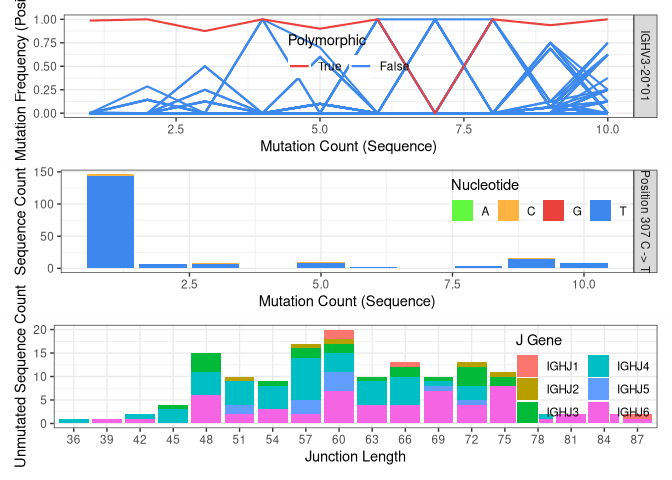

### Genotyping, including novel V gene alleles

The next step is to infer the subject’s genotype and use this to improve
the V gene calls.

`inferGenotype` uses a frequency-based method to determine the genotype.
For each V gene, it finds the minimum set of alleles that can explain a
specified fraction of each gene’s calls. The most commonly observed
allele of each gene is included in the genotype first, then the next
most common allele is added until the desired fraction of sequence
annotations can be explained.

Immcantation also includes other methods for inferring subject-specific
genotypes (`inferGenotypeBayesian`).

    gt <- inferGenotype(db, germline_db = ighv, novel = nv)

    # save genotype inf .fasta format to be used later with dowser::createGermlines
    gtseq <- genotypeFasta(gt, ighv, nv)
    writeFasta(gtseq, file.path("results", "tigger", "v_genotype.fasta"))

    gt %>% arrange(total) %>% slice(1:3) # show the first 3 rows

    ##       gene alleles counts total note
    ## 1  IGHV2-5   02,01  58,48   106     
    ## 2 IGHV3-49   04,05  77,39   116     
    ## 3 IGHV3-11   01,04  85,53   138

The individual’s genotype can be visualized with `plotGenotype`. Each
row is a gene, with colored cells indicating each of the alleles for
that gene that are included in the inferred genotype.

    plotGenotype(gt) # genotyping including novel V gene alleles

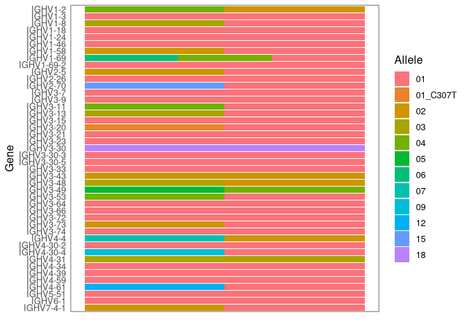

### Reassign V gene allele annotations

Some of the V gene calls may use genes that are not part of the
subject-specific genotype inferred by TIgGER. These gene calls can be
corrected with `reassignAlleles`. Mistaken allele calls can arise, for
example, from sequences which by chance have been mutated to look like
another allele. `reassignAlleles` saves the corrected calls in a new
column, `v_call_genotyped`.

With `write_rearrangement` the updated data is saved as a tabulated file
for use in the following steps.

    db <- reassignAlleles(db, gtseq)

    # show some of the corrected gene calls
    db %>%
      dplyr::filter(v_call != v_call_genotyped) %>%
      sample_n(3) %>%
      select(v_call, v_call_genotyped)

    ## # A tibble: 3 x 2
    ##   v_call                  v_call_genotyped
    ##   <chr>                   <chr>           
    ## 1 IGHV3-15*04             IGHV3-15*01     
    ## 2 IGHV5-51*01,IGHV5-51*03 IGHV5-51*01     
    ## 3 IGHV3-66*04             IGHV3-66*01

    write_rearrangement(db, file.path("results", "tigger", "data_ph_genotyped.tsv"))

## Clonal diversity analysis

**Goal:** Partition (cluster) sequences into clonally related lineages.
Each lineage is a group of sequences that came from the same original
naive cell.

Summary of the key steps: \* *Determine clonal clustering threshold:*
sequences which are under this cut-off are clonally related. \* *Assign
clonal groups:* add an annotation (`clone_id`) that can be used to
identify a group of sequences that came from the same original naive
cell. \* *Reconstruct germline sequences:* figure out the germline
sequence of the common ancestor, before mutations are introduced during
clonal expansion and SMH. \* *Analyze clonal diversity:* number and size
of clones? any expanded clones?

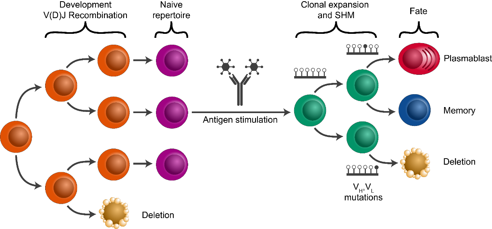

### Clonal assignment using the CDR3 as a fingerprint

Clonal relationships can be inferred from sequencing data. Hierarchical
clustering is a widely used method for identify clonally related
sequences. This method requires a measure of distance between pairs of
sequences and a choice of linkage to define the distance between groups
of sequences. Since the result will be a tree, a threshold to cut the
hierarchy into discrete clonal groups is also needed.

The figure below shows a tree and the chosen threshold (red dotted
line). Sequences which have a distance under this threshold are
considered to be part of the same clone (i.e., clonally-related) whereas
sequences which have distance above this threshold are considered to be
part of independent clones (i.e., not clonally related).

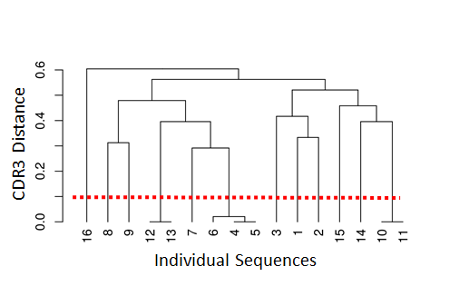

`shazam` provides methods to calculate the distance between sequences
and find an appropriate distance threshold for each dataset
(`distToNearest` and `findThreshold`). The threshold can be determined
by analyzing the distance to the nearest distribution. This is the set
of distances between each sequence and its closest non-identical
neighbor.

The figure below shows the distance-to-nearest distribution for a
repertoire. Typically, the distribution is bimodal. The first mode (on
the left) represents sequences that have at least one clonal relative in
the dataset, while the second mode (on the right) is representative of
the sequences that do not have any clonal relatives in the data
(sometimes called “singletons”). A reasonable threshold will separate
these two modes of the distribution. In this case, it is easy to
manually determine a threshold as a value intermediate between the two
modes. However, `findThreshold` can be used to automatically find the
threshold.

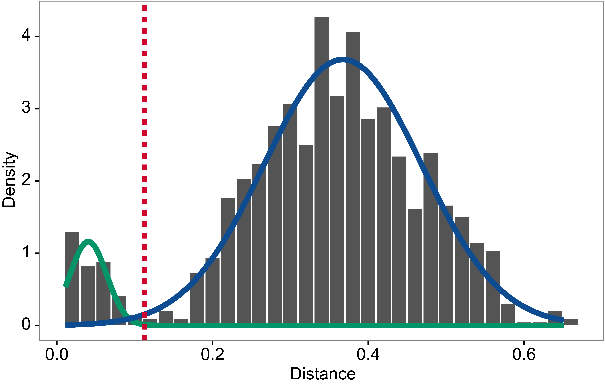

### Setting the clonal distance threshold with SHazaM

We first split sequences into groups that share the same V and J gene
assignments and that have the same junction (or equivalently CDR3)
length. This is based on the assumption that members of a clone will
share all of these properties. `distToNearest` performs this grouping
step, then counts the number of mismatches in the junction region
between all pairs of sequences in each group and returns the smallest
non-zero value for each sequence. At the end of this step, a new column
(`dist_nearest`) which contains the distances to the closest
non-identical sequence in each group will be added to `db`.

`findThreshold` uses the distribution of distances calculated in the
previous step to determine an appropriate threshold for the dataset.
This can be done using either a `density` or `mixture` based method. The
function `plot` can be used to visualize the distance-to-nearest
distribution and the threshold.

    # get the distance to nearest neighbors
    suppressPackageStartupMessages(library(shazam))
    db <- distToNearest(db, model = "ham", normalize = "len",
                        vCallColumn = "v_call_genotyped", nproc = 4)

    # determine the threshold
    threshold <- findThreshold(db$dist_nearest, method = "density")
    thr <- round(threshold@threshold, 2)
    thr

    ## [1] 0.12

    plot(threshold) # plot the distribution

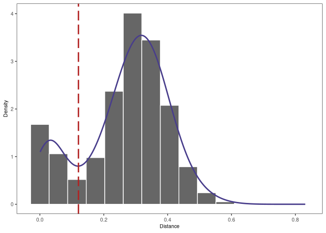

#### Advanced method: Spectral-based clonal clustering (SCOPer)

In some datasets, the distance-to-nearest distribution may not be
bimodal and `findThreshold` may fail to determine the distance
threshold. In these cases, spectral clustering with an adaptive
threshold to determine the local sequence neighborhood may be used. This
can be done with functions from the [SCOPer R
package](https://scoper.readthedocs.io/).

### Clonal assignment

Once a threshold is decided, the function `hierarchicalClones` from the
[SCOPer R package](https://scoper.readthedocs.io/) performs the clonal
assignment. There are some arguments that usually need to be specified:
\* `model`: the distance metric used in `distToNearest` \* `normalize`:
type of normalization used in `distToNearest` \* `threshold`: the
cut-off from `findThreshold`

At the end of this step, the output file will have an additional column
(`clone_id`) that provides an identifier for each sequence to indicate
which clone it belongs to (i.e., sequences that have the same identifier
are clonally-related). *Note that these identifiers are only unique to
the dataset used to carry out the clonal assignments.*

    suppressPackageStartupMessages(library(scoper))
    # Clonal assignment using hierarchical clustering
    results <- hierarchicalClones(db, threshold=thr, v_call="v_call_genotyped")

    # Plot a histogram of inter and intra clonal distances
    plot(results, binwidth=0.02)

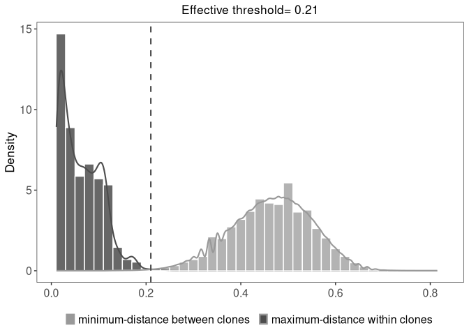

## Dowser: lineage reconstruction

B cell repertoires often consist of hundreds to thousands of separate
clones. A clonal lineage recapitulates the ancestor-descendant
relationships between clonally-related B cells and uncovering these
relationships can provide insights into affinity maturation. The R
package `dowser` offers multiple ways to build B cell phylogenetic
trees. Before performing lineage reconstruction, some preprocessing in
needed.

### Create germlines

The goal is to reconstruct the sequence of the unmutated ancestor of
each clone. We use a reference database of known alleles
([IMGT](http://www.imgt.org)). Because it is very difficult to
accurately infer the D region and the junction region for BCR sequences,
we mask this region with `N`.

Before B cell lineage trees can be built, it is necessary to construct
the unmutated germline sequence for each B cell clone. Typically the IGH
D segment is masked because the junction region of heavy chains often
cannot be reliably reconstructed. Note that occasionally errors are
thrown for some clones - this is typical and usually results in those
clones being excluded.

In the example below, we read in the IMGT germline references from our
Docker container. If you’re using a local installation, you can download
the most up-to-date reference genome by cloning the Immcantation
repository and running the script:

    # Retrieve reference genome with the script fetch_imgtdb.sh.
    # It will create directories where it is run
    git clone https://bitbucket.org/kleinstein/immcantation.git
    ./immcantation/scripts/fetch_imgtdb.sh 

And passing `"human/vdj/"` to the `readIMGT` function.

    # read in IMGT data if downloaded on your own (above)
    # and update `dir` to use the path to your `human/vdj` folder
    # references <- readIMGT(dir = "human/vdj/")

    # read in IMGT files in the Docker container
    references <- dowser::readIMGT(dir = "/usr/local/share/germlines/imgt/human/vdj")

    ## [1] "Read in 1181 from 17 fasta files"

    # reconstruct germlines
    results@db <- dowser::createGermlines(results@db, references, nproc = 1)

### Format clones

In the rearrangement table, each row corresponds to a sequence, and each
column is information about that sequence. We will create a new data
structure, where each row is a clonal cluster, and each column is
information about that clonal cluster. The function `formatClones`
performs this processing and has options that are relevant to determine
how the trees can be built and visualized. For example, `traits`
determines the columns from the rearrangement data that will be included
in the `clones` object, and will also be used to determine the
uniqueness of the sequences, so they are not collapsed.

    # make clone objects with aligned, processed sequences
    # collapse identical sequences unless differ by trait
    # add up duplicate_count column for collapsed sequences
    # store day, gex_annotation
    # discard clones with < 5 distinct sequences
    clones <- dowser::formatClones(results@db,
                                             traits="isotype", 
                                             minseq = 5, nproc = 1)
    head(clones)

    ## # A tibble: 6 x 4
    ##   clone_id data       locus  seqs
    ##   <chr>    <list>     <chr> <int>
    ## 1 19339    <airrClon> IGH      35
    ## 2 17519    <airrClon> IGH      33
    ## 3 22288    <airrClon> IGH      33
    ## 4 8284     <airrClon> IGH      32
    ## 5 24074    <airrClon> IGH      26
    ## 6 30958    <airrClon> IGH      23

### Build trees with dowser

Dowser offers multiple ways to build B cell phylogenetic trees. These
differ by the method used to estimate tree topology and branch lengths
(e.g. maximum parsimony and maximum likelihood) and implementation
(IgPhyML, PHYLIP, RAxML, or R packages `ape` and `phangorn`). Each
method has pros and cons. In this tutorial we use PHYLIP to reconstruct
lineages following a maximum parsimony technique. PHYLIP is already
installed in the Immcantation container.

    # the executable path is the location of the executable in the Docker container
    trees <- dowser::getTrees(clones, 
                              build = "dnapars", 
                              exec = "/usr/local/bin/dnapars", 
                              nproc = 1)
    head(trees)

    ## # A tibble: 6 x 5
    ##   clone_id data       locus  seqs trees  
    ##   <chr>    <list>     <chr> <int> <list> 
    ## 1 19339    <airrClon> IGH      35 <phylo>
    ## 2 17519    <airrClon> IGH      33 <phylo>
    ## 3 22288    <airrClon> IGH      33 <phylo>
    ## 4 8284     <airrClon> IGH      32 <phylo>
    ## 5 24074    <airrClon> IGH      26 <phylo>
    ## 6 30958    <airrClon> IGH      23 <phylo>

### Plot trees with dowser and ggtree

Regardless of how you build trees, they are visualized in the same
manner with the `plotTrees` function. This will return a list of
`ggplot` objects in the same order as the input object. Here, we color
the tips by the `isotype` value because we specified that column in the
`formatClones` step.

Plot all of the trees:

    plots_all <- dowser::plotTrees(trees, tips = "isotype", tipsize = 2)

Plot the largest tree:

    plots_all[[1]]

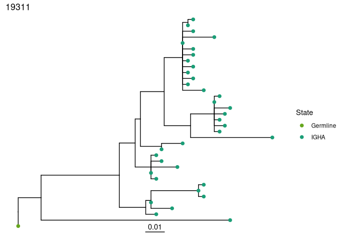

    # save a pdf of all trees
    dowser::treesToPDF(plots_all,
              file = file.path("intro-lab_files", "final_data_trees.pdf"),
              nrow = 2, ncol = 2)

    ## png 
    ##   2

In addition to the functions for building and visualizing trees,
`dowser` also implements new techniques for analyzing B cell migration
and differentiation, as well as for detecting new B cell evolution over
time. Visit the [dowser website](https://dowser.readthedocs.io) to learn
more.

## SHazaM: mutational load

B cell repertoires differ in the number of mutations introduced during
somatic hypermutation (SHM). The `shazam` R package provides a wide
array of methods focused on the analysis of SHM, including the
reconstruction of SHM targeting models and quantification of selection
pressure.

Having identified the germline sequence (`germline_alignment_d_mask`) in
previous steps, we first identify the set of somatic hypermutations by
comparing the observed sequence (`sequence_alignment`) to the germline
sequence. `observedMutations` is next used to quantify the mutational
load of each sequence using either absolute counts (`frequency=F`) or as
a frequency (the number of mutations divided by the number of
informative positions (`frequency=T`). Each mutation can be defined as
either a replacement mutation (R, or non-synonymous mutation, which
changes the amino acid sequence) or a silent mutation (S, or synonymous
mutation, which does not change the amino acid sequence). R and S
mutations can be counted together (`conmbine=T`) or independently
(`combine=F`). Counting can be limited to mutations occurring within a
particular region of the sequence (for example, to focus on the V region
`regionDefinition=IMGT_V`) or use the whole sequence
(`regionDefinition=NULL`).

Standard `ggplot` commands can be used to generate boxplots to visualize
the distribution of mutation counts across sequences, which are found in
the column `mu_count` that `observedMutations` added to `db`.

    # Calculate total mutation count, R and S combined
    results@db <- observedMutations(results@db, sequenceColumn = "sequence_alignment", 
                            germlineColumn = "germline_alignment_d_mask",
                            regionDefinition = NULL, frequency = F,
                            combine = T, nproc = 4)
    ggplot(results@db, aes(x = isotype, y = mu_count, fill = isotype)) +
      geom_boxplot() +
      scale_fill_manual(name = "Isotype", values = IG_COLORS) +
      xlab("Isotype") + ylab("Mutation count") + theme_bw()

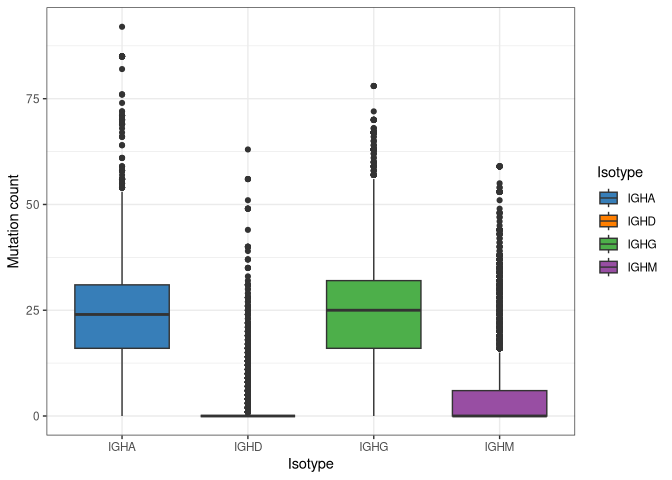

## SHazaM: models of SHM targeting biases

SHM is a stochastic process, but does not occur uniformly across the
V(D)J sequence. Some nucleotide motifs (i.e., hot-spots) are targeted
more frequently than others (i.e., cold-spots). These intrinsic biases
are modeled using 5-mer nucleotide motifs. For each 5-mer (e.g., ATCTA),
a SHM mutability model provides the relative likelihood for the center
base (e.g., the C in ATCTA) to be mutated. As associated substitution
model provides the relative probabilities of the center base in a 5-mer
mutating to each of the other 3 bases. There are several pre-built SHM
targeting models included in `shazam` which have been constructed based
on experimental datasets. These include models for human and mouse, and
for both light and heavy chains. In addition, `shazam` provides the
`createTargetingModel` method to generate new SHM targeting models from
user-supplied sequencing data. 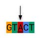 The resulting model
can be visualized as a hedgehog plot with `plotMutability`. In this
visualization, 5-mers that belong to classically-defined SHM hot-spot
motifs (e.g., WRC) are shown in red and green, cold-spot motifs in blue,
and other motifs (i.e., neutral) in grey. The bars radiating outward are
the relative mutabilities of each 5-mer. The middle circle is the
central nucleotide being targeted for SHM, here shown by a green circle
on the left plot (nucleotide A) and an orange circle on the right plot
(nucleotide C). Moving from the center of the circle outward covers the
5-mer nucleotide motif (5’ to 3’). As expected, higher relative mutation
rates are observed at hot-spot motifs.

    # Build and plot SHM targeting model
    m <- createTargetingModel(results@db, vCallColumn = "v_call_genotyped")

    ## Warning in createMutabilityMatrix(db, sub_mat, model = model, sequenceColumn =
    ## sequenceColumn, : Insufficient number of mutations to infer some 5-mers. Filled
    ## with 0.

    # nucleotides: center nucleotide characters to plot
    plotMutability(m, nucleotides = c("A","C"), size = 1.2)

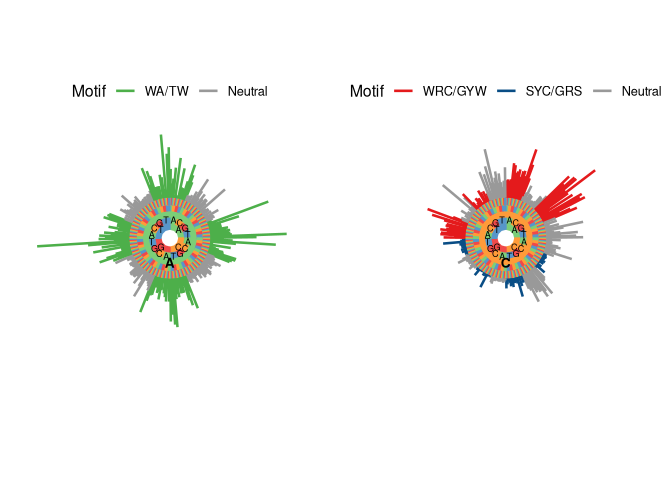

## SHazaM: quantification of selection pressure

During T-cell dependent adaptive immune responses, B cells undergo
cycles of SHM and affinity-dependent selection that leads to the
accumulation of mutations that improve their ability to bind antigens.
The ability to estimate selection pressure from sequence data is of
interest to understand the events driving physiological and pathological
immune responses. `shazam` incorporates the Bayesian estimation of
Antigen-driven SELectIoN (BASELINe) framework, to detect and quantify
selection pressure, based on the analysis of somatic hypermutation
patterns. Briefly, `calcBaseline` analyzes the observed frequency of
replacement and silent mutations normalized by their expected frequency
based on a targeting model, and generates a probability density function
(PDF) for the selection strength (∑). This PDF can be used to
statistically test for the occurrence of selection, as well as compare
selection strength across conditions. An increased frequency of R
mutations (∑ &gt; 0) suggests positive selection, and a decreased
frequency of R mutations (∑ &lt; 0) points towards negative selection .
  

positive Σ: Replacement frequency higher than expected negative Σ:
Replacement frequency lower than expected

The somatic hypermutations that are observed in clonally-related
sequences are not independent events. In order to generate a set of
independent SHM events, selection pressure analysis starts by collapsing
each clone to one representative sequence (with its associated germline)
using the function `collapseClones`. Next `calcBaseline` takes each
representative sequences and calculates the selection pressure. The
analysis can be focused on a particular region, the V region
(`regionDefinition=IMGT_V`) in the example below. Because selection
pressure may act differently across the BCR, we may also be interested
to evaluate the selection strength for different regions such as the
Complementary Determining Regions (CDR) or Framework Regions (FWR)
separately. Selection strength can also be calculated separately for
different isotopes or subjects. This can be done with `groupbaseline`,
which convolves the PDFs from individual sequences into a single PDF
representing the group of sequences (e.g., all IgG sequences). These PDF
can be visualized with `plot`. FWR are critical to maintenance the
overall structure of the BCR and typically have a lower observed
selection strength, because mutations that alter the amino acid sequence
are often negatively selected. CDRs are the areas of the BCR that
generally bind to the antigen and may be subject to increased selection
strength, although this can depend on the point in affinity maturation
when the sequence is observed. In the example, negative selection is
observed in the FWR, and almost no selection is observed in the CDR. In
both CDR and FWR, sequences annotated with IGHM isotype show more
positive selection strength than sequences annotated with IGHG and IGHA.

    # Calculate clonal consensus and selection using the BASELINe method
    z <- collapseClones(results@db)
    b <- calcBaseline(z, regionDefinition = IMGT_V)

    ## calcBaseline will calculate observed and expected mutations for clonal_sequence using clonal_germline as a reference.

    ## Calculating BASELINe probability density functions...

    # Combine selection scores for all clones in each group
    g <- groupBaseline(b, groupBy = "isotype")

    ## Grouping BASELINe probability density functions...
    ## Calculating BASELINe statistics...

    # Plot probability densities for the selection pressure
    plot(g, "isotype", sigmaLimits = c(-1, 1), silent = F)

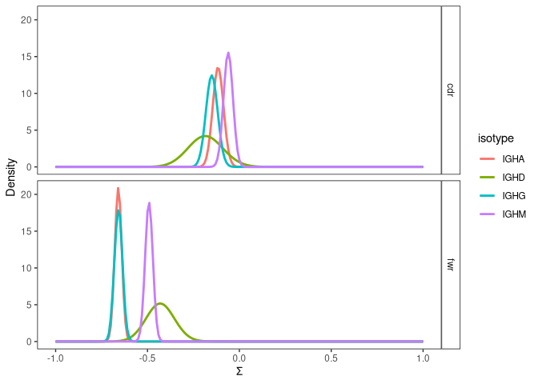

## SHazaM: Built in mutation models

`shazam` comes with several pre-built targeting models, mutation models
and sequence region definitions. They can be used to change the default
behavior of many functions. For example, mutations are usually defined
as R when they introduce any change in the amino acid sequence (`NULL`).
However, for some analyses, it may be useful to consider some amino acid
substitutions to be equivalent (i.e., treated as silent mutations). For
example, it is possible to define replacement mutations as only those
that introduce a change in the amino acid side chain charge
(`CHARGE_MUTATIONS`).

Empirical SHM Targeting Models

-   HH\_S5F: Human heavy chain 5-mer model
-   HKL\_S5F: Human light chain 5-mer model
-   MK\_RS5NF: Mouse light chain 5-mer model

Mutation Definitions

-   NULL: Any mutation that results in an amino acid substitution is
    considered a replacement (R) mutation.
-   CHARGE\_MUTATIONS: Only mutations that alter side chain charge are
    replacements.
-   HYDOPATHY\_MUTATIONS: Only mutations that alter hydrophobicity class
    are replacements.
-   POLARITY\_MUTATIONS: Only mutations that alter polarity are
    replacements.
-   VOLUME\_MUTATIONS: Only mutations that alter volume class are
    replacements.

Sequence Region Definitions

-   NULL: Full sequence
-   IMGT\_V: V segment broken into combined CDRs and FWRs
-   IMGT\_V\_BY\_REGIONS: V segment broken into individual CDRs and FWRs
