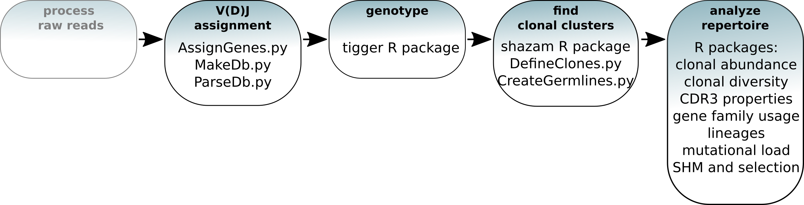

# Introduction to Bulk B Cell Repertoire Analysis using the Immcantation Framework

The field of high-throughput adaptive immune receptor repertoire
sequencing (AIRR-seq) has experienced significant growth in recent
years, but this growth has come with considerable complexity and variety
in experimental design. These complexities, combined with the high
germline and somatic diversity of immunoglobulin repertoires, present
analytical challenges requiring specialized methodologies. In this
tutorial, we present an example pipeline for processing bulk BCR data.

-   Slides and example data: <https://goo.gl/FpW3Sc>
-   The tutorial is available as a R Markdown notebook in the
    Immcantation repository:
    [intro-lab.Rmd](https://bitbucket.org/kleinstein/immcantation/src/master/training).

**This tutorial covers:**

-   V(D)J gene annotation and novel polymorphism detection
-   Inference of B cell clonal relationships
-   Diversity analysis
-   Mutational load profiling
-   Modeling of somatic hypermutation (SHM) targeting
-   Quantification of selection pressure

General workflow:  

For installation of docker used in this tutorial, go to the link given
below:

<https://immcantation.readthedocs.io/en/stable/docker/intro.html>

### Software versions

Use this command to list the software versions:

    versions report

    ## immcantation: devel
    ## date: 2023.07.08
    ## 
    ## presto: 0.7.1
    ## changeo: 1.3.0
    ## alakazam: 1.2.1.999
    ## shazam: 1.1.2.999
    ## tigger: 1.0.1.999
    ## scoper: 1.2.1.999
    ## dowser: 1.2.0
    ## enchantr: 0.1.4
    ## prestor: 0.0.7
    ## rabhit: 0.1.5
    ## rdi: 1.0.0
    ## igphyml: 1.1.5
    ## seurat: 4.3.0
    ## 
    ## airr-py: 1.4.1
    ## airr-r: 1.4.1
    ## blast: 2.13.0
    ## cd-hit: 4.8.1
    ## igblast: 1.21.0
    ## muscle: 3.8.425
    ## phylip: 3.697
    ## raxml-ng: 1.2.0
    ## vsearch: 2.22.1

### Build versions

Use this command to list the date and changesets used during the image
build:

    builds report

    ## date: 2023-08-03 17:37:05 UTC
    ## immcantation: 4.4.0-83-ga5b27a5ff038+
    ## presto: 0.7.1-9-g745dc25faa6d
    ## changeo: 1.3.0-10-g7ca1495cb045
    ## alakazam: 1.2.0-38-g35398512883e
    ## shazam: 1.1.2-31-g7f4c6f9a93a4
    ## tigger: 17b8ba3da16b
    ## rdi: d27b9067cab6+
    ## scoper: 1.2.0-41-ge7a63d2dba99+
    ## prestor: 0.0.8+

### Example data used in the tutorial

`../data/input.fasta`: Processed B cell receptor reads from one healthy
donor (PGP1) 3 weeks after flu vaccination (*Laserson et al. (2014)*)

-   As part of the processing, each sequence has been annotated with the
    isotype.
-   This step is not a part of the tutorial, but you can learn how to do
    it
    [here](https://presto.readthedocs.io/en/latest/examples/primers.html#assigning-isotype-annotations-from-the-constant-region-sequence).

<!-- -->

    head ../data/input.fasta

    ## >seq1|ISOTYPE=IGHM
    ## nnnnnnnnnnnnnnnnnnnnnnnagtgtcaggtgcagctggtggagctggggagcgtggt
    ## ccagcctgggaggccctgagtctctcctgtgcagcctctggattcaccttcagtctctat
    ## gctatgcactgggtccgccaggctccaggcaaggggctggagtgggtggcagttatatca
    ## tatcatgtaagcagtaaatactacgcagactccgtgaagggccgattcaccatctccaga
    ## gacaattccaagaacacgctgtatctgcaaatgaacagcctgagagctgaggacacggct
    ## gtgtattactgtgcgagagggccctatagtactggttattactacgagcttgactactgg
    ## ggccagggaacgctcggtcacccgtctcctcacgggtagtgcatccgccccaaccc
    ## >seq2|ISOTYPE=IGHM
    ## nnnnnnnnnnnnnnnnnntgtcccaggtgcagctgcaggagtcgggcccaggactggtga

### Reference germlines

The container has human and mouse reference V(D)J germline genes from
IMGT (`/usr/local/share/germlines/imgt`) and the corresponding IgBLAST
databases (`/usr/local/share/igblast`) for these germline repertoires.
The training container also contains a modified version of these
databases where allele IGHV3-20\*04 has been removed, to be rediscovered
by TIgGER. The modified databases are in
`/usr/local/share/germlines/imgt_test_tigger` and
`/usr/local/share/igblast_test_tigger`.

    ls /usr/local/share/germlines/imgt

    ## IMGT.yaml
    ## human
    ## mouse
    ## rabbit
    ## rat
    ## rhesus_monkey

    ls /usr/local/share/igblast

    ## database
    ## fasta
    ## internal_data
    ## optional_file

## V(D)J gene annotation

The first step in the analysis of processed reads (`input.fasta`) is to
annotate each read with its germline V(D)J gene alleles and to identify
relevant sequence structure such as the CDR3 sequence. Immcantation
provides tools to read the output of many popular V(D)J assignment
tools, including [IMGT/HighV-QUEST](http://www.imgt.org/HighV-QUEST) and
[IgBLAST](https://www.ncbi.nlm.nih.gov/igblast/).

Here, we will use IgBLAST. Change-O provides a wrapper script
(`AssignGenes.py`) to run IgBLAST using the reference V(D)J germline
sequences in the container.

### A test with 200 sequences

It is often useful to prototype analysis pipelines using a small subset
of sequences. For a quick test of Change-O’s V(D)J assignment tool, use
`SplitSeq.py` to extract 200 sequences from `input.fasta`, then assign
the V(D)J genes with `AssignGenes.py`.

    mkdir -p results/igblast
    SplitSeq.py sample -n 200 --outdir results --fasta -s ../data/input.fasta

    ## /usr/lib64/python3.11/site-packages/Bio/pairwise2.py:278: BiopythonDeprecationWarning: Bio.pairwise2 has been deprecated, and we intend to remove it in a future release of Biopython. As an alternative, please consider using Bio.Align.PairwiseAligner as a replacement, and contact the Biopython developers if you still need the Bio.pairwise2 module.
    ##   warnings.warn(
    ##      START> SplitSeq
    ##    COMMAND> sample
    ##       FILE> input.fasta
    ## MAX_COUNTS> 200
    ##      FIELD> None
    ##     VALUES> None
    ## 
    ## PROGRESS> 13:47:41 |Reading files            | 0.0 minPROGRESS> 13:47:41 |Done                     | 0.0 min
    ## 
    ## PROGRESS> 13:47:41 |Sampling n=200           | 0.0 minPROGRESS> 13:47:41 |Done                     | 0.0 min
    ## 
    ## MAX_COUNT> 200
    ##   SAMPLED> 200
    ##    OUTPUT> input_sample1-n200.fasta
    ## 
    ## END> SplitSeq

`AssignGenes.py` performs V(D)J assignment with IgBLAST.

-   It requires the input sequences (`-s`) and a reference germlines
    database (`-b`). In this case, we use the germline database already
    available in the container.
-   The organism is specified with `--organism` and the type of receptor
    with `--loci` (`ig` for the B cell receptor).
-   Use `--format blast` to specify that the results should be in the
    `fmt7` format.
-   Improved computational speed can be achieved by specifying the
    number of processors with `--nproc`.

<!-- -->

    AssignGenes.py igblast -s results/input_sample1-n200.fasta \
    -b /usr/local/share/igblast_test_tigger --organism human --loci ig \
    --format blast --outdir results/igblast --nproc 8

    ##    START> AssignGenes
    ##  COMMAND> igblast
    ##  VERSION> 1.21.0
    ##     FILE> input_sample1-n200.fasta
    ## ORGANISM> human
    ##     LOCI> ig
    ##    NPROC> 8
    ## 
    ## PROGRESS> 13:47:43 |Running IgBLAST          | 0.0 minPROGRESS> 13:47:46 |Done                     | 0.1 min
    ## 
    ##   PASS> 200
    ## OUTPUT> input_sample1-n200_igblast.fmt7
    ##    END> AssignGenes

### V(D)J assignment using all the data

To run the command on all of the data, modify it to change the input
file (`-s`) to the full data set. *Please note that this may take some
time to finish running.*

    AssignGenes.py igblast -s ../data/input.fasta \
    -b /usr/local/share/igblast_test_tigger --organism human --loci ig \
    --format blast --outdir results/igblast --nproc 8

    ##    START> AssignGenes
    ##  COMMAND> igblast
    ##  VERSION> 1.21.0
    ##     FILE> input.fasta
    ## ORGANISM> human
    ##     LOCI> ig
    ##    NPROC> 8
    ## 
    ## PROGRESS> 13:47:48 |Running IgBLAST          | 0.0 minPROGRESS> 14:05:37 |Done                     | 17.8 min
    ## 
    ##   PASS> 91010
    ## OUTPUT> input_igblast.fmt7
    ##    END> AssignGenes

## Data standardization using Change-O

Once the V(D)J annotation is finished, the IgBLAST results are parsed
into a [standardized
format](https://changeo.readthedocs.io/en/stable/standard.html) suitable
for downstream analysis. All tools in the Immcantation framework use
this format, which allows for interoperability and provides flexibility
when designing complex workflows.

In this example analysis, the `fmt7` results from IgBLAST are converted
into the
[AIRR](https://docs.airr-community.org/en/latest/datarep/rearrangements.html)
format, a tabulated text file with one sequence per row. Columns provide
the annotation for each sequence using standard column names as
described here:
<https://docs.airr-community.org/en/latest/datarep/rearrangements.html>.

### Generate a standardized database file

The command line tool `MakeDb.py igblast` requires the original input
sequence fasta file (`-s`) that was passed to the V(D)J annotation tool,
as well as the V(D)J annotation results (`-i`). The argument
`--format airr` specifies that the results should be converted into the
AIRR format. The path to the reference germlines is provided by `-r`.

    mkdir -p results/changeo
    MakeDb.py igblast \
    -s ../data/input.fasta -i results/igblast/input_igblast.fmt7 \
    --format airr \
    -r /usr/local/share/germlines/imgt_test_tigger/human/vdj/ --outdir results/changeo \
    --outname data

    ##          START> MakeDB
    ##        COMMAND> igblast
    ##   ALIGNER_FILE> input_igblast.fmt7
    ##       SEQ_FILE> input.fasta
    ##        ASIS_ID> False
    ##     ASIS_CALLS> False
    ##       VALIDATE> strict
    ##       EXTENDED> False
    ## INFER_JUNCTION> False
    ## 
    ## PROGRESS> 14:05:37 |Loading files       | 0.0 minPROGRESS> 14:05:38 |Done                | 0.0 min
    ## 
    ## PROGRESS> 14:05:38 |                    |   0% (     0) 0.0 minPROGRESS> 14:05:48 |#                   |   5% ( 4,551) 0.2 minPROGRESS> 14:05:51 |##                  |  10% ( 9,102) 0.2 minPROGRESS> 14:05:53 |###                 |  15% (13,653) 0.2 minPROGRESS> 14:05:55 |####                |  20% (18,204) 0.3 minPROGRESS> 14:05:58 |#####               |  25% (22,755) 0.3 minPROGRESS> 14:06:00 |######              |  30% (27,306) 0.4 minPROGRESS> 14:06:03 |#######             |  35% (31,857) 0.4 minPROGRESS> 14:06:05 |########            |  40% (36,408) 0.4 minPROGRESS> 14:06:07 |#########           |  45% (40,959) 0.5 minPROGRESS> 14:06:10 |##########          |  50% (45,510) 0.5 minPROGRESS> 14:06:12 |###########         |  55% (50,061) 0.6 minPROGRESS> 14:06:15 |############        |  60% (54,612) 0.6 minPROGRESS> 14:06:17 |#############       |  65% (59,163) 0.6 minPROGRESS> 14:06:20 |##############      |  70% (63,714) 0.7 minPROGRESS> 14:06:22 |###############     |  75% (68,265) 0.7 minPROGRESS> 14:06:24 |################    |  80% (72,816) 0.8 minPROGRESS> 14:06:27 |#################   |  85% (77,367) 0.8 minPROGRESS> 14:06:30 |##################  |  90% (81,918) 0.9 minPROGRESS> 14:06:32 |################### |  95% (86,469) 0.9 minPROGRESS> 14:06:35 |####################| 100% (91,010) 0.9 min
    ## 
    ## OUTPUT> data_db-pass.tsv
    ##   PASS> 87504
    ##   FAIL> 3506
    ##    END> MakeDb

### Subset the data to include productive heavy chain sequences

We next filter the data from the previous step to include **only
productive** sequences from the heavy chain. The determination of
whether a sequence is productive (or not) is provided by the V(D)J
annotation software.

`ParseDb.py select` finds the rows in the file `-d` for which the column
`productive` (specified with `-f`) contains the values `T` or `TRUE`
(specified by `-u`). The prefix `data_p` will be used in the name of the
output file (specified by `--outname`).

    ParseDb.py select -d results/changeo/data_db-pass.tsv \
    -f productive -u T --outname data_p

    ##   START> ParseDb
    ## COMMAND> select
    ##    FILE> data_db-pass.tsv
    ##  FIELDS> productive
    ##  VALUES> T
    ##   REGEX> False
    ## 
    ## PROGRESS> 14:06:36 |                    |   0% (     0) 0.0 minPROGRESS> 14:06:36 |#                   |   5% ( 4,376) 0.0 minPROGRESS> 14:06:36 |##                  |  10% ( 8,752) 0.0 minPROGRESS> 14:06:37 |###                 |  15% (13,128) 0.0 minPROGRESS> 14:06:37 |####                |  20% (17,504) 0.0 minPROGRESS> 14:06:37 |#####               |  25% (21,880) 0.0 minPROGRESS> 14:06:37 |######              |  30% (26,256) 0.0 minPROGRESS> 14:06:37 |#######             |  35% (30,632) 0.0 minPROGRESS> 14:06:37 |########            |  40% (35,008) 0.0 minPROGRESS> 14:06:38 |#########           |  45% (39,384) 0.0 minPROGRESS> 14:06:38 |##########          |  50% (43,760) 0.0 minPROGRESS> 14:06:38 |###########         |  55% (48,136) 0.0 minPROGRESS> 14:06:38 |############        |  60% (52,512) 0.0 minPROGRESS> 14:06:38 |#############       |  65% (56,888) 0.0 minPROGRESS> 14:06:38 |##############      |  70% (61,264) 0.0 minPROGRESS> 14:06:39 |###############     |  75% (65,640) 0.0 minPROGRESS> 14:06:39 |################    |  80% (70,016) 0.0 minPROGRESS> 14:06:39 |#################   |  85% (74,392) 0.0 minPROGRESS> 14:06:39 |##################  |  90% (78,768) 0.0 minPROGRESS> 14:06:39 |################### |  95% (83,144) 0.1 minPROGRESS> 14:06:39 |####################| 100% (87,504) 0.1 min
    ## 
    ##    OUTPUT> data_p_parse-select.tsv
    ##   RECORDS> 87504
    ##  SELECTED> 64892
    ## DISCARDED> 22612
    ##       END> ParseDb

Next, we filter the data to include **only heavy chain** sequences.

`ParseDb.py select` finds the rows in the file `-d` from the previous
step for which the column `v_call` (specified with `-f`) contains
(pattern matching specified by `--regex`) the word `IGHV` (specified by
`-u`). The prefix `data_ph` (standing for productive and heavy) will be
used in the name of the output file (specified by `--outname`) to
indicate that this file contains productive (p) heavy (h) chain sequence
data.

    ParseDb.py select -d results/changeo/data_p_parse-select.tsv \
    -f v_call -u IGHV --regex --outname data_ph

    ##   START> ParseDb
    ## COMMAND> select
    ##    FILE> data_p_parse-select.tsv
    ##  FIELDS> v_call
    ##  VALUES> IGHV
    ##   REGEX> True
    ## 
    ## PROGRESS> 14:06:40 |                    |   0% (     0) 0.0 minPROGRESS> 14:06:40 |#                   |   5% ( 3,245) 0.0 minPROGRESS> 14:06:40 |##                  |  10% ( 6,490) 0.0 minPROGRESS> 14:06:41 |###                 |  15% ( 9,735) 0.0 minPROGRESS> 14:06:41 |####                |  20% (12,980) 0.0 minPROGRESS> 14:06:41 |#####               |  25% (16,225) 0.0 minPROGRESS> 14:06:41 |######              |  30% (19,470) 0.0 minPROGRESS> 14:06:41 |#######             |  35% (22,715) 0.0 minPROGRESS> 14:06:41 |########            |  40% (25,960) 0.0 minPROGRESS> 14:06:41 |#########           |  45% (29,205) 0.0 minPROGRESS> 14:06:42 |##########          |  50% (32,450) 0.0 minPROGRESS> 14:06:42 |###########         |  55% (35,695) 0.0 minPROGRESS> 14:06:42 |############        |  60% (38,940) 0.0 minPROGRESS> 14:06:42 |#############       |  65% (42,185) 0.0 minPROGRESS> 14:06:42 |##############      |  70% (45,430) 0.0 minPROGRESS> 14:06:42 |###############     |  75% (48,675) 0.0 minPROGRESS> 14:06:43 |################    |  80% (51,920) 0.0 minPROGRESS> 14:06:43 |#################   |  85% (55,165) 0.0 minPROGRESS> 14:06:43 |##################  |  90% (58,410) 0.0 minPROGRESS> 14:06:43 |################### |  95% (61,655) 0.0 minPROGRESS> 14:06:43 |####################| 100% (64,892) 0.0 min
    ## 
    ##    OUTPUT> data_ph_parse-select.tsv
    ##   RECORDS> 64892
    ##  SELECTED> 64892
    ## DISCARDED> 0
    ##       END> ParseDb

## Load libraries and read in the data

After loading the libraries needed, the process is started by using
`readChangeoDb` to read the tabulated data generated in the previous
step.

    suppressPackageStartupMessages(library(airr))
    suppressPackageStartupMessages(library(alakazam))
    suppressPackageStartupMessages(library(dplyr))
    suppressPackageStartupMessages(library(ggplot2))
    suppressPackageStartupMessages(library(tigger))

    dir.create(file.path("results", "tigger"))

    ## Warning in dir.create(file.path("results", "tigger")): 'results/tigger' already
    ## exists

    db <- read_rearrangement(file.path("results", "changeo",
                                       "data_ph_parse-select.tsv"))
    colnames(db) # show the column names in the database

    ##  [1] "sequence_id"        "sequence"           "rev_comp"          
    ##  [4] "productive"         "v_call"             "d_call"            
    ##  [7] "j_call"             "sequence_alignment" "germline_alignment"
    ## [10] "junction"           "junction_aa"        "v_cigar"           
    ## [13] "d_cigar"            "j_cigar"            "stop_codon"        
    ## [16] "vj_in_frame"        "locus"              "c_call"            
    ## [19] "junction_length"    "np1_length"         "np2_length"        
    ## [22] "v_sequence_start"   "v_sequence_end"     "v_germline_start"  
    ## [25] "v_germline_end"     "d_sequence_start"   "d_sequence_end"    
    ## [28] "d_germline_start"   "d_germline_end"     "j_sequence_start"  
    ## [31] "j_sequence_end"     "j_germline_start"   "j_germline_end"    
    ## [34] "isotype"

### Remove sequences with many Ns using filterN

Bulk BCR data in general includes ambiguous nucleotides (Ns), and we
will remove those low-quality sequences with many Ns

    source("assets/filterN.R")

    # Identify sequences with at least 20 Ns or continuous 15 Ns in the v_region
    v_n_stretches_plot <- filterN(db, "sequence_alignment",
                                      start=1, end=312, 
                                      max_n=20, max_n_stretch = 15,
                                      label="v_region",
                                      plot=TRUE)

    ## Warning: `aes_string()` was deprecated in ggplot2 3.0.0.
    ## i Please use tidy evaluation idioms with `aes()`.
    ## i See also `vignette("ggplot2-in-packages")` for more information.
    ## This warning is displayed once every 8 hours.
    ## Call `lifecycle::last_lifecycle_warnings()` to see where this warning was
    ## generated.

    v_region_n_pass <- v_n_stretches_plot$db_pass
    # number of sequences before filtering N
    dim(db)

    ## [1] 64892    34

    db = db[which(v_region_n_pass),]
    # number of sequences after filtering N
    dim(db)

    ## [1] 64892    34

## Genotyping and discovery of novel V gene alleles with TIgGER

V(D)J assignment is a key step in analyzing repertoires and is done by
matching the sequences against a database of known V(D)J alleles.
However, current databases are incomplete and this process will fail for
sequences that utilize previously undetected alleles. Some assignments
may also occur to genes which are not carried by the individual. The
TIgGER R package infers subject-specific V genotypes (including novel
alleles), then uses the results to improve the V gene annotations.

`readIgFasta` loads the reference V germline genes that were used in the
V(D)J assignment (in this case the sequences in the Immcantation
container).

    ighv <- readIgFasta(file.path("", "usr", "local", "share", "germlines",
                                  "imgt_test_tigger", "human", "vdj",
                                  "imgt_human_IGHV.fasta"))
    ighv[1] # show the first germline

    ##                                                                                                                                                                                                                                                                                                                        IGHV1-18*01 
    ## "CAGGTTCAGCTGGTGCAGTCTGGAGCT...GAGGTGAAGAAGCCTGGGGCCTCAGTGAAGGTCTCCTGCAAGGCTTCTGGTTACACCTTT............ACCAGCTATGGTATCAGCTGGGTGCGACAGGCCCCTGGACAAGGGCTTGAGTGGATGGGATGGATCAGCGCTTAC......AATGGTAACACAAACTATGCACAGAAGCTCCAG...GGCAGAGTCACCATGACCACAGACACATCCACGAGCACAGCCTACATGGAGCTGAGGAGCCTGAGATCTGACGACACGGCCGTGTATTACTGTGCGAGAGA"

#### Identify potentially novel V gene alleles

For each V gene allele, `findNovelAlleles` analyzes the sequences that
were assigned the allele and evaluates the apparent mutation frequency
at each position as a function of sequence-wide mutation counts.
Positions that contain polymorphisms (rather than somatic
hypermutations) will exhibit a high apparent mutation frequency even
when the sequence-wide mutation count is low.

In this example, TIgGER finds one novel V gene allele.

    nv <- findNovelAlleles(db, germline_db = ighv, nproc = 8) # find novel alleles

    selectNovel(nv) # show novel alleles

    ##   germline_call                note polymorphism_call nt_substitutions
    ## 1   IGHV3-20*01 Novel allele found! IGHV3-20*01_C307T           307C>T
    ## 2   IGHV3-20*03 Novel allele found!  IGHV3-20*03_T68G            68T>G
    ##                                                                                                                                                                                                                                                                                                                                                                                                                                                                                                                                                                                             novel_imgt
    ## 1                                                                                                                                                                                                                                                                     GAGGTGCAGCTGGTGGAGTCTGGGGGA...GGTGTGGTACGGCCTGGGGGGTCCCTGAGACTCTCCTGTGCAGCCTCTGGATTCACCTTT............GATGATTATGGCATGAGCTGGGTCCGCCAAGCTCCAGGGAAGGGGCTGGAGTGGGTCTCTGGTATTAATTGGAAT......GGTGGTAGCACAGGTTATGCAGACTCTGTGAAG...GGCCGATTCACCATCTCCAGAGACAACGCCAAGAACTCCCTGTATCTGCAAATGAACAGTCTGAGAGCCGAGGACACGGCCTTGTATTACTGTGCGAGAGA
    ## 2 GAGGTGCAGCTGGTGGAGTCTGGGGGA...GGTGTGGTACGGCCTGGGGGGTCCCTGAGACTCTCCTGTGCAGCCTCTGGATTCACCTTT............GATGATTATGGCATGAGCTGGGTCCGCCAAGCTCCAGGGAAGGGGCTGGAGTGGGTCTCTGGTATTAATTGGAAT......GGTGGTAGCACAGGTTATGCAGACTCTGTGAAG...GGCCGATTCACCATCTCCAGAGACAACGCCAAGAACTCCCTGTATCTGCAAATGAACAGTCTGAGAGCCGAGGACACGGCCTTGTATTACTGTGCGAGAGACTCTCCTGTGCAGCCTCTGGATTCACCTTT............GATGATTATGGCATGAGCTGGGTCCGCCAAGCTCCAGGGAAGGGGCTGGAGTGGGTCTCTGGTATTAATTGGAAT......GGTGGTAGCACAGGTTATGCAGACTCTGTGAAG...GGCCGATTCACCATCTCCAGAGACAACGCCAAGAACTCCCTGTATCTGCAAATGAACAGTCTGAGAGCCGAGGACACGGCCTTGTATTACTGTGCGAGAGA
    ##   novel_imgt_count novel_imgt_unique_j novel_imgt_unique_cdr3
    ## 1              161                   6                    145
    ## 2              161                   6                    145
    ##   perfect_match_count perfect_match_freq germline_call_count germline_call_freq
    ## 1                 144          0.4784053                 301              0.005
    ## 2                 167          0.5901060                 283              0.004
    ##   mut_min mut_max mut_pass_count
    ## 1       1      10            202
    ## 2       1      10            222
    ##                                                                                                                                                                                                                                                                                                                                                                                                                                                                                                                                                                                          germline_imgt
    ## 1                                                                                                                                                                                                                                                                     GAGGTGCAGCTGGTGGAGTCTGGGGGA...GGTGTGGTACGGCCTGGGGGGTCCCTGAGACTCTCCTGTGCAGCCTCTGGATTCACCTTT............GATGATTATGGCATGAGCTGGGTCCGCCAAGCTCCAGGGAAGGGGCTGGAGTGGGTCTCTGGTATTAATTGGAAT......GGTGGTAGCACAGGTTATGCAGACTCTGTGAAG...GGCCGATTCACCATCTCCAGAGACAACGCCAAGAACTCCCTGTATCTGCAAATGAACAGTCTGAGAGCCGAGGACACGGCCTTGTATCACTGTGCGAGAGA
    ## 2 GAGGTGCAGCTGGTGGAGTCTGGGGGA...GGTGTGGTACGGCCTGGGGGGTCCCTGAGACTCTCCTTTGCAGCCTCTGGATTCACCTTT............GATGATTATGGCATGAGCTGGGTCCGCCAAGCTCCAGGGAAGGGGCTGGAGTGGGTCTCTGGTATTAATTGGAAT......GGTGGTAGCACAGGTTATGCAGACTCTGTGAAG...GGCCGATTCACCATCTCCAGAGACAACGCCAAGAACTCCCTGTATCTGCAAATGAACAGTCTGAGAGCCGAGGACACGGCCTTGTATTACTGTGCGAGAGACTCTCCTGTGCAGCCTCTGGATTCACCTTT............GATGATTATGGCATGAGCTGGGTCCGCCAAGCTCCAGGGAAGGGGCTGGAGTGGGTCTCTGGTATTAATTGGAAT......GGTGGTAGCACAGGTTATGCAGACTCTGTGAAG...GGCCGATTCACCATCTCCAGAGACAACGCCAAGAACTCCCTGTATCTGCAAATGAACAGTCTGAGAGCCGAGGACACGGCCTTGTATTACTGTGCGAGAGA
    ##   germline_imgt_count pos_min pos_max y_intercept y_intercept_pass snp_pass
    ## 1                  44       1     312       0.125                1      196
    ## 2                   0       1     312       0.125                1      222
    ##   unmutated_count unmutated_freq unmutated_snp_j_gene_length_count
    ## 1             144      0.4784053                                52
    ## 2             167      0.5901060                                54
    ##   snp_min_seqs_j_max_pass alpha min_seqs j_max min_frac
    ## 1                       1  0.05       50  0.15     0.75
    ## 2                       1  0.05       50  0.15     0.75

The function `plotNovel` helps visualize the supporting evidence for
calling the novel V gene allele. The mutation frequency of the position
that is predicted to contain a polymorphism is highlighted in red. In
this case, the position contains a high number of apparent mutations for
all sequence-wide mutation counts (top panel).

By default, `findNovelAlleles` uses several additional filters to avoid
false positive allele calls. For example, to avoid calling novel alleles
resulting from clonally-related sequences, TIgGER requires that
sequences perfectly matching the potential novel allele be found in
sequences with a diverse set of J genes and a range of junction lengths.
This can be observed in the bottom panel.

    plotNovel(db, selectNovel(nv)[1, ]) # visualize the novel allele(s)

### Genotyping, including novel V gene alleles

The next step is to infer the subject’s genotype and use this to improve
the V gene calls.

`inferGenotype` uses a frequency-based method to determine the genotype.
For each V gene, it finds the minimum set of alleles that can explain a
specified fraction of each gene’s calls. The most commonly observed
allele of each gene is included in the genotype first, then the next
most common allele is added until the desired fraction of sequence
annotations can be explained.

Immcantation also includes other methods for inferring subject-specific
genotypes (`inferGenotypeBayesian`).

    gt <- inferGenotype(db, germline_db = ighv, novel = nv)

    # save genotype inf .fasta format to be used later with CreateGermlines.py
    gtseq <- genotypeFasta(gt, ighv, nv)
    writeFasta(gtseq, file.path("results", "tigger", "v_genotype.fasta"))

    gt %>% arrange(total) %>% slice(1:3) # show the first 3 rows

    ##       gene alleles counts total note
    ## 1  IGHV2-5   02,01  58,48   106     
    ## 2 IGHV3-49   04,05  77,39   116     
    ## 3 IGHV3-11   01,04  85,53   138

The individual’s genotype can be visualized with `plotGenotype`. Each
row is a gene, with colored cells indicating each of the alleles for
that gene that are included in the inferred genotype.

    plotGenotype(gt) # genotyping including novel V gene alleles

### Reassign V gene allele annotations

Some of the V gene calls may use genes that are not part of the
subject-specific genotype inferred by TIgGER. These gene calls can be
corrected with `reassignAlleles`. Mistaken allele calls can arise, for
example, from sequences which by chance have been mutated to look like
another allele. `reassignAlleles` saves the corrected calls in a new
column, `v_call_genotyped`.

With `write_rearrangement` the updated data is saved as a tabulated file
for use in the following steps.

    db <- reassignAlleles(db, gtseq)

    # show some of the corrected gene calls
    db %>%
      dplyr::filter(v_call != v_call_genotyped) %>%
      sample_n(3) %>%
      select(v_call, v_call_genotyped)

    ## # A tibble: 3 x 2
    ##   v_call                               v_call_genotyped        
    ##   <chr>                                <chr>                   
    ## 1 IGHV1-69*01,IGHV1-69*17,IGHV1-69D*01 IGHV1-69*01,IGHV1-69D*01
    ## 2 IGHV4-59*11                          IGHV4-59*01             
    ## 3 IGHV4-34*02                          IGHV4-34*01

    write_rearrangement(db, file.path("results", "tigger", "data_ph_genotyped.tsv"))

## Clonal diversity analysis

**Goal:** Partition (cluster) sequences into clonally related lineages.
Each lineage is a group of sequences that came from the same original
naive cell.

Summary of the key steps: \* *Determine clonal clustering threshold:*
sequences which are under this cut-off are clonally related. \* *Assign
clonal groups:* add an annotation (`clone_id`) that can be used to
identify a group of sequences that came from the same original naive
cell. \* *Reconstruct germline sequences:* figure out the germline
sequence of the common ancestor, before mutations are introduced during
clonal expansion and SMH. \* *Analyze clonal diversity:* number and size
of clones? any expanded clones?

### Clonal assignment using the CDR3 as a fingerprint

Clonal relationships can be inferred from sequencing data. Hierarchical
clustering is a widely used method for identify clonally related
sequences. This method requires a measure of distance between pairs of
sequences and a choice of linkage to define the distance between groups
of sequences. Since the result will be a tree, a threshold to cut the
hierarchy into discrete clonal groups is also needed.

The figure below shows a tree and the chosen threshold (red dotted
line). Sequences which have a distance under this threshold are
considered to be part of the same clone (i.e., clonally-related) whereas
sequences which have distance above this threshold are considered to be
part of independent clones (i.e., not clonally related).

`shazam` provides methods to calculate the distance between sequences
and find an appropriate distance threshold for each dataset
(`distToNearest` and `findThreshold`). The threshold can be determined
by analyzing the distance to the nearest distribution. This is the set
of distances between each sequence and its closest non-identical
neighbor.

The figure below shows the distance-to-nearest distribution for a
repertoire. Typically, the distribution is bimodal. The first mode (on
the left) represents sequences that have at least one clonal relative in
the dataset, while the second mode (on the right) is representative of
the sequences that do not have any clonal relatives in the data
(sometimes called “singletons”). A reasonable threshold will separate
these two modes of the distribution. In this case, it is easy to
manually determine a threshold as a value intermediate between the two
modes. However, `findThreshold` can be used to automatically find the
threshold.

### Setting the clonal distance threshold with SHazaM

We first split sequences into groups that share the same V and J gene
assignments and that have the same junction (or equivalently CDR3)
length. This is based on the assumption that members of a clone will
share all of these properties. `distToNearest` performs this grouping
step, then counts the number of mismatches in the junction region
between all pairs of sequences in each group and returns the smallest
non-zero value for each sequence. At the end of this step, a new column
(`dist_nearest`) which contains the distances to the closest
non-identical sequence in each group will be added to `db`.

`findThreshold` uses the distribution of distances calculated in the
previous step to determine an appropriate threshold for the dataset.
This can be done using either a `density` or `mixture` based method. The
function `plot` can be used to visualize the distance-to-nearest
distribution and the threshold.

    # get the distance to nearest neighbors
    suppressPackageStartupMessages(library(shazam))
    db <- distToNearest(db, model = "ham", normalize = "len",
                        vCallColumn = "v_call_genotyped", nproc = 4)

    ## Joining with `by = join_by(DTN_ROW_ID)`

    # determine the threshold
    threshold <- findThreshold(db$dist_nearest, method = "density")
    thr <- round(threshold@threshold, 2)
    thr

    ## [1] 0.12

    plot(threshold) # plot the distribution

#### Advanced method: Spectral-based clonal clustering (SCOPer)

In some datasets, the distance-to-nearest distribution may not be
bimodal and `findThreshold` may fail to determine the distance
threshold. In these cases, spectral clustering with an adaptive
threshold to determine the local sequence neighborhood may be used. This
can be done with functions from the [SCOPer R
package](https://scoper.readthedocs.io/).

### Change-O: Clonal assignment

Once a threshold is decided, the function `hierarchicalClones` from the
[SCOPer R package](https://scoper.readthedocs.io/) performs the clonal
assignment. There are some arguments that usually need to be specified:
\* `model`: the distance metric used in `distToNearest` \* `normalize`:
type of normalization used in `distToNearest` \* `threshold`: the
cut-off from `findThreshold`

At the end of this step, the output file will have an additional column
(`clone_id`) that provides an identifier for each sequence to indicate
which clone it belongs to (i.e., sequences that have the same identifier
are clonally-related). *Note that these identifiers are only unique to
the dataset used to carry out the clonal assignments.*

    suppressPackageStartupMessages(library(scoper))
    # Clonal assignment using hierarchical clustering
    results <- hierarchicalClones(db, threshold=thr, v_call="v_call_genotyped")

    # Plot a histogram of inter and intra clonal distances
    plot(results, binwidth=0.02)

### TBD: See vignettes of Alakazam

Links to other types of analysis. For example, see below “Clonal
Lineages”.

## Alakazam: lineage reconstruction

TBD: Update to Dowser version, which will involve the assignment of
germlines as well (createGermlines())

B cell repertoires often consist of hundreds to thousands of separate
clones. A clonal lineage recapitulates the ancestor-descendant
relationships between clonally-related B cells and uncovering these
relationships can provide insights into affinity maturation. The R
package `alakazam` uses PHYLIP to reconstruct lineages following a
maximum parsimony technique. PHYLIP is already installed in the
Immcantation container.

Before performing lineage reconstruction, some preprocessing in needed.
The code below shows an example of such preprocessing done for one of
the largest clones in the example dataset. The function
`makeChangeoClone` takes as input a data.frame with information for a
clone (`db_clone`). `text_fields = "isotype"` specifies that annotation
in the column `isotype` should be merged during duplicate removal. For
example, if two duplicate sequences (defined by identical nucleotide
composition) are found, and one is annotated as IGHM and the second one
is an IGHG, then they will be “collapsed” into a single sequence that
will have the `isotype` value “IGHM,IGHG”. The preprocessing done by
`makeChangeoClone` also includes masking gap positions and masking
ragged ends.

    # Select one clone, the 2nd largest, just as an example
    largest_clone <- countClones(results@db) %>%
                       slice(2) %>%
                       select(clone_id) %>% as.character()

    # Subset db, get db with data for largest_clone
    db_clone <- subset(results@db, clone_id == largest_clone)

    # Build tree from a single clone
    # TODO: I added pad_end = TRUE because of error:
    #Error in makeChangeoClone(db_clone, v_call = "v_call_genotyped", text_fields = "isotype") : 
    #  All sequences are not the same length for data with first sequence_id = seq248. Consider specifying pad_end=TRUE and verify the multiple alignment
    x <- makeChangeoClone(db_clone, v_call = "v_call_genotyped",
                          text_fields = "isotype", pad_end = TRUE)

Lineage reconstruction is done with `buildPhylipLineage`. This function
uses the `dnapars` tool from PHYLIP, which in the container is located
at `/usr/local/bin/dnapars`, to build the lineage, and returns an
`igraph` object. This object can be quickly visualized with the command
`plot`. It is possible to use `igraph` or other tools to resize nodes
(e.g., by the underlying sequence count) or add colors (e.g., to
indicate tissue location of B cell subsets) to help answer specific
biological questions.

    # Lineage reconstruction
    g <- buildPhylipLineage(x, phylip_exec = "/usr/local/bin/dnapars")
    suppressPackageStartupMessages(library(igraph))
    plot(g)

